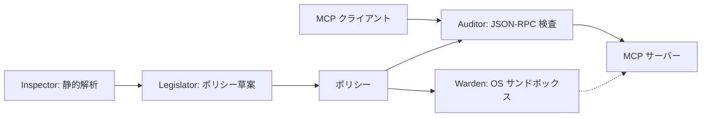

# mcp-writ

> [English](README.md)

[Model Context Protocol (MCP)](https://modelcontextprotocol.io/) サーバー向けのセキュリティラッパーです。
mcp-writ は MCP クライアントとサーバーの間に介在し、ファイルシステムのアクセス制御、syscall フィルタリング、ツール許可リスト制御といったきめ細かなセキュリティポリシーを適用します。
ネイティブバイナリの syscall 解析は現在、[iced-x86](https://github.com/icedland/iced) を用いた x86-64 ELF バイナリが対象です。今後は、この解析を ARM にも対応させることを目指しています。

## 特徴

- **多層防御** — Linux・Windows・macOS の OS サンドボックスと JSON-RPC 監査を組み合わせて保護。
- **非特権動作** — root 権限なしで動作。
- **静的解析** — ネイティブ ELF バイナリと対応スクリプトを解析し、実行前に必要な権限を調査。
- **ポリシーの生成・検証** — KDL ポリシーの草案を生成。任意のツール検出・自己検証・ドライラン監査で設定の見直しを支援。
- **コンテナ対応** — MCP サーバーのイメージを作成・ラッピングし、Docker / Podman 上でポリシーを適用して実行。
- **ツールのアクセス制御** — ツールの権限と引数を検査し、機密パスを保護。呼び出し順序の制限も任意で設定。
- **ツール定義の検証** — サーバーが提示するツール定義をスキャンし、ハッシュを照合。変更時は再検証してから呼び出しを再開。

各機能の設定方法、制御の詳細、プラットフォームごとの制約は[詳細ガイド](docs/guide.ja.md)を参照してください。

## アーキテクチャ



Inspector がバイナリと対応するソースを解析し、Legislator が解析結果と任意のツール検出からポリシー草案を作成します。実行時には Warden が OS サンドボックスを適用し、Auditor が MCP 通信を検査します。開発者向けの責務分担は[モジュールガイド](docs/modules.md)を参照してください。

## 対応 MCP バージョン

**stdio** の MCP `2026-07-28` と `2025-11-25` に同一ビルドで対応します。他のバージョンを暗黙に互換とは扱いません。HTTP/SSE トランスポートには対応していません。
ツール検出、再試行、`inputResponses` の扱いは[プロトコルリファレンス](docs/guide.ja.md#mcp-2026-07-28--2025-11-25--mrtrauditor)を参照してください。

## クイックスタート

Rust をインストールし、[ソース](https://github.com/strumbyte/mcp-writ)を取得したディレクトリで実行します。

```sh
cargo install --locked --path . --bin mcp-writ

# サーバーを起動せずに草案を生成
mcp-writ generate-policy --output policy.kdl -- ./my-mcp-server

# policy.kdl を確認・調整してから起動
mcp-writ run --policy policy.kdl --audit-log ./audit.jsonl -- ./my-mcp-server
```

例のコマンドと引数を、利用する MCP サーバーに置き換えてください。草案のツール権限、パス、ネットワーク、システムコールを確認してから使用します。静的解析だけでポリシーの完全性や安全性が保証されるわけではありません。
MCP クライアントには、サーバーの代わりに上記の `mcp-writ run` を起動するよう設定します。複数のサーバーを定義したポリシーでは `--server <名前>` を指定してください。

草案を実用的な設定へ編集し、許可・拒否の動作を確認する手順は[ポリシー作成ガイド](docs/policy-authoring.ja.md)を参照してください。

コンテナを使う場合は、CLI と同じ場所の `runners/` に Linux 用 `mcp-secure-runner` を配置します。詳細は[コンテナガイド](docs/guide.ja.md#6-コンテナラッピング詳解)を参照してください。

## サブコマンド

| コマンド | 説明 |
|---------|------|
| `run` | セキュリティポリシーを適用して MCP サーバーを実行 |
| `inspect` | ネイティブ ELF、または解釈系ペイロードをソース / AST で解析（`--format human\|json\|kdl`） |
| `generate-policy` | バイナリまたはソース解析からポリシー KDL を生成（デフォルトは静的解析のみ。`--live-discovery` と `--self-test` はオプトイン） |
| `run-image` | ポリシーとログのマウント付きでセキュアなコンテナイメージを実行 |
| `wrap-image` | 既存イメージを `mcp-secure-runner` でラップ（ポリシーを焼き込み） |
| `containerize` | MCP サーバーのソースディレクトリからセキュアなイメージをビルド |

### 使用例

```bash
# ネイティブバイナリ、またはスクリプトを解析（解釈系では ELF をスキップ）
mcp-writ inspect ./my-mcp-server --format json
mcp-writ inspect --format json server.py

# OS サンドボックスを無効にして実行し、ツール呼び出しの違反を記録・転送
# （サーバー実行に副作用の可能性あり。ツール定義の遮断検査は継続）
mcp-writ run --dry-run --policy policy.kdl --audit-log ./audit.jsonl -- ./my-mcp-server

# 監査ログファイル付きで実行
mcp-writ run --policy policy.kdl --audit-log /var/log/mcp-audit.jsonl -- ./my-mcp-server

# コンテナイメージをラップして実行
mcp-writ wrap-image --policy policy.kdl my-mcp-server:latest
# このローカルビルド例では、変更可能なタグを明示的に許可
mcp-writ run-image --allow-mutable-tag --engine docker --policy policy.kdl --log-dir ./logs my-mcp-server-secured:latest
```

## ポリシーファイル

ポリシーは [KDL](https://kdl.dev/) で定義します。以下は Linux 向けの構文例です。パス、システムコール、ツール名はサーバーに合わせて調整してください。

```kdl
policy version=1

defaults {
    filesystem {
        allow "/usr/lib/**" mode="read"
        allow "/etc/ssl/certs/**" mode="read"
        allow "/workspace/**" mode="write"
    }
    syscalls {
        allow "read" "write" "openat" "close" "fstat" "mmap" "brk" "execve" "exit_group"
    }
}

server "my-mcp-server" {
    // input_responses="auto" は制約を持つツールへの別入力を拒否する。
    tool "read_file" side_effect="read_only" {
        filesystem {
            allow "/workspace/**"
            deny "/home/*/.ssh/**"
        }
    }
    tool "exec_shell" deny=#true
}
```

完全な例（`secret-overlay`、`side_effect`、オプトインの `trajectory`、MRTR の `input_responses` 注記を含む）は [policy.example.kdl](policy.example.kdl) を参照してください。Windows ではホスト allowlist と `deny host="*"` の組み合わせはポリシー読み込み時に拒否されます。詳細は [プラットフォーム注記（Windows）](docs/guide.ja.md#プラットフォーム注記windows) を参照してください。

## 保護範囲と制約

保護の範囲はポリシーと OS に依存します。Linux は Landlock と seccomp、Windows は AppContainer、macOS は `sandbox-exec` を使用します。OS のネットワーク制御は、すべての環境でホスト名を制限できるわけではありません。ツール単位の検査は RPC 引数に対するもので、ツールごとに独立した OS サンドボックスを作成するものではありません。

応答のマスキング／DLP、HTTP ゲートウェイ、LLM による判定は対象外です。ドライランは OS サンドボックスを無効にしてサーバーを実行し、ツール呼び出しのポリシー違反を記録しながら転送します。ツール定義の遮断検査は引き続き適用されます。サンドボックスなしで実行されるため、ファイル変更や通信などの副作用が起こり得ます。運用ポリシーを決める前に[セキュリティモデル](docs/guide.ja.md#2-セキュリティモデル)を確認してください。

## ビルドと開発

```sh
cargo build --locked --release --bins
cargo test --locked
```

最小 Rust バージョンは 1.95.0 です。開発と CI で使用するバージョンは `rust-toolchain.toml` で固定しています。ネイティブ ELF 解析と OS サンドボックスの制約はユーザーガイドを参照してください。結合テストには Python 3、コンテナテストには Docker が必要です。

検証コマンドと CI の役割は[開発手順](docs/development.md)、公開作業は[リリース手順](docs/releasing.md)にまとめています。

既存環境からの移行は [mcp-writ への移行](docs/migration.ja.md)を参照してください。

## ライセンス

MITライセンスで公開しています。詳細は [LICENSE](LICENSE) を参照してください。

## ドキュメント

- [ドキュメント一覧](docs/README.md)
- [ユーザーガイド](docs/guide.ja.md) / [English guide](docs/guide.md)
- [ポリシー作成ガイド](docs/policy-authoring.ja.md) / [Writing a policy](docs/policy-authoring.md)
- [ポリシーの記述例](policy.example.kdl)
- [モジュールガイド](docs/modules.md)
- [開発手順](docs/development.md) / [リリース手順](docs/releasing.md)
