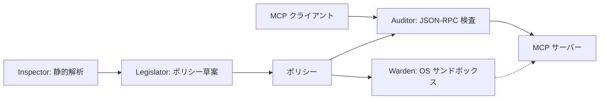

# mcp-writ

> [English](README.md)

ローカル stdio [Model Context Protocol (MCP)](https://modelcontextprotocol.io/) サーバー向けのポリシー執行、OS サンドボックス、JSON-RPC 監査を行います。
mcp-writ は MCP クライアントとサーバーの間に介在し、ファイルシステムのアクセス制御、syscall フィルタリング、ツール許可リスト制御といったきめ細かなセキュリティポリシーを適用します。
ネイティブバイナリの syscall 解析は、Linux x86-64 / AArch64 の ELF バイナリと、macOS ARM64 の Mach-O バイナリが対象です（[対応ターゲット](#対応ターゲット)）。

mcp-writ は制御面のポリシー執行点です。サーバーが提示するツール定義の固定、
`tools/call` の許可・拒否、パスとホストの引数制約、起動環境の制御、監査
ログの記録を担います。データ面の検査 — 応答本文の DLP、HTTP/SSE ゲート
ウェイ、LLM による判定 — は別レイヤーの役割であり、そのような検査器と
直列に接続して使う分担です。

## 特徴

- **多層防御** — Linux・Windows・macOS の OS サンドボックスと JSON-RPC 監査を組み合わせて保護。
- **非特権動作** — root 権限なしで動作。
- **静的解析** — ネイティブ ELF / Mach-O バイナリと対応スクリプト（Python と JavaScript/TypeScript のソース解析。その他のスクリプトは shebang またはコマンド名から識別）を解析し、実行前に必要な権限を調査。
- **ポリシーの生成・検証** — KDL ポリシーの草案を生成。任意のツール検出・自己検証・ドライラン監査で設定の見直しを支援。
- **コンテナ対応** — MCP サーバーのイメージを作成・ラッピングし、Docker / Podman 上でポリシーを適用して実行。
- **ツールのアクセス制御** — ツールの権限と引数を検査し、拒否・未記載のツールを `tools/list` から隠し、機密パスを保護。呼び出し順序の制限も任意で設定。
- **ツール定義の検証** — サーバーが提示するツール定義をスキャンし、ハッシュを照合。変更時は再検証してから呼び出しを再開。

各機能の設定方法、制御の詳細、プラットフォームごとの制約は[詳細ガイド](docs/guide.ja.md)を参照してください。

## アーキテクチャ



Inspector がバイナリと対応するソースを解析し、Legislator が解析結果と任意のツール検出からポリシー草案を作成します。実行時には Warden が OS サンドボックスを適用し、Auditor が MCP 通信を検査します。開発者向けの責務分担は[モジュールガイド](docs/modules.md)を参照してください。

## 対応 MCP バージョン

**stdio** の MCP `2026-07-28` と `2025-11-25` に同一ビルドで対応します。他のバージョンを暗黙に互換とは扱いません。HTTP/SSE トランスポートは設計上の対象外です — stdio が実装済みのランタイムです。
ツール検出、再試行、`inputResponses` の扱いは[プロトコルリファレンス](docs/guide.ja.md#mcp-2026-07-28--2025-11-25--mrtrauditor)を参照してください。

## 対応ターゲット

CLI 本体は Windows / Linux / macOS の x86-64 と ARM64 でビルド・実行でき、リリースアーカイブは6つの組み合わせすべてに提供されます。サンドボックスによる強制は OS ごとに異なります（[保護範囲と制約](#保護範囲と制約)を参照）。

`inspect` と `generate-policy` は、CLI を実行するホストとは独立に、入力バイナリの形式・ISA・ABI に従って解析します。

| 入力 | 結果 |
|---|---|
| ELF64 little-endian、x86-64 / AArch64、Linux ABI | syscall サイトをデコードして解決（x86-64 は `syscall`/`rax`、AArch64 は `svc`/`x8`） |
| Mach-O（thin / fat の universal）、plain `arm64` slice、Darwin | `svc #0x80`/`x16` を XNU の BSD syscall 表と Mach trap 表で解決。他の slice は個別の `unsupported` 状態を保持 |
| 解釈系ペイロード（`python`、`node`、スクリプト、shebang） | ネイティブデコードではなくソース / AST の能力解析 |
| その他の形式・ISA・ABI・slice | `unsupported` / `partial` / `failed` の解析状態として報告。「syscall なし」とは表示しない |

## クイックスタート

Rust と Node.js をインストールし、[ソース](https://github.com/strumbyte/mcp-writ)を取得したディレクトリで実行します。例には版を固定した
`@modelcontextprotocol/server-filesystem` `2026.8.31` を使います。
`/srv/mcp-data` は、サーバーにアクセスさせるディレクトリに置き換えてください。

```sh
cargo install --locked --path . --bin mcp-writ
npm install -g @modelcontextprotocol/server-filesystem@2026.8.31

# チェックアウト直下で、ピン済みの例を継承し、自分のデータルートに
# 1 ツールだけ許可を開く
cat > policy.kdl <<'EOF'
policy version=1
extends "examples/policies/filesystem.kdl"
server "filesystem" {
    tool "read_file" { filesystem { allow "/srv/mcp-data/**" } }
}
EOF

mcp-writ run --dry-run --policy policy.kdl --audit-log ./audit.jsonl -- mcp-server-filesystem /srv/mcp-data
```

MCP クライアント（または JSON-RPC スクリプト）をこの `run` コマンドに
向けると、`/srv/mcp-data` 配下の `read_file` は通り、他のパスを取る
ツールは拒否されます。dry-run は OS サンドボックスを無効にして違反を
記録しつつ転送するため、検証用データを使ってください。ツール一覧の検出、ホスト固有の
`defaults`、サンドボックス有りの検査（`scripts/check-server.sh` /
`.ps1`）、Windows での起動形は[クイックスタート詳解](docs/quickstart.ja.md)
を参照してください。ポリシーをさらに調整する場合は
[ポリシー作成ガイド](docs/policy-authoring.ja.md)へ。

## クライアント設定

MCP クライアントには、サーバーそのものではなく `mcp-writ run` を起動するよう
設定します。Claude Desktop（`claude_desktop_config.json`）と Cursor
（`.cursor/mcp.json`）は `mcpServers.<name>.{command,args,env}` の形です:

```json
{
  "mcpServers": {
    "filesystem": {
      "command": "mcp-writ",
      "args": [
        "run",
        "--policy", "/opt/mcp-config/policy.kdl",
        "--audit-log", "/opt/mcp-logs/audit.jsonl",
        "--", "mcp-server-filesystem", "/srv/mcp-data"
      ],
      "env": {}
    }
  }
}
```

VS Code の `.vscode/mcp.json` では、同じ 3 項目が `mcpServers` の代わりに
トップレベルの `servers` キーの下に入ります。`env` に設定した値はそのまま
起動されるサーバーの環境に引き継がれます。クライアントが PATH 上の
`mcp-writ` を見つけられない場合は、`command` に実行ファイルの絶対パスを
指定します。

## サブコマンド

| コマンド | 説明 |
|---------|------|
| `run` | セキュリティポリシーを適用して MCP サーバーを実行 |
| `inspect` | ネイティブ ELF / Mach-O、または解釈系ペイロードをソース / AST で解析（`--format human\|json\|kdl`） |
| `generate-policy` | バイナリまたはソース解析からポリシー KDL を生成（デフォルトは静的解析のみ。`--live-discovery` と `--self-test` はオプトイン） |
| `run-image` | ポリシーとログのマウント付きでセキュアなコンテナイメージを実行 |
| `wrap-image` | 既存イメージを `mcp-secure-runner` でラップ（ポリシーを焼き込み） |
| `containerize` | MCP サーバーのソースディレクトリからセキュアなイメージをビルド |

### 使用例

```bash
# ネイティブバイナリ、またはスクリプトを解析（解釈系ではネイティブ解析をスキップ）
mcp-writ inspect ./my-mcp-server --format json
mcp-writ inspect --format json server.py

# OS サンドボックスを無効にして実行し、ツール呼び出しの違反を記録・転送
# （サーバー実行に副作用の可能性あり。ツール定義の遮断検査は継続）
mcp-writ run --dry-run --policy policy.kdl --audit-log ./audit.jsonl -- ./my-mcp-server

# 監査ログファイル付きで実行
mcp-writ run --policy policy.kdl --audit-log /var/log/mcp-audit.jsonl -- ./my-mcp-server

# コンテナイメージをラップして実行
mcp-writ wrap-image --policy policy.kdl my-mcp-server:latest
# このローカルビルド例では、変更可能なタグを明示的に許可
mcp-writ run-image --allow-mutable-tag --engine docker --policy policy.kdl --log-dir ./logs my-mcp-server-secured:latest
```

## ポリシーファイル

ポリシーは [KDL](https://kdl.dev/) で定義します。以下は Linux 向けの構文例です。パス、システムコール、ツール名はサーバーに合わせて調整してください。

```kdl
policy version=1

defaults {
    filesystem {
        allow "/usr/lib/**" mode="read"
        allow "/etc/ssl/certs/**" mode="read"
        allow "/workspace/**" mode="write"
    }
    syscalls {
        allow "read" "write" "openat" "close" "fstat" "mmap" "brk" "execve" "exit_group"
    }
}

server "my-mcp-server" {
    // input_responses="auto" は制約を持つツールへの別入力を拒否する。
    tool "read_file" side_effect="read_only" {
        filesystem {
            allow "/workspace/**"
            deny "/home/*/.ssh/**"
        }
    }
    tool "exec_shell" deny=#true
}
```

完全な例（`secret-overlay`、`side_effect`、オプトインの `trajectory`、MRTR の `input_responses` 注記を含む）は [policy.example.kdl](policy.example.kdl) を参照してください。Windows ではホスト allowlist と `deny host="*"` の組み合わせはポリシー読み込み時に拒否されます。詳細は [プラットフォーム注記（Windows）](docs/guide.ja.md#プラットフォーム注記windows) を参照してください。

## 保護範囲と制約

保護の範囲はポリシーと OS に依存します — [OS 別の適用範囲](docs/guide.ja.md#os-別の適用範囲)が各設定領域の OS ごとの扱いを対応づけています。

**ガードが強制すること**

- **Linux（主対象）:** Landlock によるファイルシステム制限と seccomp
  許可リスト、`no_new_privs`。許可したツールの `filesystem` 規則は
  プロセス共通の ruleset に合成されます。
- **Windows:** AppContainer と Job Object、DACL 付与。OS の通信制御は
  全拒否か無制限のいずれかで、宛先単位の OS 制御はありません。
- **macOS:** `sandbox-exec`（旧式の SBPL）がグローバルの `filesystem`
  リストを強制します。ツール単位の `filesystem`/`network` は Auditor
  のみの検査で、`defaults.syscalls` は適用されません。
- **全 OS 共通:** ツール許可リスト、`tools-list-hash` 照合、
  `args_schema`、`side_effect`、秘密パスオーバーレイは `tools/call`
  の引数に対して検査され、違反は JSON-RPC エラーとして返ります。
- **spawn 前:** 起動対象への `binary-hash` / `entrypoint-hash` ピンを
  検証し、解決済み実行ファイル / 第 1 ペイロード引数へ束縛し、
  `exec` 直前に再検証します。ハッシュ不一致と inline eval の起動は
  fail-closed で拒否します。argv から束縛できないペイロード
  （`python -m`、`npx`）は pin されません — `generate-policy` は
  ハッシュを捏造せず `// REVIEW:` コメントでギャップを記録します。

**保証しないこと**

- ツール単位の `filesystem`/`network` 規則は RPC 引数の検査であり、
  ツールごとの OS サンドボックスではありません。サーバー内部の
  アクセスは対象外です。
- `--dry-run` は OS サンドボックス無しでサーバーを実行します。違反は
  記録されつつ転送されるため、実行に副作用が起こり得ます。
- 引数検査と利用の間の TOCTOU は Auditor の対象外です。OS 層が受け持つ
  範囲だけが閉じられます。
- 応答本文の DLP／マスキング、HTTP/SSE トランスポート、LLM による
  判定は別レイヤーの役割です（冒頭の位置づけを参照）。

運用ポリシーを決める前に[セキュリティモデル](docs/guide.ja.md#2-セキュリティモデル)を確認してください。

## ビルドと開発

```sh
cargo build --locked --release --bins
cargo test --locked
```

最小 Rust バージョンは 1.95.0 です。開発と CI で使用するバージョンは `rust-toolchain.toml` で固定しています。バイナリ解析の対象範囲と OS サンドボックスの制約はユーザーガイドを参照してください。結合テストには Python 3、コンテナテストには Docker が必要です。

検証コマンドと CI の役割は[開発手順](docs/development.md)、公開作業は[リリース手順](docs/releasing.md)にまとめています。

既存環境からの移行は [mcp-writ への移行](docs/migration.ja.md)を参照してください。

## ライセンス

MITライセンスで公開しています。詳細は [LICENSE](LICENSE) を参照してください。

## ドキュメント

- [ドキュメント一覧](docs/README.md)
- [ユーザーガイド](docs/guide.ja.md) / [English guide](docs/guide.md)
- [ポリシー作成ガイド](docs/policy-authoring.ja.md) / [Writing a policy](docs/policy-authoring.md)
- [ポリシーの記述例](policy.example.kdl)
- [モジュールガイド](docs/modules.md)
- [開発手順](docs/development.md) / [リリース手順](docs/releasing.md)
