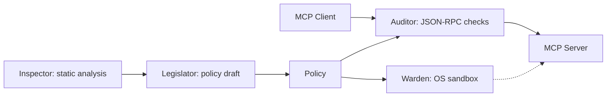

# mcp-writ

> [日本語版 / Japanese](README.ja.md)

Policy enforcement, OS sandboxing, and JSON-RPC auditing for local stdio
[Model Context Protocol (MCP)](https://modelcontextprotocol.io/) servers.
mcp-writ sits between the MCP client and server, enforcing fine-grained security policies — filesystem access control, syscall filtering, and tool allowlisting.
Native syscall analysis covers Linux x86-64 and AArch64 ELF binaries and macOS
ARM64 Mach-O binaries — see [Supported targets](#supported-targets).

mcp-writ is a control-plane enforcement point: it pins the server's tool
definitions, permits or denies `tools/call`, constrains path and host
arguments, controls the launch environment, and records an audit log.
Data-plane inspection — response-body DLP, HTTP/SSE gateways, LLM-based
judgment — is a different layer's job; deploy mcp-writ in series with such
inspectors rather than expecting it to replace them.

## Features

- **Multi-layer defense** — OS sandboxing on Linux, Windows, and macOS, combined with JSON-RPC auditing.
- **Non-privileged operation** — runs without root privileges.
- **Static analysis** — inspect native ELF and Mach-O binaries and supported scripts — Python and JavaScript/TypeScript sources; other script files are identified from their shebang or the command name — to surface capabilities before execution.
- **Policy generation and testing** — generate KDL policy drafts, with optional tool discovery, self-tests, and dry-run auditing to help review them.
- **Container support** — build and wrap MCP server images, then run them with policy enforcement using Docker or Podman.
- **Tool access controls** — check tool permissions and arguments, hide denied or unlisted tools from `tools/list`, protect sensitive paths, and optionally restrict sequences of tool calls.
- **Tool definition verification** — scan advertised tool definitions, verify pinned hashes, and revalidate changes before resuming tool calls.

See the [detailed guide](docs/guide.md) for configuration, enforcement behavior, and platform limitations.

## Architecture



Inspector analyzes binaries and supported source files. Legislator uses those
results and optional live tool discovery to draft a policy. At runtime, Warden
applies the OS sandbox and Auditor checks MCP traffic. See the
[module guide](docs/modules.md) for module responsibilities.

## Supported MCP versions

mcp-writ supports **stdio** MCP `2026-07-28` and `2025-11-25` in the same build.
Other revisions are not assumed compatible. HTTP/SSE transport is out of scope
by design — stdio is the implemented runtime.
See the [protocol reference](docs/guide.md#mcp-2026-07-28--2025-11-25--mrtr-auditor)
for discovery, retries, and `inputResponses` handling.

## Supported targets

The CLI itself builds and runs on Windows, Linux, and macOS on x86-64 and
ARM64; release archives are published for all six combinations. Sandbox
enforcement is OS-specific — see [Security boundaries](#security-boundaries).

`inspect` and `generate-policy` analyze the input binary's format, ISA, and
ABI independently of the host the CLI runs on:

| Input | Result |
|---|---|
| ELF64 little-endian, x86-64 or AArch64, Linux ABI | Syscall sites decoded and resolved (`syscall`/`rax` on x86-64, `svc`/`x8` on AArch64) |
| Mach-O thin or fat (universal), plain `arm64` slice, Darwin | `svc #0x80`/`x16` resolved against XNU BSD syscall and Mach trap tables; other slices keep their own `unsupported` state |
| Interpreter payloads (`python`, `node`, scripts, shebang) | Source/AST capability analysis instead of native decoding |
| Other formats, ISAs, ABIs, or slices | Reported with `unsupported` / `partial` / `failed` analysis state — never presented as "no syscalls" |

## Quick Start

From a [source checkout](https://github.com/strumbyte/mcp-writ) with Rust and
Node.js installed, using the pinned
`@modelcontextprotocol/server-filesystem` `2026.8.31` server. Replace
`/srv/mcp-data` with the directory the server may reach:

```sh
cargo install --locked --path . --bin mcp-writ
npm install -g @modelcontextprotocol/server-filesystem@2026.8.31

# In the checkout, extend the pinned example and open one tool on your data root
cat > policy.kdl <<'EOF'
policy version=1
extends "examples/policies/filesystem.kdl"
server "filesystem" {
    tool "read_file" { filesystem { allow "/srv/mcp-data/**" } }
}
EOF

mcp-writ run --dry-run --policy policy.kdl --audit-log ./audit.jsonl -- mcp-server-filesystem /srv/mcp-data
```

Point an MCP client (or a JSON-RPC script) at that `run` command: `read_file`
under `/srv/mcp-data` goes through and every other path-taking tool is
denied. Dry-run keeps the OS sandbox off and forwards violations while logging
them, so use test
data. For tool discovery, host `defaults`, the sandboxed check
(`scripts/check-server.sh` / `.ps1`), and the Windows launch form, see the
[quickstart walkthrough](docs/quickstart.md); tailor the policy further with
the [policy authoring guide](docs/policy-authoring.md).

## Client configuration

Point your MCP client at `mcp-writ run` instead of launching the server
directly. Claude Desktop (`claude_desktop_config.json`) and Cursor
(`.cursor/mcp.json`) use the `mcpServers.<name>.{command,args,env}` shape:

```json
{
  "mcpServers": {
    "filesystem": {
      "command": "mcp-writ",
      "args": [
        "run",
        "--policy", "/opt/mcp-config/policy.kdl",
        "--audit-log", "/opt/mcp-logs/audit.jsonl",
        "--", "mcp-server-filesystem", "/srv/mcp-data"
      ],
      "env": {}
    }
  }
}
```

VS Code's `.vscode/mcp.json` uses the same three fields under a top-level
`servers` key instead of `mcpServers`. Values set in `env` are passed to the
spawned server's environment as-is unless the policy declares
`defaults.environment` — with an allowlist present, a variable reaches the
child only when it is listed there (or is one of the baseline `PATH` /
system / temp variables). If the client cannot find `mcp-writ` on
`PATH`, put the absolute executable path in `command`.

## Subcommands

| Command | Description |
|---------|-------------|
| `run` | Run an MCP server with security policies applied |
| `inspect` | Analyze a native ELF or Mach-O binary, or an interpreter payload via source/AST (`--format human\|json\|kdl`) |
| `generate-policy` | Generate a policy KDL from binary or source analysis (static-only by default; `--live-discovery` and `--self-test` are opt-in) |
| `run-image` | Run a secured container image with policy and log mounts |
| `wrap-image` | Wrap an existing image with `mcp-secure-runner` (policy baked in) |
| `containerize` | Build a secured image from an MCP server source directory |

### Examples

```bash
# Inspect a native binary, or a script (native analysis is skipped for interpreters)
mcp-writ inspect ./my-mcp-server --format json
mcp-writ inspect --format json server.py

# Log and forward tool-call violations without OS sandboxing (server
# execution may have side effects; blocking tool-definition checks still apply)
mcp-writ run --dry-run --policy policy.kdl --audit-log ./audit.jsonl -- ./my-mcp-server

# Run with audit log file
mcp-writ run --policy policy.kdl --audit-log /var/log/mcp-audit.jsonl -- ./my-mcp-server

# Wrap then run a container image
mcp-writ wrap-image --policy policy.kdl my-mcp-server:latest
# For this local build, explicitly allow the mutable tag
mcp-writ run-image --allow-mutable-tag --engine docker --policy policy.kdl --log-dir ./logs my-mcp-server-secured:latest
```

## Policy File

Policies are defined in [KDL](https://kdl.dev/). This Linux-oriented example illustrates the syntax; adapt paths, syscalls, and tools to your server:

```kdl
policy version=1

defaults {
    filesystem {
        allow "/usr/lib/**" mode="read"
        allow "/etc/ssl/certs/**" mode="read"
        allow "/workspace/**" mode="write"
    }
    syscalls {
        allow "read" "write" "openat" "close" "fstat" "mmap" "brk" "execve" "exit_group"
    }
}

server "my-mcp-server" {
    // input_responses="auto" denies separate inputs on constrained tools.
    tool "read_file" side_effect="read_only" {
        filesystem {
            allow "/workspace/**"
            deny "/home/*/.ssh/**"
        }
    }
    tool "exec_shell" deny=#true
}
```

See [policy.example.kdl](policy.example.kdl) for a complete example (including `secret-overlay`, `side_effect`, opt-in `trajectory`, and the MRTR `input_responses` note). On Windows, a host allowlist combined with `deny host="*"` is rejected at policy load; see [Platform notes (Windows)](docs/guide.md#platform-notes-windows).

## Security boundaries

Protection depends on the policy and platform — the
[per-OS enforcement matrix](docs/guide.md#per-os-enforcement-matrix) maps each
policy area to its per-OS behavior.

**What the guard enforces**

- **Linux (the primary target):** Landlock filesystem confinement plus a
  seccomp allowlist and `no_new_privs`; allowed tools' `filesystem` rules
  merge into one process-wide ruleset.
- **Windows:** AppContainer, Job Object, and DACL grants; OS network control
  is deny-all or unrestricted — no per-destination OS filtering.
- **macOS:** `sandbox-exec` (legacy SBPL) enforces the global `filesystem`
  lists; per-tool `filesystem`/`network` is Auditor-only and
  `defaults.syscalls` is not applied.
- **Everywhere:** tool allowlist, `tools-list-hash`, `args_schema`,
  `side_effect`, and the secret-path overlay are checked on `tools/call`
  arguments; violations return a JSON-RPC error. A `defaults.environment`
  allowlist restricts the child process's environment variables at launch —
  including `--dry-run` and `MCP_WRIT_SKIP_SANDBOX` runs — and the parent
  environment is inherited unchanged when the node is absent.
- **Before spawn:** `binary-hash` / `entrypoint-hash` pins on the launch
  target are verified, bound to the resolved executable / first payload
  argument, and re-verified immediately before `exec` — a hash mismatch or
  an inline-eval launch fails closed. Payloads that cannot be bound from
  argv (`python -m`, `npx`) are not pinned; `generate-policy` records the
  gap as a `// REVIEW:` comment instead of fabricating a hash.

**What it does not guarantee**

- Per-tool `filesystem`/`network` rules inspect RPC arguments; they are not
  a per-tool OS sandbox and do not cover server-internal access.
- `--dry-run` runs the server without the OS sandbox; violations are logged
  and forwarded — execution can have real side effects.
- TOCTOU between argument check and use is outside the Auditor's scope; only
  the OS layer's own coverage closes it.
- Response-body DLP/redaction, HTTP/SSE transport, and LLM-based moderation
  belong to other layers — see the positioning note at the top.

See the [security model](docs/guide.md#2-security-model) before choosing a
deployment policy.

## Build and development

```sh
cargo build --locked --release --bins
cargo test --locked
```

The minimum Rust version is 1.95.0; `rust-toolchain.toml` pins the toolchain used
for development and CI. Binary analysis coverage and OS sandbox support have
platform constraints documented in the user guide. Python 3 is needed for
integration fixtures, and Docker is needed for container tests.

See [Development](docs/development.md) for verification commands and workflow
responsibilities, and [Releasing](docs/releasing.md) for publication procedures.

For existing installations, see [migration to mcp-writ](docs/migration.md).

## License

Licensed under the MIT License. See [LICENSE](LICENSE).

## Documentation

- [Documentation index](docs/README.md)
- [User guide](docs/guide.md) / [日本語ガイド](docs/guide.ja.md)
- [Writing a policy](docs/policy-authoring.md) / [ポリシー作成ガイド](docs/policy-authoring.ja.md)
- [Policy example](policy.example.kdl)
- [Module guide](docs/modules.md)
- [Development](docs/development.md) / [Releasing](docs/releasing.md)
