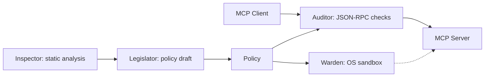

# mcp-writ

> [日本語版 / Japanese](README.ja.md)

A security wrapper for [Model Context Protocol (MCP)](https://modelcontextprotocol.io/) servers.
mcp-writ sits between the MCP client and server, enforcing fine-grained security policies — filesystem access control, syscall filtering, and tool allowlisting.

## Features

- **Multi-layer defense** — OS sandboxing on Linux, Windows, and macOS, combined with JSON-RPC auditing.
- **Non-privileged operation** — runs without root privileges.
- **Static analysis** — inspect native ELF binaries and supported scripts to identify capabilities before execution.
- **Policy generation and testing** — generate KDL policy drafts, with optional tool discovery, self-tests, and dry-run auditing to help review them.
- **Container support** — build and wrap MCP server images, then run them with policy enforcement using Docker or Podman.
- **Tool access controls** — check tool permissions and arguments, protect sensitive paths, and optionally restrict sequences of tool calls.
- **Tool definition verification** — scan advertised tool definitions, verify pinned hashes, and revalidate changes before resuming tool calls.

See the [detailed guide](docs/guide.md) for configuration, enforcement behavior, and platform limitations.

## Architecture



Inspector analyzes binaries and supported source files. Legislator uses those
results and optional live tool discovery to draft a policy. At runtime, Warden
applies the OS sandbox and Auditor checks MCP traffic. See the
[module guide](docs/modules.md) for module responsibilities.

## Supported MCP versions

mcp-writ supports **stdio** MCP `2026-07-28` and `2025-11-25` in the same build.
Other revisions are not assumed compatible. HTTP/SSE transport is not supported.
See the [protocol reference](docs/guide.md#mcp-2026-07-28--2025-11-25--mrtr-auditor)
for discovery, retries, and `inputResponses` handling.

## Quick Start

From a [source checkout](https://github.com/strumbyte/mcp-writ) with Rust installed:

```sh
cargo install --locked --path . --bin mcp-writ

# Create a draft without executing the server
mcp-writ generate-policy --output policy.kdl -- ./my-mcp-server

# Review policy.kdl, then launch through the guard
mcp-writ run --policy policy.kdl --audit-log ./audit.jsonl -- ./my-mcp-server
```

Replace the example command with your server command and arguments. Review the
draft's tool permissions, paths, network access, and syscalls before use; static
analysis does not prove that a policy is complete or safe. Configure your MCP
client to launch `mcp-writ run` with those arguments instead of launching the
server directly. Use `--server <name>` when the policy declares multiple servers.

Follow the [policy authoring guide](docs/policy-authoring.md) to turn the draft into a working policy and check allowed and denied operations.

For containers, keep the Linux `mcp-secure-runner` binary beside the CLI in its
`runners/` directory. See the [container guide](docs/guide.md#6-container-wrapping-deep-dive).

## Subcommands

| Command | Description |
|---------|-------------|
| `run` | Run an MCP server with security policies applied |
| `inspect` | Analyze a native ELF, or an interpreter payload via source/AST (`--format human\|json\|kdl`) |
| `generate-policy` | Generate a policy KDL from binary or source analysis (static-only by default; `--live-discovery` and `--self-test` are opt-in) |
| `run-image` | Run a secured container image with policy and log mounts |
| `wrap-image` | Wrap an existing image with `mcp-secure-runner` (policy baked in) |
| `containerize` | Build a secured image from an MCP server source directory |

### Examples

```bash
# Inspect a native binary, or a script (ELF is skipped for interpreters)
mcp-writ inspect ./my-mcp-server --format json
mcp-writ inspect --format json server.py

# Audit tool-call violations (OS sandbox disabled; manifest checks still apply)
mcp-writ run --dry-run --policy policy.kdl --audit-log ./audit.jsonl -- ./my-mcp-server

# Run with audit log file
mcp-writ run --policy policy.kdl --audit-log /var/log/mcp-audit.jsonl -- ./my-mcp-server

# Wrap then run a container image
mcp-writ wrap-image --policy policy.kdl my-mcp-server:latest
# For this local build, explicitly allow the mutable tag
mcp-writ run-image --allow-mutable-tag --engine docker --policy policy.kdl --log-dir ./logs my-mcp-server-secured:latest
```

## Policy File

Policies are defined in [KDL](https://kdl.dev/). This Linux-oriented example illustrates the syntax; adapt paths, syscalls, and tools to your server:

```kdl
policy version=1

defaults {
    filesystem {
        allow "/usr/lib/**" mode="read"
        allow "/etc/ssl/certs/**" mode="read"
        allow "/workspace/**" mode="write"
    }
    syscalls {
        allow "read" "write" "openat" "close" "fstat" "mmap" "brk" "execve" "exit_group"
    }
}

server "my-mcp-server" {
    // input_responses="auto" denies separate inputs on constrained tools.
    tool "read_file" side_effect="read_only" {
        filesystem {
            allow "/workspace/**"
            deny "/home/*/.ssh/**"
        }
    }
    tool "exec_shell" deny=#true
}
```

See [policy.example.kdl](policy.example.kdl) for a complete example (including `secret-overlay`, `side_effect`, opt-in `trajectory`, and the MRTR `input_responses` note). On Windows, a host allowlist combined with `deny host="*"` is rejected at policy load; see [Platform notes (Windows)](docs/guide.md#platform-notes-windows).

## Security boundaries

Protection depends on the policy and platform. Linux uses Landlock and seccomp;
Windows uses AppContainer; macOS uses `sandbox-exec`. OS-level network controls
are not a universal hostname filter. Per-tool checks inspect RPC arguments and
do not create a separate OS sandbox for each tool.

Response redaction/DLP, HTTP gateways, and LLM-based moderation are outside the
scope of this project. Dry-run mode disables the OS sandbox and forwards tool-call
policy violations; blocking manifest checks still apply. See the
[security model](docs/guide.md#2-security-model) before choosing a deployment policy.

## Build and development

```sh
cargo build --locked --release --bins
cargo test --locked
```

The minimum Rust version is 1.95.0; `rust-toolchain.toml` pins the toolchain used
for development and CI. Native ELF analysis and OS sandbox support have platform
constraints documented in the user guide. Python 3 is needed for integration
fixtures, and Docker is needed for container tests.

See [Development](docs/development.md) for verification commands and workflow
responsibilities, and [Releasing](docs/releasing.md) for publication procedures.

For existing installations, see [migration to mcp-writ](docs/migration.md).

## License

Licensed under the MIT License. See [LICENSE](LICENSE).

## Documentation

- [Documentation index](docs/README.md)
- [User guide](docs/guide.md) / [日本語ガイド](docs/guide.ja.md)
- [Writing a policy](docs/policy-authoring.md) / [ポリシー作成ガイド](docs/policy-authoring.ja.md)
- [Policy example](policy.example.kdl)
- [Module guide](docs/modules.md)
- [Development](docs/development.md) / [Releasing](docs/releasing.md)
