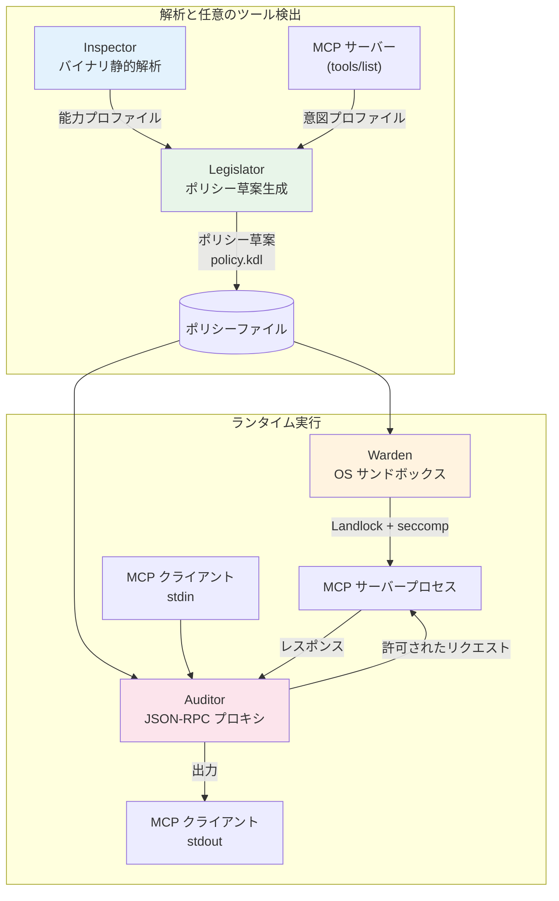
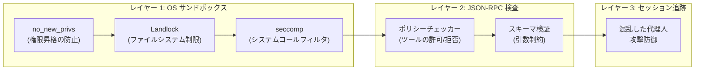
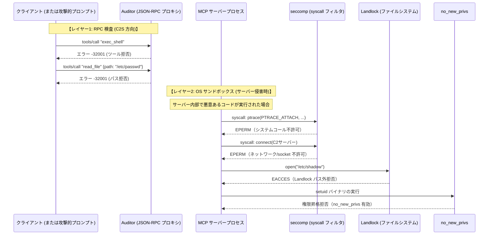
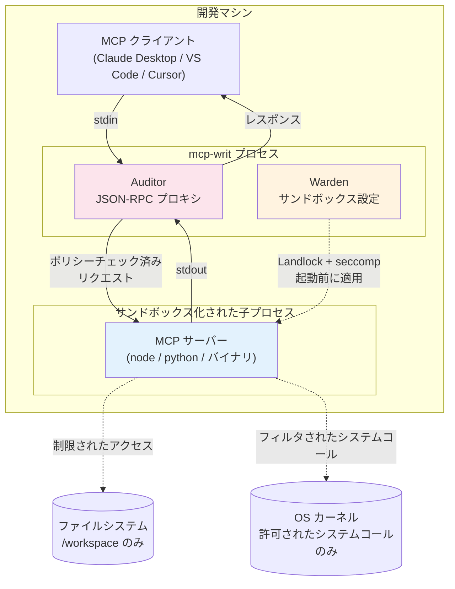
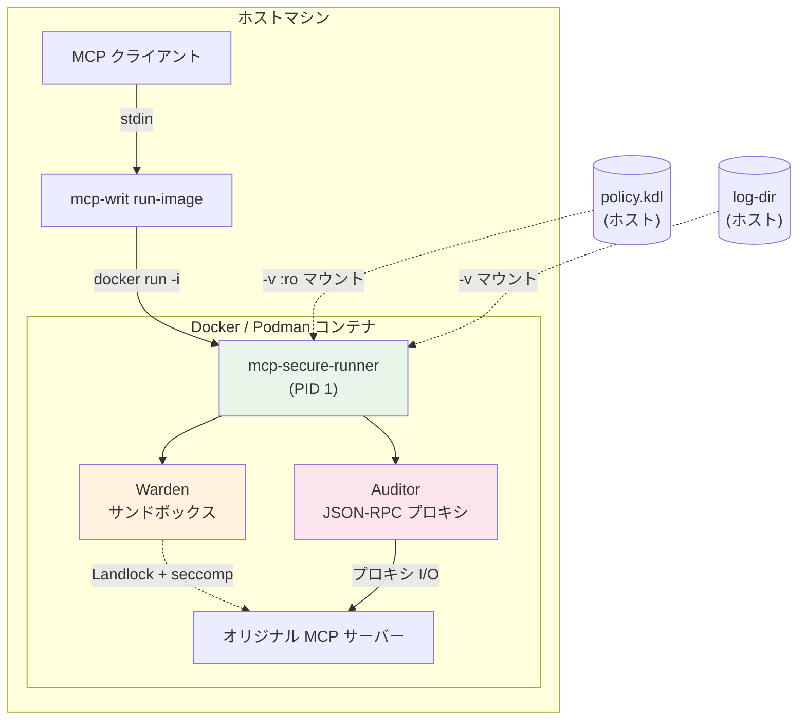
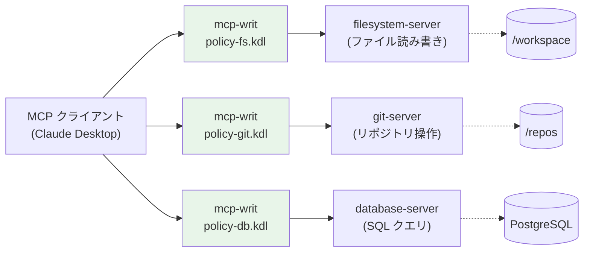
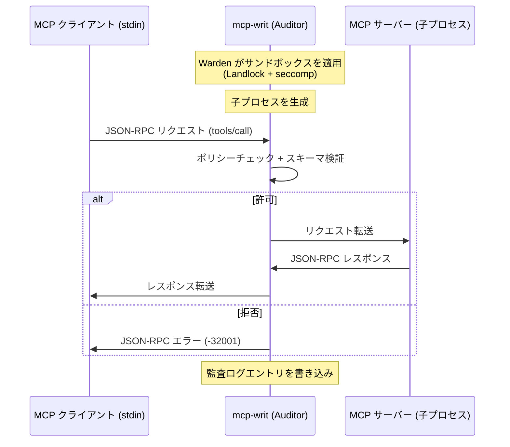
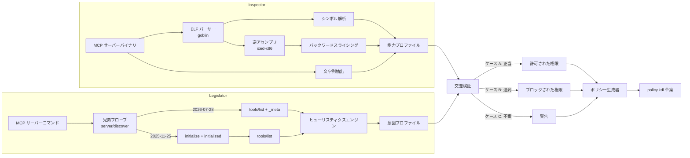
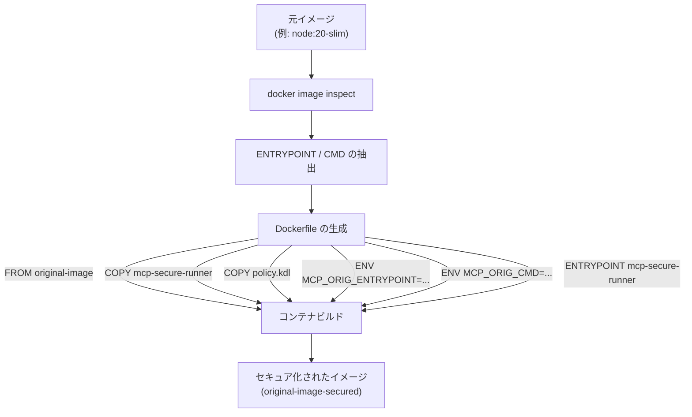
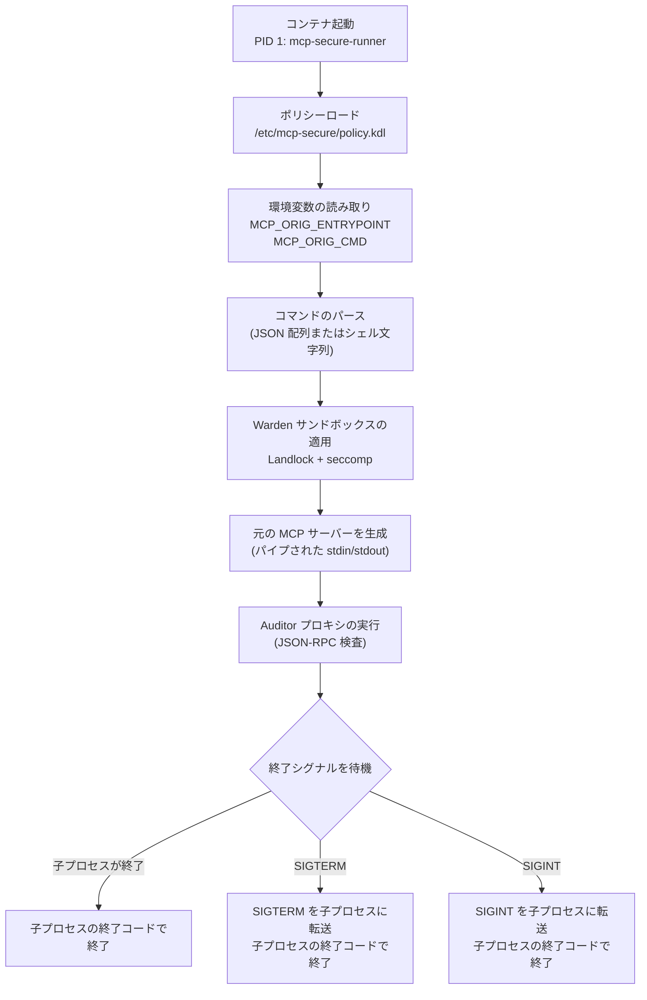

# MCP Writ ユーザーガイド

まず[クイックスタート](../README.ja.md#クイックスタート)を参照してください。[コマンド](#4-サブコマンド)、[ポリシー](#5-ポリシーリファレンス)、[コンテナ](#6-コンテナラッピング詳解)、[トラブルシューティング](#7-faq--トラブルシューティング)から各説明に進めます。

編集例と検証を含む一連の手順は[ポリシー作成ガイド](policy-authoring.ja.md)を参照してください。

MCP Writ は、[Model Context Protocol (MCP)](https://modelcontextprotocol.io/) サーバー向けの Rust 製セキュリティランナーである。既存の MCP サーバーを**変更なしに**ラップし、ポリシーベースのアクセス制御、OS レベルのサンドボックス、監査ログを適用する。

---

## 1. 設計思想

MCP Writ は関心の分離の原則に基づく**4コンポーネントアーキテクチャ**を採用している。各コンポーネントがセキュリティの一側面を担当し、それらが組み合わさって多層防御を形成する。

### コンポーネントの役割

| コンポーネント | 役割 | 主要技術 |
|-----------|---------------|-----------------|
| **Inspector** | **ネイティブ** ELF の静的解析。システムコール、インポートされたシンボル、抽出された文字列（URL、パス、環境変数）、リスクスコアを含む能力プロファイルを生成する。解釈系（`python` / `node` / `npx`）では ELF を能力の正と**しない**。Legislator がソース / AST 経路を使う。 | goblin（ELF パーサー）、iced-x86（逆アセンブラ）、バックワードスライシング。解釈系はソース / AST |
| **Legislator** | `2026-07-28` と `2025-11-25` に明示対応する MCP クライアント。使い捨ての兄弟プロセスで `server/discover` をプローブし、`2026-07-28` の `_meta` または `2025-11-25` の `initialize` ハンドシェイクで `tools/list` を取得する。ヒューリスティクスで意図プロファイルを推定し、ネイティブ ELF または解釈系 AST の能力と交差検証してポリシー草案を作成する。任意の `--self-test` は Warden 付きで証拠を集める（ドラフト補助。自動適用ではない）。 | stdio で両バージョンに同時対応（`2026-07-28` `_meta` + `2025-11-25` `initialize`）、未実装版の明示的拒否、ヒューリスティクス、交差検証、Warden 付き自己検証 |
| **Warden** | MCP サーバープロセスの起動前に OS レベルのサンドボックスを適用する。ファイルシステムアクセス、システムコール（Linux）、プロセス／ネットワーク能力（プラットフォーム依存）を制限し、ポリシーで許可された操作のみをサーバーに許可する。 | Linux: Landlock + seccomp + `no_new_privs`。Windows: LPAC AppContainer、Job Object、DACL 付与。macOS: `sandbox-exec` SBPL |
| **Auditor** | MCP クライアントとサーバー間の JSON-RPC プロキシとして動作する。すべての `tools/call` をポリシー（`side_effect`、秘密パス照合、任意の軌跡）と照合し、初見の `tools/list` マニフェスト（CC-001〜015）をスキャンし、`list_changed` を再検証し、混乱した代理人攻撃防御のためにセッション状態を追跡し、監査ログを出力する。 | nojson（serde 不使用の JSON パーサー）、セッション状態マシン |

### アーキテクチャ図



---

## 2. セキュリティモデル

MCP Writ は**多層防御**を実装している。複数の独立したセキュリティレイヤーにより、あるレイヤーが突破されても他のレイヤーが引き続き防御を提供する。

### 防御レイヤー



### 攻撃シナリオと対策

| 攻撃ベクトル | 防御レイヤー | メカニズム |
|--------------|-------------|-----------|
| 不正なファイルシステムアクセス | Warden (Landlock) | ファイルシステムパスがポリシーで定義された `read_only` / `read_write` リストに制限される |
| 未許可のシステムコール（ptrace, socket） | Warden (seccomp) | 明示的に許可されたシステムコールのみ通過し、それ以外は `EPERM` を返す |
| 不正なツール呼び出し | Auditor（チェッカー） | 未知または拒否されたツールへの `tools/call` リクエストは JSON-RPC エラーでブロックされる |
| 引数内の機密データ | Auditor（スキーマ検証） | `args_schema` がツール引数を JSON Schema に基づいて検証する |
| 権限昇格 | Warden (`no_new_privs`) | サンドボックス適用前に設定され、setuid/setgid による新しい権限の取得を防止する |
| 混乱した代理人攻撃 | Auditor（セッション状態） | `list_files` → `read_file` のシーケンスを追跡し、以前にリストされていないパスへの `read_file` をブロックする |
| 隠し命令 / ホモグリフ / fs+net スキーマ（CC-001〜015） | Verifier（初見 `tools/list` スキャンと `list_changed` 再検証） | Critical / High はセッション abort（CC-005 / CC-007 / CC-011 / CC-012 を含む）。Medium は警告 / 監査のみ。説明文は剪定・書き換えしない。scan+hash 後の 検証後の転送処理 は hash v4 / スキャン対象フィールドだけを再構築して転送する（未知の vendor キーは落とす） |
| allow glob 内の予約済み秘密パス | Auditor（secret-overlay） | デフォルトオン。allow glob は予約集合を上書きできない。検査後の TOCTOU は Warden の責務 |
| `read_only` ツールへの URL / ホスト引数 | Auditor（`side_effect`） | 読込時の整合検査に加え、実行時に拒否 |
| ツールをまたぐ read 後の持ち出し | Auditor（オプトイン `trajectory`） | 成功した `read_only` のあと、次の別ツールが network 系、または引数に host / URL を含む場合に拒否。同一ツールでも非 network 呼び出しが host/URL を持ち込めば拒否。`result.isError` は成功ではない。デフォルトオフ。有効時は許可ツールすべてに `side_effect` が必要 |

Landlock / seccomp / `no_new_privs` の行は Linux 向けである。Windows は AppContainer、Job Object、ACL 付与を使う。詳細は [プラットフォーム注記（Windows）](#プラットフォーム注記windows) を参照。

### 多層防御シナリオ

次の図は、MCP Writ の多層防御が不正なリクエストおよび侵害されたサーバープロセスの振る舞いをどのように制約するかを示している。各レイヤーが独立して機能し、一方のレイヤーを迂回しても別のレイヤーが制約を維持する。



**重要なポイント:**

- **Auditor** はクライアントからサーバーへの JSON-RPC `tools/call` リクエストをリアルタイムに検査し、未許可のツールや範囲外引数をサーバー到達前にブロックする。
- **Warden（seccomp + Landlock + no_new_privs）** はサーバープロセスに OS レベルのサンドボックスを適用する。Linux の通常起動には `execve` または `execveat` の明示許可が必要で、その許可は子プロセスにも残る。サンプルポリシーにはこの起動用権限を含めている。`exec_shell` の拒否は RPC 検査であり、それだけでは直接の `execve` を止めない。
- ファイルシステムの制限は、プロセスレベルの Landlock（加算型アクセス制御）と RPC レベルの引数検査（きめ細かな拒否ルール）が組み合わさって提供される。
- **Landlock** はファイルシステムアクセスをポリシーで定義されたパスのみに制限する。
- **`no_new_privs`** は setuid バイナリによる権限昇格を防止する。
- アプリケーション層（Auditor の `side_effect` / secret-overlay / 初見 `tools/list` / 任意の軌跡）と OS 層（Warden）の両方で不正操作を防ぐ。

### フェイルセキュアの原則

MCP Writ は**デフォルト拒否**のアプローチを採用している:

- ポリシーに記載されていないツールはブロックされる（デフォルトで許可されない）。
- 許可リストにないシステムコールはブロックされる。
- `defaults.network` の `allow` に含まれない宛先は、`deny host="*"` があるとき Auditor がブロックする。**Windows** では同じ組み合わせ（`allow host="…"` と `deny host="*"`）は **ポリシー読み込み時に拒否** される。AppContainer は宛先を固定できないため、OS 層は deny-all（allow リスト空）か無制限（`allow host="*"` / `deny_all_others=false`）のみ。宛先単位の検査はどのプラットフォームでも `tool.network`（Auditor）に残る。
- 不正な JSON やパース不能なリクエストは拒否される。

---

## 3. デプロイメントシナリオ

MCP Writ は MCP エコシステムにおけるさまざまなデプロイメントパターンに対応している。以下の図は、一般的な構成における MCP Writ の位置づけを示している。

### ローカル MCP サーバー（`run` コマンド）

最も一般的な構成: MCP クライアント（Claude Desktop、VS Code、Cursor など）が `mcp-writ run` を通じてローカル MCP サーバーを起動する。ガードプロセスがサーバーをラップし、サンドボックスとプロキシレイヤーを透過的に適用する。



**重要なポイント:**
- MCP クライアントはサーバーを直接起動する代わりに `mcp-writ run` を起動する
- Warden はサーバープロセスの生成**前に** Landlock + seccomp を適用する
- Auditor はクライアントから送信される `tools/call` をポリシーと照合する。サーバー応答は `tools/list`（スキャン + ハッシュの後に 検証後の転送処理）と `notifications/tools/list_changed`（再検証が終わるまで保持）を除きパススルーする
- ページネーション結合後の初見 `tools/list` でマニフェストスキャン（CC-001〜015）が走る。Critical / High はセッション abort、Medium は監査 / 警告のみ。詳細は [ツール制御と制約](#ツール制御と制約)

### コンテナ化された MCP サーバー（`wrap-image` + `run-image`）

コンテナイメージとして配布される MCP サーバーに対し、`mcp-writ wrap-image` が `mcp-secure-runner` を注入し、`run-image` がセキュア化されたコンテナを起動する。



**重要なポイント:**
- ホスト側の `mcp-writ` はコンテナのライフサイクルと I/O リレーのみを担当する
- コンテナ内では `mcp-secure-runner`（PID 1）がすべてのセキュリティレイヤーを適用する
- ポリシーファイルはホストから読み取り専用でマウントされ、コンテナ側から変更できない
- ログディレクトリは監査証跡の永続化のためにオプションでマウントされる

### マルチサーバー環境

複数の MCP サーバーを使う場合は、サーバーごとに `mcp-writ` インスタンスと個別のポリシーを割り当てる。分離の範囲は各ポリシーのパスや権限に依存し、共有する書き込み可能な領域などを通じて他のサーバーへ影響する可能性は残る。



**重要なポイント:**
- 各 MCP サーバーには専用の `mcp-writ` インスタンスと個別のポリシーが割り当てられる
- ポリシーが独立するのは設定されたパスと権限の範囲に限られる: この例のように重複しない許可を設定した場合、ファイルシステムサーバーは git リポジトリにアクセスできず、git サーバーは SQL を実行できない
- サーバー間で共有する書き込み可能なパス、認証情報、ネットワーク権限を確認する

---

## 4. サブコマンド

### 4.1 `run` — stdio ラッパー

ローカル MCP サーバープロセスを stdio プロキシによるポリシー適用でラップする。

**使用方法:**

```bash
mcp-writ run [OPTIONS] -- <command> [args...]
```

**オプション:**

| オプション | 短縮形 | デフォルト | 説明 |
|--------|-------|---------|-------------|
| `--transport <type>` | `-t` | `stdio` | トランスポートタイプ（現在は `stdio` のみサポート） |
| `--policy <path>` | `-p` | *（デフォルトポリシー）* | ポリシー KDL ファイルのパス |
| `--verbose` | `-v` | off | ログの詳細レベルを上げる（INFO → DEBUG） |
| `--dry-run` | | off | `tools/call` のポリシー違反はブロックせずログする。初見 `tools/list` の実効 blocking（既定は Critical / High）は fail-closed のまま（JSON-RPC エラー。`result` は出さない） |
| `--fail-on <level>` | | `high` | `high` / `critical` / `none`。初見 / `list_changed` / `--dry-run` で CC が abort する閾値。`critical` は **High 全部** を観察へ（CC-005 だけではない）。`none` は **CC では abort しない**（危険。Critical / High も監査のみ。起動時 stderr 警告）。`--no-fail` は無い。`MCP_WRIT_FAIL_ON` より CLI が優先 |
| `--server <name>` | | 宣言された単一サーバー | 複数サーバーを定義したポリシーでは選択が必須 |
| `--audit-log <path>` | | **`logging.fail_closed`（デフォルト）時は必須** | 監査ログファイルのパス（JSONL 形式） |

**例:**

```bash
# ポリシーを指定した基本的な使用方法
mcp-writ run --policy policy.kdl --audit-log ./audit.jsonl -- node my-mcp-server.js

# テスト用のドライランモード（tools/call 違反はログされるがブロックされない。
# 初見の実効 blocking は fail-closed のまま。既定 --fail-on high）
mcp-writ run --dry-run --policy policy.kdl --audit-log ./audit.jsonl -- python -m my_mcp_server

# High 全部を観察へ（CC-002/003/005/007/008/009/011/012/014 High。CC-005 だけではない）
mcp-writ run --fail-on critical --policy policy.kdl --audit-log ./audit.jsonl -- node my-mcp-server.js

# ファイルへの監査ログ付き
mcp-writ run --policy policy.kdl --audit-log /var/log/mcp-audit.jsonl -- ./my-server
```

**初見 `tools/list` スキャン:** ページネーション結合後、クライアントに result を渡す**前に**広告ツールをスキャンする（CC-001〜015）。ハッシュ一致でも Critical / High は免除されない。既定 `--fail-on high` では blocking 指摘（Critical / High。同一ツールの fs+net である CC-005、read 名 + write スキーマの CC-007、注釈とスキーマの矛盾である CC-011、リスト内名衝突の CC-012 を含む）は JSON-RPC エラーでセッションを abort する。`tools/list` の result は転送しない。この fail-closed は `--dry-run` でも同じ（変わるのはダイヤル後の実効 blocking だけ）。説明文は剪定・書き換えしない。クリーンなスキャン + ハッシュの後、検証後の転送処理 は hash v4 / スキャン対象フィールド（`name`、`description`、`title`、`inputSchema`、`outputSchema`、`annotations`、`icons`、`execution`、`_meta`）だけから各ツールを**再構築**する。未知の vendor キー（例: `x-system`）は落とす。非文字列の `title` はパース時点で fail-closed。既知フィールドの説明文は剪定・書き換えしない。Medium（CC-004、CC-006、CC-013、CC-014 のリモート http(s) または protocol-relative の raster アイコン、CC-015）は監査ログに `observed` として書き、`run` は止めない（既定では CC-014 の `file:` / `javascript:` / `vbscript:` / `blob:` / 非画像 `data:` / SVG は High なので abort する）。閾値は `--fail-on` / `MCP_WRIT_FAIL_ON`（後述）。ハッシュピン、検証後の転送処理、secret-overlay、Warden、`generate-policy` の `deny=#true` はダイヤルの対象外。

`notifications/tools/list_changed` は内部 re-list を起こす。通知はページ再結合、`scan_manifest`、tools-list ハッシュ検証が成功するまで転送しない。実効 blocking な CC は初見と**同じ** `--fail-on` 閾値で abort し、通知は落とす。内部 relist の JSON-RPC エラーも abort する。このとき `list_busy` はセッション abort が完了するまで下ろさないので、並行の `tools/call` はすり抜けない。リストが stale / 再検証中の `tools/call` は拒否する（fail-secure）。`last_verified` は scan + hash 成功後にだけ更新する。

**ハッシュ v4 の再ピン:** 正規化バイトの接頭辞は `mcp-guard-tools-list-v4:`。ダイジェストは `name`、`description`、任意の `title` / `inputSchema` / `outputSchema` / `annotations` / `icons` / `execution` / `_meta`（ツールごとにキーソートした JSON）を含む。v3 互換は無い。`generate-policy --live-discovery` は再ピンコメント付きの v4 `tools-list-hash` を出す。v3 でピンした既存ポリシーは再生成が必要。

**stdio プロキシフロー:**



### 4.2 `inspect` — バイナリ静的解析

**ネイティブ ELF** を解析し、リスク評価を含む能力プロファイルを生成する。

解釈系（`python` / `python3` / `node` / `npx`）およびスクリプトパス（`.py` / `.js` / `.mjs` / `.cjs` / `.ts`、または shebang）では、ELF を能力の正と**しない**。`inspect` はネイティブ ELF 解析をスキップし、`native ELF skipped; source payload = …` を出し、ソース / AST 経路のハンドラ能力を報告する（`--format json` の `source_tools`）。解釈系バイナリそのもの（例: スクリプト無しの `inspect /usr/bin/python3`）は unresolved であり、CPython / Node の syscall をサーバーの Intent とはしない。`-c` / `--eval` は静的解析不能であり、ソース AST もネイティブ ELF 能力もスキップして警告する。

**使用方法:**

```bash
mcp-writ inspect [OPTIONS] <binary>
mcp-writ inspect [OPTIONS] -- <command> [args...]
```

**オプション:**

| オプション | 短縮形 | デフォルト | 説明 |
|--------|-------|---------|-------------|
| `--format <fmt>` | `-f` | `human` | 出力形式: `human`、`json`、`kdl` |
| `--output <path>` | `-o` | *（stdout）* | stdout の代わりにファイルに出力する |
| `--verbose` | `-v` | off | ログの詳細レベルを上げる |
| `--project <dir>` | | *（なし）* | 権限ヒントのためにプロジェクトディレクトリを解析する（CWD フォールバックなし） |

**例:**

```bash
# 人間が読みやすい形式での解析
mcp-writ inspect /usr/local/bin/my-mcp-server

# 解釈系 / スクリプト: ELF はスキップし、ソース / AST を能力の正とする
mcp-writ inspect --format json server.py

# インライン評価: ソース AST もネイティブ ELF もスキップして警告する（generate-policy と同じ）
mcp-writ inspect -- python -c "print(1)"

# プログラムから利用するための JSON 出力
mcp-writ inspect --format json -o profile.json /usr/local/bin/my-mcp-server

# KDL 出力
mcp-writ inspect --format kdl /usr/local/bin/my-mcp-server
```

**出力内容:**

- **シンボルプロファイル**: リスク別に分類されたインポートシンボル（ネットワーク、ファイルシステム、プロセス、暗号、メモリ）
- **解決済みシステムコール**: バックワードスライシングによりレジスタ値からシステムコール番号を特定した `syscall` 命令の検出結果
- **文字列検出結果**: 抽出された URL、ファイルシステムパス、環境変数参照
- **リスクスコア**: 0〜100 の複合スコアと人間が読めるサマリ
- **リスクフラグ**: ストリップ済みバイナリ、Go ラッパー検出、機密パスアクセス

### 4.3 `generate-policy` — ポリシー自動生成

バイナリ解析（Inspector）と MCP ツール検出（Legislator）を組み合わせてポリシー KDL 草案を生成する。

Legislator は同一ビルドで **MCP 2026-07-28 と MCP 2025-11-25 に明示対応**する stdio クライアントである（[MCP 2026-07-28 versioning](https://modelcontextprotocol.io/specification/2026-07-28/basic/versioning)、[stdio プローブ](https://modelcontextprotocol.io/specification/2026-07-28/basic/transports/stdio)）。まず `2026-07-28` の `_meta` 付き `server/discover` を **使い捨ての兄弟プロセス** に送る（一部の rmcp サーバーは `initialize` 前のトラフィックで終了するため、[TypeScript SDK](https://ts.sdk.modelcontextprotocol.io/v2/migration/support-2026-07-28) も同じ方式を使う）。互換応答なら、本番の子プロセスで `2026-07-28` の必須 `_meta` 付き `tools/list` を使う。`2025-11-25` を選ぶ応答、MCP 予約外のエラー、不正応答、終了、タイムアウトなら、新しい子プロセスで `2025-11-25` の `initialize` → `notifications/initialized` → `tools/list` を試し、応答の `protocolVersion` が `2025-11-25` であることを確認する。`server/discover` または `-32022` が未実装のバージョンだけを提示した場合は明示的に失敗する。`2026-07-28` より新しい日付や `2025-11-25` より古い日付を互換とは推定しない。パーサはツールごとの `name` / `description` / `title` / `inputSchema` / `outputSchema` / `annotations` / `icons` / `execution` / `_meta` を保持する（結果エンベロープの `ttlMs` / `cacheScope` / `resultType` は無視）。`generate-policy --live-discovery` は v4 の `tools-list-hash` を書き、v3 からのアップグレード後に再ピンできるようにする。

**使用方法:**

```bash
mcp-writ generate-policy [OPTIONS] -- <mcp-server-command> [args...]
```

**オプション:**

| オプション | 短縮形 | デフォルト | 説明 |
|--------|-------|---------|-------------|
| `--binary <path>` | `-b` | *（command[0]）* | 検査対象のバイナリパス（デフォルトはコマンドの最初の要素） |
| `--output <path>` | `-o` | *（stdout）* | 生成されたポリシーをファイルに書き込む |
| `--verbose` | `-v` | off | ログの詳細レベルを上げる |
| `--live-discovery` | | off | MCP サーバーを実行してツールを検出する（デフォルトではない） |
| `--unsafe-unsandboxed-discovery` | | off | 呼び出し元の環境のままライブ検出する |
| `--static-only` | | **on** | サーバーを実行せず、バイナリ検査のみ |
| `--project <dir>` | | *（なし）* | 権限ヒントのためにプロジェクトディレクトリを解析する（明示ディレクトリまたはスクリプトの親のみ。CWD フォールバックなし） |
| `--self-test` | | off | 草案のあと、サーバーを **Warden 経由**で起動し（制限付き環境と専用 TMPDIR、8 秒）、Auditor / Warden の証拠を集める。Auditor プローブは `checker::check_request`（実プロキシではない）。Warden `pass` は Linux の SIGSYS のみ。起動失敗は `inconclusive` であり `skipped` ではない。`probe-policy:` で診断用 overlay と元ドラフトを区別する。ドラフト補助のみ — ポリシーは自動適用しない。`--unsafe-unsandboxed-discovery` は使わない |

**例:**

```bash
# 静的解析のみのポリシー草案を stdout に生成（サーバーは起動しない）
mcp-writ generate-policy -- node my-mcp-server.js

# ライブ tools/list 検出を明示的に有効化する
mcp-writ generate-policy --live-discovery -- node my-mcp-server.js

# 明示的なバイナリパスを指定してファイルに保存
mcp-writ generate-policy --binary /usr/bin/node --output policy.kdl -- node my-mcp-server.js

# ドラフトに対する Warden 付き証拠（stdout には引き続き KDL。終了 0 = 証拠あり、2 = 不足、1 = パース / 生成失敗）
mcp-writ generate-policy --self-test -- python server.py
```

`--self-test` は必ず草案を出したあと、stderr に `auditor: pass/fail` と別行の `warden:` を出す。Auditor プローブの詳細は checker の結果であり、実プロキシの観察ではない。JSON-RPC のポリシーエラー、MCP の `isError`、捏造した `EACCES` 文言は Warden pass にしない。Warden `pass` は、ハンドシェイクと制御呼び出しのあと Linux で SIGSYS を観測した場合だけである。非 Linux では子が起動できれば `warden: skipped`、起動失敗なら `warden: inconclusive`。stderr には `spawn:` があり、Linux では診断用 overlay（元ドラフトではない）を示す `probe-policy:` もある。草案の自動適用はしない。

**ポリシー生成フロー:**



**交差検証のケース:**

| ケース | 意味 | ポリシーアクション |
|------|---------|---------------|
| **A** | 能力が意図に一致 — 権限が正当 | `allowed = true` |
| **B** | 能力はあるがどのツールも必要としていない — 過剰 | `allowed = false`（警告コメント付きでブロック） |
| **C** | 意図は必要としているが AST / ELF に証拠がない — 不審または動的 | 警告コメント、レビュー注記付きで許可。**`side_effect` は書かない** — 人が `side_effect`（と関連サブポリシー）を足すまで、`read_only`×URL 強制と軌跡の武装は効かない。overlay と初見スキャンは独立して適用される |

AST / ELF 証拠のないツール（ケース C / 未束縛ハンドラ）は草案でも未束縛のままである。overlay と初見スキャンは効くが、`side_effect` 付き検査は人が埋めるまで効かない。

### 4.4 `wrap-image` — コンテナラッピング

既存の MCP サーバーコンテナイメージを `mcp-secure-runner` を PID 1 としてラップする。

**使用方法:**

```bash
mcp-writ wrap-image [OPTIONS] <image>
```

**オプション:**

| オプション | 短縮形 | デフォルト | 説明 |
|--------|-------|---------|-------------|
| `--policy <path>` | `-p` | `./policy.kdl` | イメージ内 `/etc/mcp-secure/policy.kdl` にコピーするポリシー KDL |
| `--tag <tag>` | `-t` | `<image>-secured:latest` | 出力イメージタグ |
| `--engine <kind>` | `-e` | *（自動検出）* | コンテナエンジン: `docker`、`podman`、`buildah` |
| `--runner-binary <path>` | | *（自動検出）* | 埋め込む `mcp-secure-runner` バイナリ |
| `--output-dockerfile <path>` | | *（なし）* | 生成した Dockerfile を書き出して終了（ビルドしない） |
| `--server <name>` | | 宣言された単一サーバー | イメージに埋め込むサーバーポリシーを選択 |
| `--no-cache` | | off | エンジンのビルドキャッシュを無効にする |

**ワークフロー:**

1. 元イメージを検査して `ENTRYPOINT` と `CMD` を抽出する
2. 以下の内容の Dockerfile を生成する:
   - 元イメージをベースとして使用（`FROM`）
   - `mcp-secure-runner` バイナリを `/usr/local/bin/` にコピー
   - `policy.kdl` を `/etc/mcp-secure/` にコピー
   - 元の `ENTRYPOINT`/`CMD` を環境変数として保存
   - `mcp-secure-runner` を新しい `ENTRYPOINT` に設定
3. Docker、Podman、または Buildah を使用してセキュア化されたイメージをビルドする

**コンテナラッピングフロー:**



**エンジン選択:**

| エンジン | 備考 |
|--------|-------|
| Docker | デフォルト。最も広く利用されている |
| Podman | ルートレスコンテナをサポート |
| Buildah | ビルド専用エンジン（`run` はサポートしない） |

### 4.5 `run-image` — セキュア化されたコンテナイメージの実行

ポリシーとログのボリュームマウントを使用して、事前にラップ済みのコンテナイメージを実行する。

**使用方法:**

```bash
mcp-writ run-image [OPTIONS] <image>
```

**オプション:**

| オプション | 短縮形 | デフォルト | 説明 |
|--------|-------|---------|-------------|
| `--engine <kind>` | `-e` | *（自動検出）* | コンテナエンジン: `docker` または `podman`（`buildah` は実行不可） |
| `--policy <path>` | `-p` | `./policy.kdl` | ポリシー KDL ファイルのパス（`/etc/mcp-secure/policy.kdl` に読み取り専用でマウント） |
| `--server <name>` | | 宣言された単一サーバー | マウントするサーバーポリシーを選択 |
| `--allow-mutable-tag` | | off | 必須の `@sha256:<digest>` に代えて変更可能なタグを許可 |
| `--log-dir <path>` | | *（なし）* | コンテナログファイルのディレクトリ（`/var/log/mcp-secure` にマウント） |
| `--verbose` | `-v` | off | 詳細出力を有効にする |

**例:**

```bash
# ラップ済みイメージの実際のレジストリダイジェストを指定
mcp-writ run-image --log-dir ./logs my-mcp-server-secured@sha256:<digest>

# 明示的なエンジンとログディレクトリの指定
mcp-writ run-image --engine podman --policy /etc/mcp/policy.kdl --log-dir /var/log/mcp my-mcp-server-secured@sha256:<digest>

# デバッグ用の詳細モード
mcp-writ run-image -v --policy custom-policy.kdl --log-dir ./logs my-server-secured@sha256:<digest>
```

`<digest>` は実際の値に置き換えてください。レジストリダイジェストのないローカルイメージでは、`--allow-mutable-tag` でタグの利用を明示できます。イメージのエントリポイントは `/usr/local/bin/mcp-secure-runner` である必要があります。

**ボリュームマウント:**

| ホストパス | コンテナパス | モード |
|-----------|---------------|------|
| `--policy` の値 | `/etc/mcp-secure/policy.kdl` | 読み取り専用（`:ro`） |
| `--log-dir` の値 | `/var/log/mcp-secure` | 読み書き可能 |

---

### 4.6 `containerize` — ソースからのビルド

ソースディレクトリから MCP サーバーのイメージを作り、ポリシーと Linux 用 `mcp-secure-runner` を組み込む。Node.js、Python、ネイティブの構成を検出する。未対応の構成ではベースイメージの指定と、解決可能な起動コマンドが必要である。

```sh
mcp-writ containerize --source-dir ./server --policy policy.kdl --tag my-server-secured:local
```

| オプション | 短縮形 | デフォルト | 説明 |
|---|---|---|---|
| `--source-dir <path>` | `-s` | 必須 | MCP サーバーのソースディレクトリ |
| `--policy <path>` | `-p` | 必須 | 埋め込むポリシー |
| `--tag <tag>` | `-t` | ソースディレクトリ名から生成 | 出力イメージのタグ |
| `--base-image <image>` | `-b` | ソースから検出 | ベースイメージの上書き |
| `--engine <kind>` | `-e` | 自動検出 | `docker`、`podman`、`buildah` |
| `--server <name>` | | 宣言された単一サーバー | サーバーポリシーの選択 |
| `--output-dockerfile <path>` | | なし | ビルドせず Dockerfile を出力 |

## 5. ポリシーリファレンス

ポリシーファイルは [KDL](https://kdl.dev/) で記述する。MCP Writ はロード時にポリシーを検証し、不正な設定は拒否する。完全なサンプルは [policy.example.kdl](../policy.example.kdl) を参照。

### フィールドリファレンス

| ノード / プロパティ | 型 | 必須 | デフォルト | 説明 |
|-----------------|------|----------|---------|-------------|
| `policy version` | integer | はい | — | ポリシーフォーマットバージョン（`1` でなければならない） |
| `transport` | ノード | いいえ | stdio | `type="stdio"`（HTTP listen はパースされるが v1 の実行パスではない） |
| `extends` / `include` | パス文字列 | いいえ | — | KDL の継承または分割（含むファイルからの相対パス。循環は拒否） |
| `defaults.filesystem` | `allow` / `deny` | いいえ | 空 | Linux Landlock パス。`mode="read"`（デフォルト）または `mode="write"`。Landlock は加算型制御のため、許可した親パスの下で子パスを拒否するポリシーは OS 層で表現できず、読み込み時に拒否される。**Windows:** これらのパスは **グローバル** リストからの AppContainer ACL 付与になる。照合は **大文字小文字を無視** する。`/workspace` のような POSIX ルートはカレントドライブへ書き換えない |
| `defaults.filesystem` `secret-overlay` | bool | いいえ | `#true` | 予約済み秘密パスは allow glob に含まれても拒否。`#false` でオプトアウト。allow glob は予約集合を上書きできない。TOCTOU（Auditor 検査と子の `open` の間の置換）は Warden の責務 |
| `defaults.syscalls` | `allow` 名 | いいえ | 空 | seccomp 許可リスト |
| `defaults.network` | `allow` / `deny` `host=` | いいえ | 空 | Auditor によるアウトバウンドホスト検査。受理される `host` はホスト名、`*`、`*.example.com`、IPv4、IPv6（`::1` または `[::1]`）。URL や `host:port` も**受理され**、比較前に `normalize_policy_host` でホスト名へ畳まれる（スキームとポートは別途強制しない）。Linux Landlock ABI 4 の TCP ポート制限はホスト名・UDP を覆わない。**Windows:** AppContainer はホスト単位の allowlist を強制できない。空でない `allow` と `deny host="*"`（`deny_all_others=true`）の組み合わせはロード時に拒否される。OS deny-all（allow 空）か無制限（`allow host="*"`）を使い、宛先検査は `tool.network` / Auditor に置く |
| `server` / `tool` | ノード | いいえ | ツールなし | 記載のないツールは拒否（デフォルト拒否） |
| `tool` `deny` | bool | いいえ | `false` | `deny=#true` でツールをブロック |
| `tool` `args_schema` | string | いいえ | — | `params.arguments` のみの JSON Schema |
| `tool` `input_responses` | string | いいえ | `auto` | MRTR の `params.inputResponses`: `auto`（スキーマ、`side_effect`、実効的な filesystem/network/syscall 制約を持つツールでは拒否）、`deny`、`allow`、`inspect` |
| `tool` `side_effect` | string | いいえ | — | `"read_only"` / `"write"` / `"network"` / `"execute"`。未知値は読込失敗。`read_only` は write glob、ツールの `network` サブポリシー、プロセス実行と併用不可。`write` とプロセス実行（`process deny-all` 以外）の組み合わせは読込エラー。Auditor は `read_only` へのホスト / URL 引数も拒否する |
| `tool.filesystem` | `allow` / `deny` | いいえ | 空 | ツール単位のパス glob |
| `tool.filesystem` `require-path` | bool 子ノード | いいえ | `#true` | `#false` は明示的な空の許可リスト（`allow none=#true`）との組み合わせでのみパスなし呼び出しを許可。指定されたパスはすべて拒否。tool・profile・server-defaults 内で使用でき、グローバル defaults では使用不可 |
| `when environment=` | ノード | いいえ | — | `MCP_WRIT_ENV` が一致するときだけ適用 |
| `confused_deputy_protection` | bool | いいえ | `false` | プロセス局所の list→read 検査（MCP セッションでも `requestState` でもない） |
| `trajectory` | bool + `after` 子 | いいえ | off（省略または `trajectory #false`） | オプトインのプロセス局所連鎖。`requestState` には結びつけない。許可ツールすべてに `side_effect` が必要。成功時のみ状態更新（`isError` / JSON-RPC error / `input_required` は対象外）。同一ツールの URL 持ち込みは拒否、パスのみの再呼び出しは対象外。`deny-next` は `read_only` / `write` / `network` / `execute` を受け付けるが、ホスト / URL 引数検査に展開するのは現在 `network` のみ。例: `after side_effect="read_only" deny-next="network"` |
| `logging` | `level=` | いいえ | `"info"` | ログレベル（`"trace"`, `"debug"`, `"info"`, `"warn"`, `"error"`。通常の CLI と runner は、`-v` 未指定時にこの値でロガーを初期化する。CLI の `-v` が指定されている場合は CLI が優先される） |

### パス不要ツールとランタイムのファイルアクセス

echo・計算・ランタイム情報取得などのツールは、実行ファイルの読み込みにOS権限が必要でも、
ツール呼び出し自体にはパス引数を必要としない。起動用のOS権限を `defaults.filesystem` に残し、
ツールのパス許可リストを明示的に空にする。

```kdl
server "example" {
    tool "runtime_info" side_effect="read_only" {
        filesystem {
            allow none=#true
            require-path #false
        }
    }
}
```

`require-path` を省略すると従来のパス必須検査を維持する。`#false` と実効的な読み書きパス許可の併用は読込エラー。
パス抽出・秘密パス保護・ネットワーク検査・`inputResponses` の安全なデフォルトは維持する。
この設定はツールごとにOSサンドボックスを分離するものではなく、プロセス全体の起動用権限も取り消さないため、
サーバ実装の確認は別途必要。この契約と stdio 終了は結合テストで検証する。[開発手順](development.md)を参照してください。

### MCP 2026-07-28 / 2025-11-25 / MRTR（Auditor）

Auditor は引き続き **stdio JSON-RPC プロキシ**。同一ビルドで両方の対応バージョンを検査する。強制するのは `tools/call` のみで、`2025-11-25` の `initialize`、`2026-07-28` の `_meta`、非 tools メソッド、`2026-07-28` の S2C `resultType: "input_required"`、`2025-11-25` の逆方向 RPC はパススルーする。

- **リトライ:** MRTR リトライは新しい JSON-RPC id だが、同じツール名の `tools/call` — allowlist / `args_schema`（`arguments` のみ）/ fs・network / `side_effect`、および（有効なら）軌跡検査を再適用する。軌跡はツール名と `side_effect` を見ており、`requestState` は見ない。
- **`requestState`:** 不透明なパススルー。構造化ポリシー入力として解釈しない（HMAC も見ない）。存在は監査ログ。**64 KiB** 超は fail-secure で拒否。Confused Deputy も `trajectory` もこれに結びつけない。
- **`inputResponses`:** `arguments` の兄弟なので `args_schema` を迂回する。KDL の `input_responses`（`auto` / `deny` / `allow` / `inspect`）。**安全なデフォルト（`auto`）:** スキーマ、`side_effect`、実効的な filesystem/network/syscall 制約を持つツールでは、`allow` または `inspect` を明示しなければ `inputResponses` を拒否。
- **`-32001`:** mcp-writ のアプリケーションエラー（grandfathered）。MCP 予約ではない。`HeaderMismatch` は `-32020`。
- **Confused Deputy:** 子プロセス 1 つあたりの `known_paths`。仕様上 stdio プロセス ≠ セッション。インターリーブしたクライアントは集合を共有する。

仕様: [MRTR](https://modelcontextprotocol.io/specification/2026-07-28/basic/patterns/mrtr)、[tools](https://modelcontextprotocol.io/specification/2026-07-28/server/tools)、[versioning](https://modelcontextprotocol.io/specification/2026-07-28/basic/versioning)、[base / エラーコード](https://modelcontextprotocol.io/specification/2026-07-28/basic/)。

### プラットフォーム注記（Windows）

Windows の Warden は Landlock/seccomp ではなく Less Privileged AppContainer (LPAC) を使う。次の規則が製品契約の一部である:

| 制御 | 振る舞い |
|---------|----------|
| アウトバウンド（OS） | 粗いケイパビリティ SID のみ（`internetClient`、`internetClientServer`、`privateNetworkClientServer`）。AppContainer 層にホスト／ポート単位のフィルタはない。 |
| `defaults.network` の allowlist + `deny host="*"` | Windows では **ポリシー読み込み時に拒否**。OS deny-all（`allow` 空）か OS 無制限（`allow host="*"` / `deny_all_others=false`）を選ぶ。 |
| ツール単位の `network` | すべてのプラットフォームで Auditor のみ。`tools/call` 引数を検査する。生ソケットは仲介しない。 |
| ファイルシステムパス | 照合は **大文字小文字を無視**。`/workspace` のような POSIX ルートは POSIX のまま残り、カレントドライブ（`D:/workspace`）へは **書き換えない**。ツール単位の `filesystem` は Auditor 検査。AppContainer ACL は **グローバル** のファイルシステムリストを使う。 |
| プロセス寿命 | 子プロセスは `KILL_ON_JOB_CLOSE` の Job Object に入り、セッション終了時に子孫も終了する。 |
| ハンドル継承 | 継承されるのは stdio パイプのみ（`PROC_THREAD_ATTRIBUTE_HANDLE_LIST`）。 |
| DACL 付与 | AppContainer SID に付与したアクセスは、サンドボックス破棄時に復元する。 |

ループバック免除は HTTP トランスポート設定に従うが、実装済みランタイムは引き続き stdio のみである。

### ツール制御と制約

以下はツールのポリシー制御と、サーバーが提示する定義の検査である。任意のプログラム動作の解析や応答の DLP を行うものではない。

#### `side_effect`

許容値: `read_only`、`write`、`network`、`execute`。未知値はポリシー読込時に失敗する。

読込時の整合:

- `read_only` は write glob（`mode="write"` / `read_write_paths`）、ツール明示の `network` サブポリシー、プロセス実行を禁止する。
- `write` とプロセス実行（`process deny-all` 以外）の組み合わせは読込エラー。v1 は厳格。

Auditor の強制: `side_effect="read_only"` のツールは、引数にホストまたは URL があると拒否される。

#### `secret-overlay`

デフォルトは **オン**（省略時 `#true`）。オプトアウトは `defaults.filesystem` の `secret-overlay #false`。

allow glob は予約済み秘密パス（`/etc/passwd`、`/etc/shadow`、`/etc/sudoers`、`**/.ssh/**`、`**/.gnupg/**`、`**/.aws/credentials`、`**/.env`、`**/.env.*`。ただし `.env.example` は除く）を上書きできない。allow glob 内の通常の新規ファイル（例: `/workspace/notes.txt`）は拒否しない。Auditor は `tools/call` 引数を正規化する（NFKC、有界パーセントデコード、`file:` URI、辿れる範囲のシンボリックリンク）。TOCTOU — その検査と子の `open` の間の置換 — は **Warden** の責務である。Auditor を通過したことをもって TOCTOU が解消したとは言わない。

#### `trajectory`

オプトイン。デフォルトは **オフ** — ノードを省略するか `trajectory #false`。プロセス局所: 子プロセス 1 つ、Confused Deputy と同じセッション状態。MRTR の `requestState` には**結びつけない**。`inputSchema` 上の同一ツール fs+net は CC-005（マニフェスト）であり、軌跡規則ではない。

`trajectory` を有効にするときは、**許可**ツールすべてに `side_effect` が必要（拒否ツールは省略可）。無いと読込失敗する。

```kdl
trajectory #true {
    after side_effect="read_only" deny-next="network"
}
```

`deny-next` は `read_only` / `write` / `network` / `execute` を受け付ける。ホスト / URL 引数検査に展開するのは現在 `deny-next="network"` のみ（加えて `side_effect` が `network` のツールにも一致する）。他の `deny-next` 値は次ツールの文書化された `side_effect` だけを見る。

`tools/call` が軌跡状態を更新するのは **成功したときだけ**である。JSON-RPC の `error`、MCP の `result.isError=true`、MRTR の `input_required` は成功ではない。サーバー発リクエスト（`method` あり）は、同じ JSON-RPC id を再利用しても保留中のクライアント呼び出しを完了させない。

成功した `read_only` のあと:

- 次の*別*ツールが `side_effect="network"` か、引数にホスト / URL を含めば拒否する
- **同一ツール**の後続呼び出しでも、非 network ツールが host/URL を持ち込めば拒否する。パスだけの再呼び出しは対象外

`trajectory` を省略するか `trajectory #false` にすれば現行どおり（デフォルト）。Property 順は意味を持たない（`kdl_canon`）。子の `after` 順は意味を持つ。

#### `generate-policy --self-test`

ドラフトに対する Warden 付き証拠。KDL は引き続き出力され、自動適用はしない。起動は `run` と同じ制限付き Warden 経路であり、`--unsafe-unsandboxed-discovery` は使わない。

| 証拠 | 意味 |
|------|------|
| Auditor | `checker::check_request` のポリシーエラー（deny ツール、秘密パスなど）。**実プロキシの観察ではない**。`auditor:` 行に `warden` は出さない。 |
| Warden | ハンドシェイクと制御呼び出しのあと Linux で SIGSYS（`warden: pass`）。JSON-RPC の `EACCES` / `isError` 文言は OS 証拠ではない（`inconclusive`）。起動失敗は `inconclusive`。非 Linux で起動できれば `skipped`。プローブは診断用 overlay（`probe-policy:`）であり、元ドラフトではない。 |

終了コード: `0` は証拠あり、`2` は不足、`1` は生成 / パース失敗。

#### 初見マニフェストスキャン（`run`）

マニフェスト検査は以下の **CC-001〜015** を報告する。表は既定の `--fail-on high` での動作を示す。

| 重大度 | 規則 | `run` |
|--------|------|-------|
| Critical | CC-001、CC-010 | セッション abort。result は転送しない（`--dry-run` でも同じ）。クリーンなスキャン後は 検証後の転送処理 で hash v4 表面だけを転送する（未知の vendor キーは落とす）。 |
| High | CC-002、CC-003、CC-005、CC-007、CC-008、CC-009、CC-011、CC-012、CC-014（`file:` / `javascript:` / `vbscript:` / `blob:` / 非画像 `data:` / SVG） | セッション abort（CC-005 / CC-007 / CC-011 / CC-012 を含む）。 |
| Medium | CC-004、CC-006、CC-013、CC-014（リモート http(s) または protocol-relative の PNG/JPEG/WebP）、CC-015 | 警告 / 監査のみ（`observed`）。`run` は継続。 |

| ID | 見るもの |
|----|----------|
| CC-001 | 隠し命令。指示語を含む HTML コメントも含む。title への毒もこのサーフェス。`execution` / `icons` の文字列葉と未知の vendor キー文字列もスキャンする |
| CC-002 | 不可視 / bidi / タグ文字。U+2060–206F を含む |
| CC-003 | 広告テキストのクロスツール影（title / annotations / スキーマ / `_meta` を含む） |
| CC-004 | **説明文のみ**のテンプレ構文 |
| CC-005 | 同一ツールの fs + net スキーマキー（キー集合は広げない） |
| CC-006 | 制約のない `redirect_uri` |
| CC-007 | read 系の名前（`getFoo`、`get.x`、`get-x` など）+ write の **プロパティキー** |
| CC-008 | 混在スクリプトのツール名 |
| CC-009 | 広告テキストの事前 fetch URI 指示 |
| CC-010 | 広告テキストの秘密エコー指示 |
| CC-011 | `readOnlyHint` / `destructiveHint` とプロパティキーの矛盾。注釈が無いとヒットしない。文字列 `"true"`/`"false"` とその他の非 bool 型は fail-closed |
| CC-012 | リスト内の名前衝突（NFKC のあと静的 fold: 完全一致、ASCII 大小、全角 ASCII、キリル/ギリシャ見た目類似（大文字 ΗΝΜΖ、`в/к/м/н`、 `т→t` / `г→r` を含む）、`fi` などのラテン合字、丸囲み / 数学英数字 / `™` などの互換形） |
| CC-013 | 名前長 1–128 と文字種 `[A-Za-z0-9_.-]` |
| CC-014 | アイコン `src` のスキームと種別 |
| CC-015 | 広告テキストの秘密パス誘導（secret-overlay と同じリテラル。`.env.example` は除外） |

生成ドラフトの RIS コメントだけでは `run` を止めない。

#### 対象範囲と制約

マニフェスト検査は、サーバーが提示するツールのメタデータを対象とする。任意の引数に対する SQL／シェル注入検査、応答のマスキング、説明文の書き換え、説明と実装の一致の証明は行わない。未知の vendor フィールドは検査するが、転送するツール定義には含めない。

名前の衝突検査は NFKC と明示的な見た目の対応表を使い、キリル文字やギリシャ文字の類似文字を扱う。すべての文字体系やフォント依存の類似を覆うものではなく、Unicode の confusables データベース全体は取り込まない。アイコン検査で認識するスキームや書式文字にも範囲がある。

HTTP/SSE ゲートウェイ、認証サービス、LLM による判定、攻撃ペイロードによる検査、動的なツール非表示は対象外である。自己検証は限られた制御の証拠を集めるもので、脆弱性スキャンではない。

重大度はマニフェスト検査全体に設定する。`cc-005=warn` のような規則単位の上書きはサポートしない。

#### 重大度ダイヤル（`--fail-on`）

`run` のみ。KDL フィールドは**作らない**。`--no-fail` は**無い**。

| 値 | abort | 監査 |
|----|-------|------|
| `high`（既定。`MCP_WRIT_FAIL_ON` 空文字も同じ） | Critical + High | Medium は `observed` |
| `critical` | Critical のみ | **High 全部**（CC-002 / 003 / 005 / 007 / 008 / 009 / 011 / 012 / 014 High）は warn / 監査。CC-005 救済だけではない |
| `none` | **なし。CC 指摘では abort しない** | Critical / High も `observed`（監査のみ）。危険。起動時に stderr 警告 |

`none` を「Critical も止める」と読まないこと。止める（abort する）のは `high` / `critical` の実効 blocking だけ。`none` は Critical も High も通す。

優先順位: **CLI > `MCP_WRIT_FAIL_ON` > 既定 `high`**。`--fail-on medium` / 未知値 / 無効 env は起動拒否。wrap-image / containerize の Dockerfile は `ENV MCP_WRIT_FAIL_ON=""`（画像が黙って `critical` / `none` を継承しない）。実行時 `-e` は利用者の明示。

### 完全なポリシー例

```kdl
policy version=1

defaults {
    filesystem {
        allow "/usr/lib/**" mode="read"
        allow "/etc/ssl/certs/**" mode="read"
        allow "/workspace/**" mode="write"
        // デフォルトオン。allow glob は予約済み秘密パスを上書きできない。
        // secret-overlay #false
        secret-overlay #true
    }
    syscalls {
        allow "read" "write" "openat" "close" "fstat" "newfstatat"
        allow "stat" "lstat" "access" "getcwd" "mmap" "munmap"
        allow "pread64" "pwrite64" "rt_sigaction" "rt_sigprocmask"
        allow "brk" "exit_group"
        allow "execve" "execveat"
    }
    network {
        // OS sandbox: deny all outbound by default.
        // Windows AppContainer cannot pin destinations, so a host allowlist
        // plus deny-others is rejected on Windows. Linux/macOS may use
        // `allow host="api.example.com"` plus `deny host="*"`.
        // The Auditor still enforces per-tool network rules on every platform.
        deny host="*"
    }
}

server "mcp-filesystem" {
    // input_responses="auto" は制約を持つツールへの別入力を拒否する。
    // side_effect: read_only | write | network | execute（読込時 + Auditor）
    tool "read_file" side_effect="read_only" {
        filesystem {
            allow "/workspace/**"
            deny "/home/*/.ssh/**"
        }
    }
    tool "write_file" side_effect="write" {
        filesystem {
            allow "/workspace/output/**" mode="write"
        }
    }
    tool "exec_shell" deny=#true
}

// オプトイン。デフォルトオフ。プロセス局所。requestState には結びつけない。
// trajectory #true {
//     after side_effect="read_only" deny-next="network"
// }

logging level="info"
```

---

## 6. コンテナラッピング詳解

### ランナーの準備

CLI を Windows／macOS で動かす場合も、ランナーは Linux コンテナ内で実行する。リリースアーカイブの `runners/` は CLI と同じ場所に配置してください。ソースからビルドする場合は Linux 用ランナーを作り、`<mcp-writ-dir>/runners/mcp-secure-runner-linux-amd64`（または `arm64`）に配置します。`x86_64`／`aarch64` の名前も使用できます。アーキテクチャと C ライブラリはコンテナイメージに適合する必要があり、Windows／macOS 用の実行ファイルでは代用できません。

`wrap-image --runner-binary <path>` または `MCP_SECURE_RUNNER_PATH` でも配置場所を指定できます。自動検出ではカレントディレクトリを探索しません。


### `mcp-secure-runner` の動作（PID 1）

セキュア化されたコンテナが起動すると、`mcp-secure-runner` がコンテナ内の PID 1 として実行される。その処理は以下のとおり:

1. `/etc/mcp-secure/policy.kdl` からポリシーをロードする
2. `MCP_ORIG_ENTRYPOINT` と `MCP_ORIG_CMD` 環境変数を読み取る
3. 元のコマンドをパースする（JSON 配列またはシェルスタイルの文字列）
4. Warden サンドボックスを適用する（Landlock + seccomp）
5. 元の MCP サーバーをパイプされた stdin/stdout を持つ子プロセスとして生成する
6. コンテナ I/O と子プロセスの間で Auditor プロキシを実行する
7. PID 1 の責務を果たす: SIGTERM/SIGINT を子プロセスに転送し、子プロセスの終了コードで終了する



### Dockerfile の生成

`wrap-image` は次の構成の Dockerfile を生成する:

```dockerfile
FROM <base-image>
COPY <runner-path> /usr/local/bin/mcp-secure-runner
COPY <policy-path> /etc/mcp-secure/policy.kdl
ENV MCP_ORIG_ENTRYPOINT="<original-entrypoint>" MCP_ORIG_CMD="<original-cmd>"
ENV MCP_WRIT_SKIP_SANDBOX="" MCP_WRIT_FAIL_ON="" MCP_WRIT_ENV="" MCP_WRIT_SERVER=""
ENTRYPOINT ["/usr/local/bin/mcp-secure-runner"]
```

### ENTRYPOINT/CMD の保持

元イメージの `ENTRYPOINT` と `CMD` はシリアライズされて環境変数に格納される:

| 変数 | 形式 | 例 |
|----------|--------|---------|
| `MCP_ORIG_ENTRYPOINT` | JSON 配列またはシェル文字列 | `["/docker-entrypoint.sh"]` |
| `MCP_ORIG_CMD` | JSON 配列またはシェル文字列 | `["node","server.js"]` |

実行時に `mcp-secure-runner` はこれらをコマンドラインに復元する:
- 値が `[` で始まる場合、JSON 配列としてパースされる
- それ以外の場合、シェルスタイルの分割（クォートを考慮）が使われる
- `ENTRYPOINT` の引数が先になり、その後に `CMD` の引数が続く
---

## 7. FAQ / トラブルシューティング

### Warden は Windows で動作しますか？

はい。Warden は Less Privileged AppContainer (LPAC)、kill-on-close の Job Object、stdio のみのハンドル継承を使います（`src/warden/windows_sandbox.rs`）。AppContainer のアウトバウンドは deny-all か無制限であり、宛先を固定できません。空でない `defaults.network` の `allow` と `deny host="*"` の組み合わせはポリシー読み込み時に拒否されます。OS deny-all（`deny host="*"` かつ allow 空）か OS 無制限（`allow host="*"` / `deny_all_others=false`）を使い、ホスト単位の検査は `tool.network`（Auditor）に置いてください。パス照合は大文字小文字を無視します。詳細は [プラットフォーム注記（Windows）](#プラットフォーム注記windows) を参照。

### Warden は macOS で動作しますか？

macOS では、Warden は動的に生成された Seatbelt (SBPL) プロファイルを用いた `sandbox-exec`（`src/warden/macos_sandbox.rs`）によりプロセス分離を提供します。なお、`sandbox-exec` は macOS のレガシー機構であり、Linux の Landlock/seccomp とは保護モデルや保証範囲が異なります。Auditor（JSON-RPC プロキシ）レイヤーはすべてのプラットフォームで共通して保護を提供します。

### テストの実行方法は？

単体・結合・OS 別・コンテナの検証手順は[開発手順](development.md)を参照してください。コンテナテストには起動中の Docker が必要です。専用 CI では前提条件の不足を失敗として扱いますが、通常のローカル実行ではスキップされる場合があります。

### ドライランモードの使い方は？

ドライランモードはツール呼び出しの違反を記録して転送し、OS サンドボックスを無効にする。マニフェスト検査には設定した `--fail-on` の閾値が引き続き適用される:

```bash
mcp-writ run --dry-run --policy policy.kdl --audit-log ./audit.jsonl -- node my-mcp-server.js
```

ドライランモードでは:
- `tools/call` のポリシー違反は `[DRY-RUN]` プレフィックス付きでログされ、サーバーへ転送される
- 既定の `--fail-on high` では、初見 `tools/list` の Critical / High は **fail-closed**: クライアントは JSON-RPC エラーを受け取り、`result` は無い（enforce と同じ）
- Warden サンドボックスは**完全にスキップ**される
- 転送した `tools/call` 違反の監査ログは `action: "denied"` の代わりに `action: "observed"` 判定を使う

### ポリシーファイルが提供されない場合はどうなりますか？

MCP Writ は以下の**デフォルトポリシー**を使用する:
- `policy version=1` で `stdio` トランスポートを設定
- ツールエントリなし（デフォルト拒否により全ツールが拒否される）
- ファイルシステムとシステムコールの許可リストは空
- すべてのアウトバウンドネットワークトラフィックをブロック（`deny_all_others` のデフォルトは true）

これは意図的に制限的である。本番利用では必ずポリシーファイルを提供すること。

### MCP サーバーが必要とするシステムコールを確認するには？

`inspect` サブコマンドを使用してサーバーバイナリを解析する:

```bash
mcp-writ inspect --format json /path/to/my-mcp-server
```

出力にはシステムコール番号を名前に解決した `syscalls` セクションが含まれる。これを `defaults.syscalls { allow ... }` の出発点として使用する。

解釈系とスクリプトでは、`inspect` は解釈系 ELF を能力の正と**しない**。`inspect server.py`（または `generate-policy -- python server.py`）を使い、ソース / AST 経路を通す。
