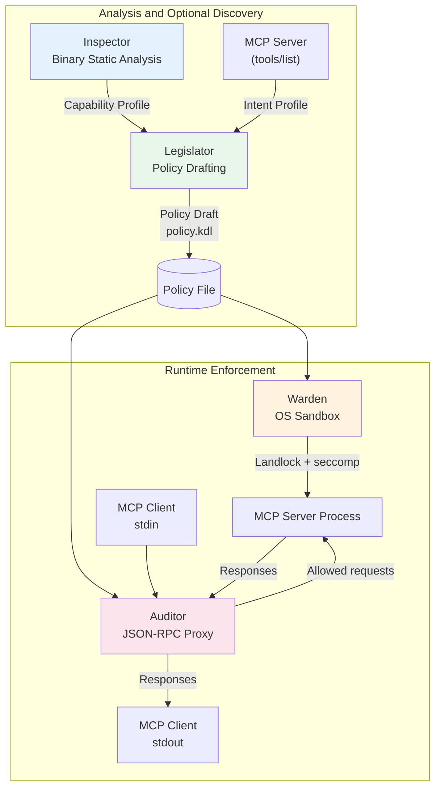
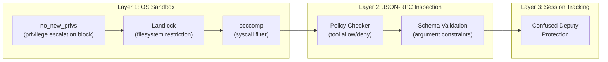
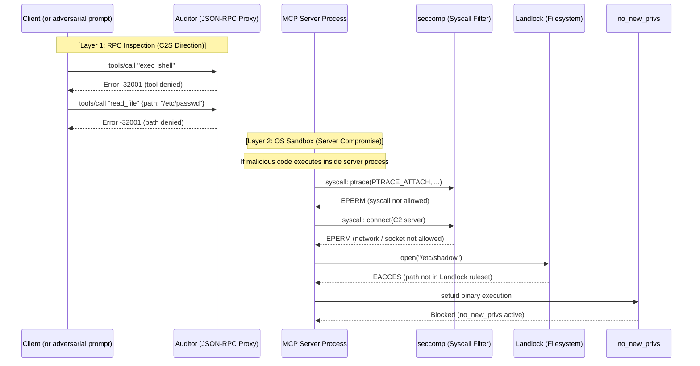
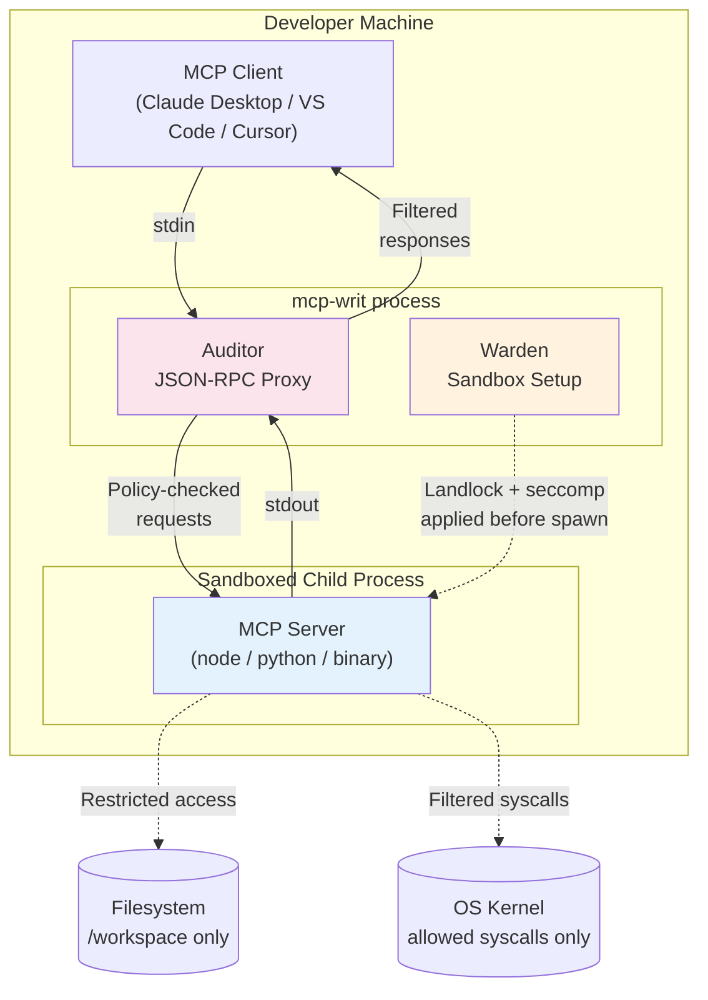
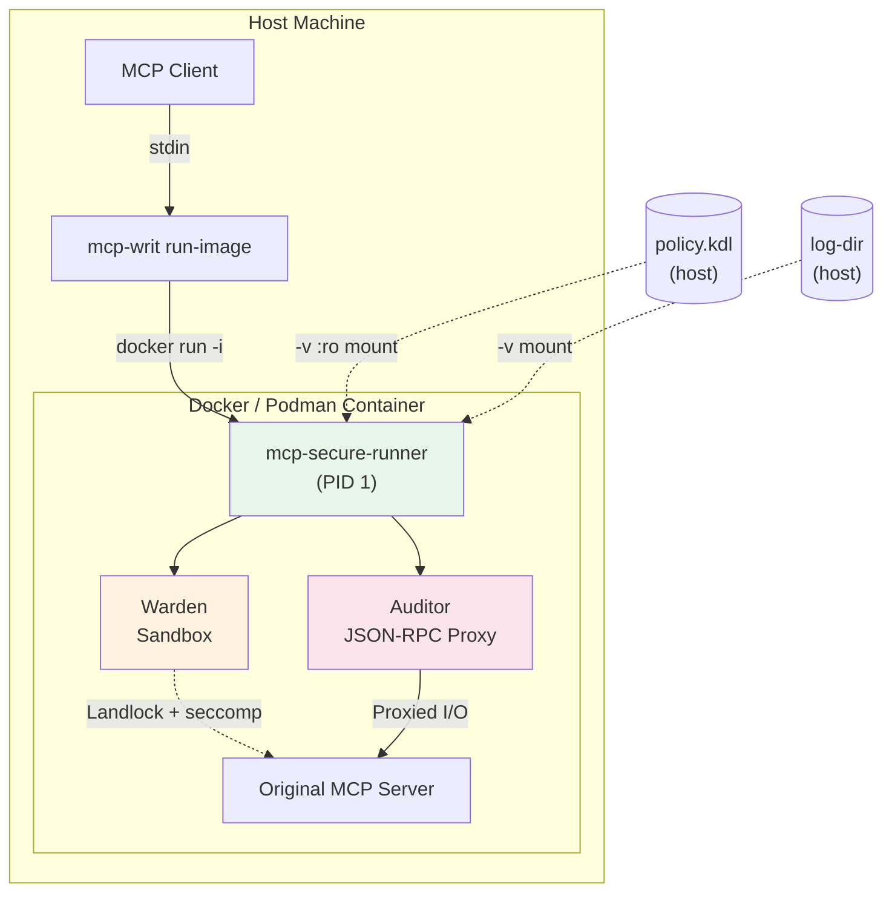
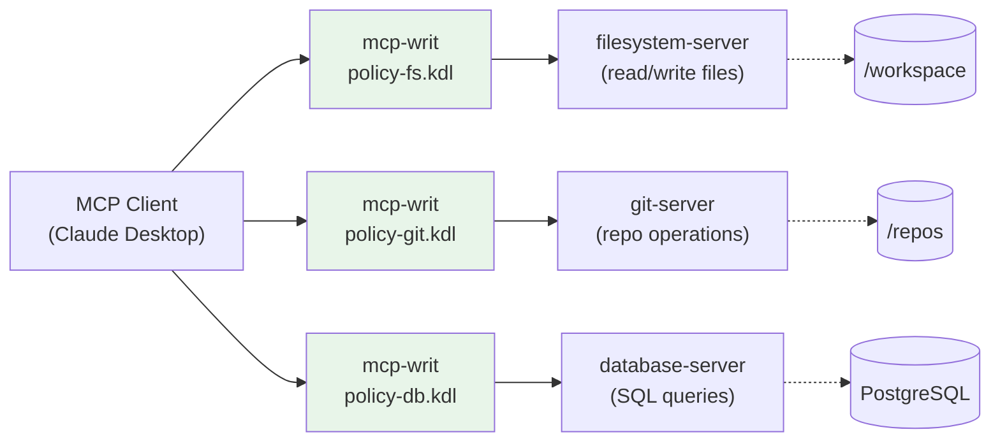
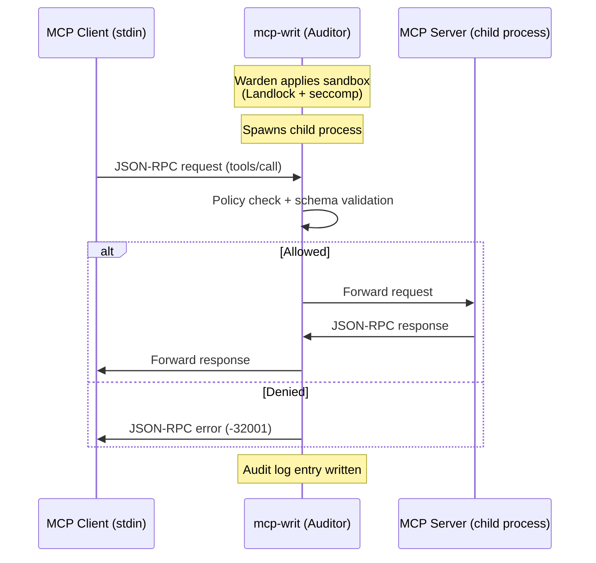
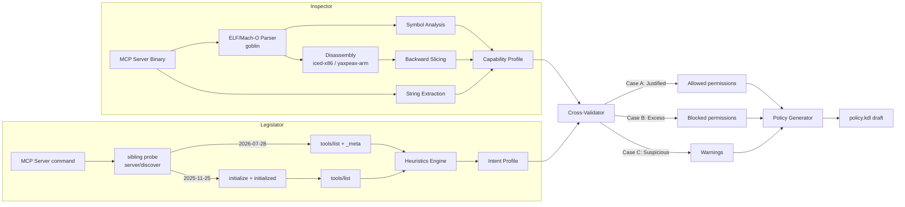
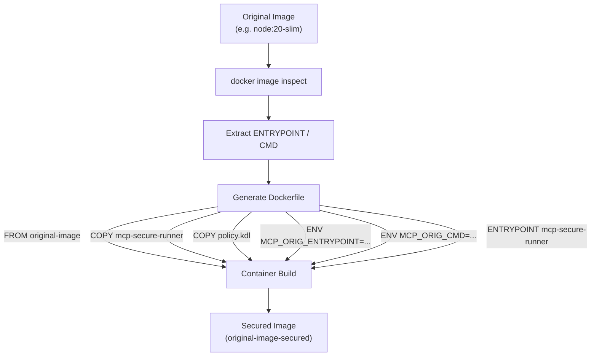
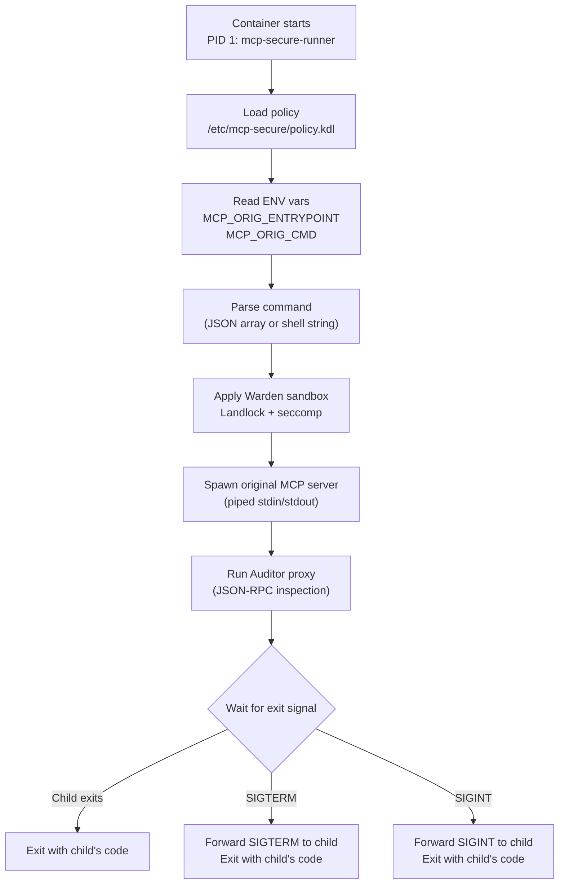

# MCP Writ User Guide

Read the [quick start](../README.md#quick-start) first. Reference sections: [commands](#4-subcommands), [policy](#5-policy-reference), [containers](#6-container-wrapping-deep-dive), and [troubleshooting](#7-faq--troubleshooting).

For a step-by-step workflow with editing examples and verification, see [Writing a policy](policy-authoring.md).

MCP Writ is a Rust-based security runner for [Model Context Protocol (MCP)](https://modelcontextprotocol.io/) servers. It wraps existing MCP servers — without modification — to enforce policy-based access control, OS-level sandboxing, and audit logging.

---

## 1. Design Philosophy

MCP Writ follows a **four-component architecture** inspired by the separation-of-concerns principle. Each component handles one security dimension, and together they form a defense-in-depth stack.

### Component Roles

| Component | Responsibility | Key Technologies |
|-----------|---------------|-----------------|
| **Inspector** | Static analysis of a **native** ELF or Mach-O binary. Produces a Capability Profile detailing syscalls, imported symbols, extracted strings (URLs, paths, env vars), and a risk score. For interpreters (`python` / `node` / `npx`), the binary is **not** the capability source of truth — Legislator follows the source/AST path instead. | goblin (ELF/Mach-O parser), iced-x86 + yaxpeax-arm (disassemblers), backward slicing; source/AST for interpreters |
| **Legislator** | MCP client for exactly `2026-07-28` and `2025-11-25`: probes `server/discover` on a disposable sibling process, then fetches `tools/list` via `2026-07-28` `_meta` or a `2025-11-25` `initialize` handshake. Heuristics infer Intent Profiles; cross-validation against native binary or interpreter AST capabilities drafts a policy. Optional `--self-test` collects Warden-backed evidence (draft aid, not auto-apply). | simultaneous stdio support (`2026-07-28` `_meta` + `2025-11-25` `initialize`), explicit rejection of unimplemented revisions, heuristic rules, cross-validation, Warden-backed self-test |
| **Warden** | Applies OS-level sandboxing before the MCP server process starts. Restricts filesystem access, syscalls (Linux), and process/network capabilities (platform-specific) so the server can only do what the policy permits. | Linux: Landlock + seccomp + `no_new_privs`. Windows: AppContainer, Job Object, DACL grants. macOS: `sandbox-exec` SBPL |
| **Auditor** | Acts as a JSON-RPC proxy between the MCP client and server. Inspects every `tools/call` against the policy (`side_effect`, secret-path overlay, optional trajectory), scans first-seen `tools/list` manifests (CC-001–015) and revalidates `list_changed`, tracks session state for Confused Deputy protection, and writes an audit log. | nojson (zero-serde JSON), session state machine |

### Architecture Diagram



---

## 2. Security Model

MCP Writ implements **defense in depth** — multiple independent security layers so that if one layer is bypassed, the others still provide protection.

### Defense Layers



### Attack Scenarios and Mitigations

| Attack Vector | Defense Layer | Mechanism |
|--------------|-------------|-----------|
| Unauthorized filesystem access | Warden (Landlock) | Filesystem paths restricted to policy-defined `read_only` / `read_write` lists |
| Unallowed syscalls (ptrace, socket) | Warden (seccomp) | Only explicitly allowed syscalls pass; all others trigger `EPERM` |
| Unauthorized tool invocation | Auditor (checker) | `tools/call` requests for unknown or denied tools are blocked with a JSON-RPC error in normal execution (under `--dry-run` the violation is forwarded for auditing instead), and those tools are also hidden from `tools/list` responses |
| Sensitive data in arguments | Auditor (schema validation) | `args_schema` validates tool arguments against a JSON Schema |
| Privilege escalation | Warden (`no_new_privs`) | Set before any sandbox, prevents the process from gaining new privileges via setuid/setgid |
| Confused Deputy attack | Auditor (session state) | Tracks `list_files` → `read_file` sequences; blocks `read_file` for paths not previously listed |
| Hidden instructions / homoglyphs / fs+net schema (CC-001–015) | Verifier (first-seen `tools/list` scan and `list_changed` revalidation) | Critical/High abort the session (including CC-005/CC-007/CC-011/CC-012). Medium is warn/audit only. Descriptions are not pruned or rewritten. After scan and hash verification, only the verified hash-v4 fields are forwarded (unknown vendor keys dropped) |
| Reserved secret paths under an allow glob | Auditor (secret-overlay) | Default on. Allow globs cannot override reserved paths. TOCTOU after the check is Warden's job |
| `read_only` tool with a URL/host argument | Auditor (`side_effect`) | Load-time consistency plus runtime reject |
| Read-then-exfiltrate across tools | Auditor (opt-in `trajectory`) | After a successful `read_only` call, deny the next other tool that is network-class or whose arguments contain a host/URL, and deny a same-tool call that sneaks a host/URL on a non-network tool. `result.isError` does not count as success. Default off. When enabled, every allowed tool needs `side_effect` |

The Landlock / seccomp / `no_new_privs` rows describe Linux. Windows uses AppContainer, Job Objects, and ACL grants; see [Platform notes (Windows)](#platform-notes-windows).

### Defense-in-Depth Scenario

The following diagram illustrates how MCP Writ's defense layers constrain unauthorized requests and compromised server processes. Each layer functions independently to maintain security even if another layer is bypassed.



**Key takeaways:**

- The **Auditor** inspects client-to-server JSON-RPC `tools/call` requests in real time, rejecting unauthorized tools or out-of-policy arguments before they reach the server.
- **Warden (seccomp + Landlock + no_new_privs)** applies OS-level sandboxing to the server process. Normal Linux startup requires an explicit `execve` or `execveat` allowance, which remains available in the child. The sample policies include that startup permission. Denying `exec_shell` is an RPC check and does not by itself stop a direct `execve`.
- Filesystem protection combines process-level Landlock rules (additive access control) with RPC-level argument checks (fine-grained deny rules).
- **Landlock** restricts filesystem access to policy-defined paths.
- **`no_new_privs`** prevents privilege escalation via setuid binaries.
- The net result: unauthorized operations are prevented at both the **application** layer (Auditor `side_effect`, secret-overlay, first-seen `tools/list`, optional trajectory) and the **OS** layer (Warden).

### Fail-Secure Principle

MCP Writ follows a **default-deny** approach:

- Tools not listed in the policy are blocked (not allowed by default).
- `tools/list` responses show only policy-allowed tools; denied and unlisted tools are filtered out of the verified response (the verification hash still covers the full advertised set). Under `--dry-run` nothing is filtered — the full advertised list is forwarded and the hypothetical filtered result is recorded as a `tools_list.filtered` audit event.
- Syscalls not in the allowlist are blocked.
- Network destinations not listed under `defaults.network` `allow` are blocked by the Auditor when `deny host="*"` is set. On **Windows**, that same combination (`allow host="…"` plus `deny host="*"`) is **rejected at policy load**: AppContainer cannot pin outbound destinations, so the OS layer is deny-all (empty allow list) or unrestricted (`allow host="*"` / `deny_all_others=false`). Per-tool `network` rules remain Auditor checks on every platform.
- Invalid JSON or unparseable requests are rejected.

---

## 3. Deployment Scenarios

MCP Writ adapts to different deployment patterns in the MCP ecosystem. The following diagrams show how it fits into common configurations.

### Local MCP Server (`run` command)

The most common setup: an MCP client (Claude Desktop, VS Code, Cursor, etc.) launches a local MCP server through `mcp-writ run`. The guard process wraps the server, applying sandbox and proxy layers transparently.



**Key points:**
- The MCP client launches `mcp-writ run` instead of the server directly
- Warden applies Landlock + seccomp **before** spawning the server process
- Auditor inspects client-to-server `tools/call` requests against the policy. Server responses pass through except `tools/list` (scan + hash, then verified response forwarding) and `notifications/tools/list_changed` (held until revalidation)
- On the first assembled `tools/list`, a manifest scan (CC-001–015) runs. Critical/High findings abort the session; Medium findings are audit/warn only. See [Tool controls and limits](#tool-controls-and-limits)

### Containerized MCP Server (`wrap-image` + `run-image`)

For MCP servers distributed as container images, `mcp-writ wrap-image` injects `mcp-secure-runner` and then `run-image` launches the secured container.



**Key points:**
- Host-side `mcp-writ` handles container lifecycle and I/O relay only
- Inside the container, `mcp-secure-runner` (PID 1) applies all security layers
- Policy file is mounted read-only from the host — the container cannot modify it
- Log directory is optionally mounted for audit trail persistence

### Multi-Server Environment

In real-world development environments, multiple MCP servers run simultaneously. Each server gets its own `mcp-writ` instance with a tailored policy, providing separation between server processes. The isolation depends on the paths and capabilities granted to each policy; shared writable resources can still connect their trust boundaries.



**Key points:**
- Each MCP server gets its own `mcp-writ` instance with a tailored policy
- Policies are isolated only as far as their configured paths and permissions allow: with non-overlapping grants (as in this example), the filesystem server cannot access git repos and the git server cannot run SQL
- Review shared writable paths, credentials, and network grants across server policies

---

## 4. Subcommands

### 4.1 `run` — stdio Wrapper

Wraps a local MCP server process with policy enforcement via stdio proxy.

**Usage:**

```bash
mcp-writ run [OPTIONS] -- <command> [args...]
```

**Options:**

| Option | Short | Default | Description |
|--------|-------|---------|-------------|
| `--transport <type>` | `-t` | `stdio` | Transport type (currently only `stdio` is supported) |
| `--policy <path>` | `-p` | *(default policy)* | Path to policy KDL file |
| `--verbose` | `-v` | off | Increase log verbosity (INFO → DEBUG) |
| `--dry-run` | | off | Run the server without OS sandboxing; log `tools/call` policy violations without blocking those requests. Effective first-seen `tools/list` blocking (default: Critical/High) still fail-closed (JSON-RPC error, no `result`). Server execution may have side effects |
| `--fail-on <level>` | | `high` | `high` / `critical` / `none`. CC abort threshold for first-seen, `list_changed`, and `--dry-run`. `critical` demotes **all High** (not only CC-005). `none` **never aborts on CC** (dangerous; Critical/High audited only; stderr warning at startup). No `--no-fail`. CLI overrides `MCP_WRIT_FAIL_ON` |
| `--server <name>` | | *(single declared server)* | Select the server policy; required when multiple servers are declared |
| `--audit-log <path>` | | **required** when `logging.fail_closed` (default) | Path to audit log file (JSONL format) |

**Example:**

```bash
# Basic usage with a policy
mcp-writ run --policy policy.kdl --audit-log ./audit.jsonl -- node my-mcp-server.js

# Dry-run mode for testing (no OS sandboxing; `tools/call` violations logged
# but not blocked; effective first-seen blocking still fail-closed;
# default --fail-on high)
mcp-writ run --dry-run --policy policy.kdl --audit-log ./audit.jsonl -- python -m my_mcp_server

# Observe the entire High set (CC-002/003/005/007/008/009/011/012/014 High, not only CC-005)
mcp-writ run --fail-on critical --policy policy.kdl --audit-log ./audit.jsonl -- node my-mcp-server.js

# With audit logging to a file
mcp-writ run --policy policy.kdl --audit-log /var/log/mcp-audit.jsonl -- ./my-server
```

**First-seen `tools/list` scan:** After pagination is assembled, Auditor scans the advertised tools (CC-001–015) **before** the client sees a result. A hash match does **not** waive Critical/High findings. Under the default `--fail-on high`, blocking findings (Critical/High, including CC-005 same-tool fs+net, CC-007 read-named write schema, CC-011 annotation/schema contradiction, and CC-012 intra-list name collision) abort the session with a JSON-RPC error — the `tools/list` result is not forwarded. This fail-closed path applies even under `--dry-run` (only the dial's effective blocking changes). Descriptions are not pruned or rewritten. After scan and hash verification, Auditor **rebuilds** each tool from the hash-v4 / scanned field set only (`name`, `description`, `title`, `inputSchema`, `outputSchema`, `annotations`, `icons`, `execution`, `_meta`). Unknown vendor keys (for example `x-system`) are dropped. A non-string `title` fails closed at parse. Descriptions of known fields are not pruned or rewritten. Medium findings (CC-004, CC-006, CC-013, CC-014 remote http(s) or protocol-relative raster icons, CC-015) are written to the audit log as `observed` and do not stop `run` (under the default, CC-014 `file:` / `javascript:` / `vbscript:` / `blob:` / non-image `data:` / SVG is High and does abort). The threshold is `--fail-on` / `MCP_WRIT_FAIL_ON` (below). Hash pin, verified response forwarding, secret-overlay, Warden, and `generate-policy` `deny=#true` are outside the dial.

`notifications/tools/list_changed` **does** trigger an internal re-list. The notification is not forwarded until pagination is reassembled, `scan_manifest` runs, and the tools-list hash verifies. Effectively blocking CC findings abort like first-seen at the **same** `--fail-on` threshold (notification is dropped). A JSON-RPC error on the internal relist also aborts; `list_busy` stays set until the session abort completes so concurrent `tools/call` cannot slip through. While the list is stale or a re-list is in flight, `tools/call` is denied (fail-secure). `last_verified` is updated only after a successful scan + hash.

**Hash v4 re-pin:** Canonical bytes are prefixed with `mcp-guard-tools-list-v4:`. The digest includes `name`, `description`, optional `title`, `inputSchema`, `outputSchema`, `annotations`, `icons`, `execution`, and `_meta` (key-sorted JSON per tool). There is no v3 compatibility. `generate-policy --live-discovery` emits a v4 `tools-list-hash` with a re-pin comment. Existing policies pinned under v3 must be regenerated.

**Launch-target hash verification:** When the policy's `server` block carries `binary-hash` / `entrypoint-hash` / `lockfile-hash` / `docker-manifest-hash` entries, `run` verifies them before the server process exists. The order is fixed: (1) `argv[0]` is resolved to a canonical path, (2) every configured target file is hashed and compared (`hash.verified` / `hash.mismatch` audit events), (3) the workload is **bound** — a `binary-hash` target must canonicalize to the launched executable (a mismatch is `hash.mismatch` and fails the launch), an `entrypoint-hash` target must be the launched executable or its first payload argument (`server.py` in `python server.py`), and (4) the executable is re-hashed immediately before spawn, so an executable swapped in after verification is caught fail-closed — a separate entrypoint script is checked only for path correspondence, its contents are not re-hashed, and file immutability between the re-hash and exec is not guaranteed. Any verification failure exits `run` with `Supply chain verification failed` and never reaches spawn. Hash entries that are only `lockfile-hash` / `docker-manifest-hash` cannot bind a process, and inline evaluation (`-c` / `-e` / `--eval` / `--command`; `-p` / `--print` on node, `-E` on perl — including attached spellings like `-c'…'` and `--eval=…` / `--print=…`, and clusters like `-Ec'…'` or `-pe'…'`) is never hash-bindable — both fail closed. `python -m <module>` and `npx <pkg>` cannot bind their payload from argv either; `generate-policy` therefore emits `binary-hash` for the interpreter plus a `// REVIEW:` comment naming the unbound payload, and never fabricates a hash for it. The *first payload argument* is the first non-option token after the interpreter once the operands of known value-taking options (`--require` / `-r`, `--import`, `--loader`, `--input-type`, `-W`, `-X`, and similar) are skipped; an unlisted option that takes a value can still leave its operand pinned as the entrypoint, so confirm the emitted `target=` names the real script. A script launched directly (`./server.py` or a PATH-installed entry script) is pinned itself, but the interpreter its `#!` line selects is not — the draft flags that with a `// REVIEW:` comment. Delegating launchers (`env`, `py`, `npx`, `uvx` / `uv run`, `npm exec`, `docker run`, `sudo`, `timeout`, and similar) pin only the launcher binary — the draft records that the command they select is unbound. Because the digests cover this host's files (interpreter paths, virtualenv pythons, script locations), recompute them on the deployment host — `generate-policy` emits that reminder as a REVIEW comment — and regenerate the draft when the server or its interpreter is updated.

**Stdio Proxy Flow:**



### 4.2 `inspect` — Binary Static Analysis

Analyzes a **native ELF or Mach-O** binary and produces a capability profile with risk assessment.

For interpreters (`python` / `python3` / `node` / `npx`) and script paths (`.py` / `.js` / `.mjs` / `.cjs` / `.ts`, or a shebang), the native binary is **not** the capability source of truth. `inspect` skips native analysis, prints `native analysis skipped; source payload = …`, and reports handler capabilities from the source/AST path (`source_tools` in `--format json`). Inspecting the interpreter binary itself (for example `inspect /usr/bin/python3` with no script) is unresolved: CPython/Node syscalls are not treated as the server's Intent. `-c` / `--eval` is not statically parseable — `inspect` warns and skips both source AST and native binary capability.

**Usage:**

```bash
mcp-writ inspect [OPTIONS] <binary>
mcp-writ inspect [OPTIONS] -- <command> [args...]
```

**Options:**

| Option | Short | Default | Description |
|--------|-------|---------|-------------|
| `--format <fmt>` | `-f` | `human` | Output format: `human`, `json`, or `kdl` |
| `--output <path>` | `-o` | *(stdout)* | Write output to file instead of stdout |
| `--verbose` | `-v` | off | Increase log verbosity |
| `--project <dir>` | | *(none)* | Analyze a project directory for permission hints (no CWD fallback) |

**Example:**

```bash
# Human-readable analysis
mcp-writ inspect /usr/local/bin/my-mcp-server

# Interpreter / script: native analysis is skipped; source/AST is the capability source
mcp-writ inspect --format json server.py

# Inline eval: warn and skip both source AST and native binary capability (same as generate-policy)
mcp-writ inspect -- python -c "print(1)"

# JSON output for programmatic use
mcp-writ inspect --format json -o profile.json /usr/local/bin/my-mcp-server

# KDL output
mcp-writ inspect --format kdl /usr/local/bin/my-mcp-server
```

**Output includes:**

- **Symbol profile**: imported symbols categorized by risk (network, filesystem, process, crypto, memory)
- **Resolved syscalls**: detected `syscall` instructions with backward-sliced register values identifying the syscall number
- **String findings**: extracted URLs, filesystem paths, and environment variable references
- **Risk score**: 0–100 composite score with human-readable summary
- **Risk flags**: stripped binary, Go wrapper detection, sensitive path access
- **Target + analysis state**: detected format/ISA/ABI/endianness and the per-component analysis status (`analyzed` / `partial` / `unsupported` / `not_applicable` / `failed`) with a reason code. In JSON these are the `target` and `analysis` objects; in KDL the `target`, `code_region`, and `analysis` nodes; in human output the `Target:` and `Analysis:` lines. An empty syscall list is meaningful **only** under `analyzed` — `unsupported` (for example a non-Linux `EI_OSABI`, a big-endian or ELF32 AArch64 ELF, a non-arm64 Mach-O slice, or a PE container) means the binary was not decoded, not that it makes no syscalls. AArch64 ELF64 little-endian Linux binaries are analyzed through the same pipeline as x86-64, resolving `svc` entries against the AArch64 syscall table (the `svc` immediate is auxiliary info under Linux).
- **Mach-O / Darwin ARM64**: thin and fat (`universal`) Mach-O files are identified per slice. The analyzable plain `arm64` slice is decoded; every other slice (x86-64, arm64e, arm64_32) keeps its own `unsupported` state so a fat binary never looks fully validated from the arm64 slice alone. Under the Darwin ABI only `svc #0x80` is a syscall entry and the number register is `x16`: non-negative values resolve against the XNU BSD syscall table, negative values against the Mach trap table (`kind="mach_trap"`, signed numbers in output). Darwin findings are never emitted into Linux seccomp `allow` lines in generated policies — the `syscalls` section carries review comments only.

### 4.3 `generate-policy` — Policy Auto-Generation

Combines binary analysis (Inspector) with MCP tool discovery (Legislator) to produce a policy KDL draft.

Legislator implements and tests exactly **MCP 2026-07-28 and MCP 2025-11-25 in the same build** ([MCP 2026-07-28 versioning](https://modelcontextprotocol.io/specification/2026-07-28/basic/versioning), [stdio probe](https://modelcontextprotocol.io/specification/2026-07-28/basic/transports/stdio)). It first sends `server/discover` with `2026-07-28` `_meta` on a **disposable sibling process** (the [TypeScript SDK](https://ts.sdk.modelcontextprotocol.io/v2/migration/support-2026-07-28) uses the same pattern because some rmcp servers exit on pre-`initialize` traffic). A compatible response selects the `2026-07-28` path (`tools/list` with required `_meta`). A response selecting `2025-11-25`, a non-reserved error, malformed response, exit, or timeout tries `2025-11-25` on a fresh child via `initialize` → `notifications/initialized` → `tools/list`; the returned `protocolVersion` must be `2025-11-25`. If `server/discover` or `-32022` advertises only an unimplemented revision, discovery fails explicitly. Dates later than `2026-07-28` and earlier than `2025-11-25` are not inferred to be compatible. The parser keeps per-tool `name` / `description` / `title` / `inputSchema` / `outputSchema` / `annotations` / `icons` / `execution` / `_meta` (and ignores result-envelope `ttlMs` / `cacheScope` / `resultType`). `generate-policy --live-discovery` writes a v4 `tools-list-hash` so operators can re-pin after upgrading from v3.

**Usage:**

```bash
mcp-writ generate-policy [OPTIONS] -- <mcp-server-command> [args...]
```

**Options:**

| Option | Short | Default | Description |
|--------|-------|---------|-------------|
| `--binary <path>` | `-b` | *(command[0])* | Path to binary to inspect (defaults to first element of command) |
| `--output <path>` | `-o` | *(stdout)* | Write generated policy to file |
| `--verbose` | `-v` | off | Increase log verbosity |
| `--live-discovery` | | off | Execute the MCP server to discover tools (not the default) |
| `--unsafe-unsandboxed-discovery` | | off | Live discovery with the ambient environment |
| `--static-only` | | **on** | Do not execute the server; inspect the binary only |
| `--project <dir>` | | *(none)* | Analyze a project directory for permission hints (explicit dir or script parent only; no CWD fallback) |
| `--self-test` | | off | After drafting, spawn the server **via Warden** (restricted env + private TMPDIR, 8s) and collect Auditor / Warden evidence. Auditor probes are `checker::check_request` (not a live proxy). Warden `pass` is Linux SIGSYS only. Spawn failure is `inconclusive`, not `skipped`. Reports a `probe-policy:` overlay distinct from the original draft. Draft aid only — does not auto-apply. Never uses `--unsafe-unsandboxed-discovery` |

**Example:**

```bash
# Generate a static-only policy draft to stdout (no server execution)
mcp-writ generate-policy -- node my-mcp-server.js

# Opt in to live tools/list discovery
mcp-writ generate-policy --live-discovery -- node my-mcp-server.js

# Save to file with explicit binary path
mcp-writ generate-policy --binary /usr/bin/node --output policy.kdl -- node my-mcp-server.js

# Warden-backed evidence on the draft (stdout still prints the KDL; exit 0 = evidence, 2 = insufficient, 1 = parse/generate failure)
mcp-writ generate-policy --self-test -- python server.py
```

`--self-test` always prints the draft, then reports `auditor: pass/fail` and a separate `warden:` line on stderr. Auditor probe details are labeled as checker results, not live-proxy observations. A JSON-RPC policy error, MCP `isError`, or fabricated `EACCES` text is never a Warden pass. Warden `pass` is Linux SIGSYS after a successful handshake and control call. Non-Linux: `warden: skipped` when the child starts, `warden: inconclusive` when spawn fails. stderr includes `spawn:` and, on Linux, `probe-policy:` describing the diagnostic overlay (not the original draft). The draft is never applied automatically.

**Launch-target hashes in the draft:** The `server "auto-generated"` block pins the launch target the same way `run` binds it. `binary-hash` covers the resolved `argv[0]` (a native server binary, or the interpreter for `python server.py` / `node index.js`); `entrypoint-hash` covers the first payload argument when it is a script file. The digests are **this host's** — REVIEW comments in the draft tell the operator to recompute them on the deployment host and to regenerate the draft when the server or interpreter is updated. When the payload cannot be bound from argv — `python -m <module>`, `npx <pkg>`, or inline eval (`-c` / `-e` / `--eval` / `--command`; `-p` / `--print` on node, `-E` on perl — incl. attached and `=` spellings) — no hash is fabricated; a `// REVIEW:` comment records the reason. See [Launch-target hash verification](#41-run--stdio-wrapper) for what `run` enforces.

**Policy Generation Flow:**



**Cross-Validation Cases:**

| Case | Meaning | Policy Action |
|------|---------|---------------|
| **A** | Capability matches Intent — permission is justified | `allowed = true` |
| **B** | Capability exists but no tool needs it — excess | `allowed = false` (blocked, with warning comment) |
| **C** | Intent requires it but binary / AST lacks evidence — suspicious or dynamic | Warning comment, allowed with review note. **No `side_effect` is written** — `read_only`×URL enforcement and trajectory arming do not apply until a human adds `side_effect` (and related sub-policies). Overlay and first-seen scan still apply independently |

Tools without binary/AST evidence (Case C / unbound handlers) therefore stay unbound in the draft: overlay and first-seen scan still apply, but `side_effect`-gated checks do not until a human fills them in.

### 4.4 `wrap-image` — Container Wrapping

Wraps an existing MCP server container image with `mcp-secure-runner` as PID 1.

**Usage:**

```bash
mcp-writ wrap-image [OPTIONS] <image>
```

**Options:**

| Option | Short | Default | Description |
|--------|-------|---------|-------------|
| `--policy <path>` | `-p` | `./policy.kdl` | Policy KDL copied into the image at `/etc/mcp-secure/policy.kdl` |
| `--tag <tag>` | `-t` | `<image>-secured:latest` | Output image tag |
| `--engine <kind>` | `-e` | *(auto-detect)* | Container engine: `docker`, `podman`, or `buildah` |
| `--runner-binary <path>` | | *(auto-detect)* | `mcp-secure-runner` binary to embed |
| `--output-dockerfile <path>` | | *(none)* | Write the generated Dockerfile and exit (no build) |
| `--server <name>` | | *(single declared server)* | Select the server policy to embed in the image |
| `--no-cache` | | off | Disable the engine build cache |

**Workflow:**

1. Inspects the original image to extract `ENTRYPOINT` and `CMD`
2. Generates a Dockerfile that:
   - Uses the original image as base (`FROM`)
   - Copies `mcp-secure-runner` binary into `/usr/local/bin/`
   - Copies `policy.kdl` into `/etc/mcp-secure/`
   - Saves original `ENTRYPOINT`/`CMD` as environment variables
   - Sets `mcp-secure-runner` as the new `ENTRYPOINT`
3. Builds the secured image using Docker, Podman, or Buildah

**Container Wrapping Flow:**



**Engine Selection:**

| Engine | Notes |
|--------|-------|
| Docker | Default and most widely available |
| Podman | Rootless container support |
| Buildah | Build-only engine (does not support `run`) |

### 4.5 `run-image` — Run Secured Container Image

Runs a previously wrapped container image with policy and log volume mounts.

**Usage:**

```bash
mcp-writ run-image [OPTIONS] <image>
```

**Options:**

| Option | Short | Default | Description |
|--------|-------|---------|-------------|
| `--engine <kind>` | `-e` | *(auto-detect)* | Container engine: `docker` or `podman` (`buildah` cannot run containers) |
| `--policy <path>` | `-p` | `./policy.kdl` | Path to policy KDL file (mounted read-only at `/etc/mcp-secure/policy.kdl`) |
| `--server <name>` | | *(single declared server)* | Select the server policy to mount |
| `--allow-mutable-tag` | | off | Allow a tag instead of requiring an immutable `@sha256:<digest>` reference |
| `--log-dir <path>` | | *(none)* | Directory for container log files (mounted at `/var/log/mcp-secure`) |
| `--verbose` | `-v` | off | Enable verbose output |

**Example:**

```bash
# Pin the wrapped image to its actual registry digest
mcp-writ run-image --log-dir ./logs my-mcp-server-secured@sha256:<digest>

# With explicit engine and log directory
mcp-writ run-image --engine podman --policy /etc/mcp/policy.kdl --log-dir /var/log/mcp my-mcp-server-secured@sha256:<digest>

# Verbose mode for debugging
mcp-writ run-image -v --policy custom-policy.kdl --log-dir ./logs my-server-secured@sha256:<digest>
```

Replace `<digest>` with the actual digest. For a local image that has no registry
digest, `--allow-mutable-tag` explicitly opts into using its tag. The image must
have `/usr/local/bin/mcp-secure-runner` as its entrypoint.

**Volume Mounts:**

| Host Path | Container Path | Mode |
|-----------|---------------|------|
| `--policy` value | `/etc/mcp-secure/policy.kdl` | Read-only (`:ro`) |
| `--log-dir` value | `/var/log/mcp-secure` | Read-write |

---

### 4.6 `containerize` — Build from Source

Builds an MCP server image from a source directory and embeds a policy and Linux
`mcp-secure-runner`. Node.js, Python, and native source layouts are detected;
unsupported layouts need an explicit base image and a resolvable server command.

```sh
mcp-writ containerize --source-dir ./server --policy policy.kdl --tag my-server-secured:local
```

| Option | Short | Default | Description |
|---|---|---|---|
| `--source-dir <path>` | `-s` | required | MCP server source directory |
| `--policy <path>` | `-p` | required | Policy to embed |
| `--tag <tag>` | `-t` | derived from source directory | Output image tag |
| `--base-image <image>` | `-b` | detected from source | Override the base image |
| `--engine <kind>` | `-e` | auto-detect | `docker`, `podman`, or `buildah` |
| `--server <name>` | | single declared server | Select the server policy |
| `--output-dockerfile <path>` | | none | Write a Dockerfile instead of building |

## 5. Policy Reference

Policy files are written in [KDL](https://kdl.dev/). MCP Writ validates the policy on load and rejects invalid configurations. See [policy.example.kdl](../policy.example.kdl) for a complete sample.

### Field Reference

| Node / property | Type | Required | Default | Description |
|-----------------|------|----------|---------|-------------|
| `policy version` | integer | Yes | — | Policy format version (must be `1`) |
| `transport` | node | No | stdio | `type="stdio"` (HTTP listen is parsed but not a v1 runtime path) |
| `extends` / `include` | string path | No | — | Inherit or split KDL files (relative to the including file; cycles rejected) |
| `defaults.filesystem` | `allow` / `deny` | No | empty | Linux Landlock paths; `mode="read"` (default) or `mode="write"`. Landlock is additive; policies that deny a child path beneath an allowed parent are rejected because the OS layer cannot express that restriction. **Windows:** these paths become AppContainer ACL grants from the **global** lists only; matching is **case-insensitive**. POSIX roots such as `/workspace` are not rewritten to the current drive |
| `defaults.filesystem` `secret-overlay` | bool | No | `#true` | Reserved secret paths stay denied even when an allow glob matches. `#false` opts out. Allow globs cannot override the reserved set. TOCTOU (swap between the Auditor check and the child's `open`) is Warden's job |
| `defaults.syscalls` | `allow` names | No | empty | seccomp allowlist |
| `defaults.environment` | `allow` names | No | absent = inherit all | Child-process environment allowlist. When the node is present (even empty) the server gets `PATH`, the Windows system vars, TMPDIR/TMP/TEMP overridden to the private temp dir only when the spawn path assigns one (macOS sandboxed, self-test, discovery; AppContainer remaps to `AC\Temp`), and each listed name copied from the parent — a listed name absent on the parent stays unset; every other variable is dropped. Without the node the parent environment is inherited unchanged. Applied by the Warden at spawn on Linux/macOS/Windows, including `--dry-run` and `MCP_WRIT_SKIP_SANDBOX` runs. `environment` under a tool/profile/server-defaults/server is rejected at load. Names must be non-empty and contain no `=` or NUL; lookup is case-insensitive on Windows, exact elsewhere |
| `defaults.network` | `allow` / `deny` `host=` | No | empty | Outbound host check at the Auditor. Accepted `host` values are a hostname, `*`, `*.example.com`, IPv4, or IPv6 (`::1` or `[::1]`). A URL or `host:port` value **is accepted** and folded to that hostname by `normalize_policy_host` before comparison (scheme and port are not enforced separately). Linux Landlock ABI 4 TCP port controls do not cover hostnames or UDP. **Windows:** AppContainer cannot enforce a per-host allowlist. A nonempty `allow` list together with `deny host="*"` (`deny_all_others=true`) is rejected at load. Use an empty allow list (OS deny-all) or unrestricted outbound (`allow host="*"`), and keep destination checks on `tool.network` / Auditor |
| `server` / `tool` | nodes | No | no tools | Tools not listed are denied (default-deny) |
| `tool` `deny` | bool | No | `false` | `deny=#true` blocks the tool |
| `tool` `args_schema` | string | No | — | JSON Schema for `params.arguments` only |
| `tool` `input_responses` | string | No | `auto` | MRTR `params.inputResponses`: `auto` (deny on tools with a schema, `side_effect`, or effective filesystem/network/syscall constraints), `deny`, `allow`, `inspect` |
| `tool` `side_effect` | string | No | — | `"read_only"` / `"write"` / `"network"` / `"execute"`. Unknown values fail at load. `read_only` cannot combine with write globs, a tool `network` sub-policy, or process exec. `write` plus process exec (anything other than `process deny-all`) is a load error. Auditor also rejects host/URL arguments on `read_only` |
| `tool.filesystem` | `allow` / `deny` | No | empty | Per-tool path globs |
| `tool.filesystem` `require-path` | bool child node | No | `#true` | `#false` permits calls without a path only with an explicitly empty allow-list (`allow none=#true`). Every supplied path remains forbidden. Available in tool, profile and server-defaults filesystem blocks, not global defaults |
| `when environment=` | node | No | — | Applied only when `MCP_WRIT_ENV` matches |
| `confused_deputy_protection` | bool | No | `false` | Process-local list→read check (not an MCP session; not `requestState`) |
| `trajectory` | bool + `after` children | No | off (omit or `trajectory #false`) | Opt-in process-local chaining. Not bound to `requestState`. Requires `side_effect` on every allowed tool. Success-only state (`isError` / JSON-RPC error / `input_required` do not arm). Same-tool URL sneak is denied; path-only same-tool retry is not. `deny-next` accepts `read_only` / `write` / `network` / `execute`; only `network` currently expands to host/URL argument checks. Example: `after side_effect="read_only" deny-next="network"` |
| `logging` | `level=` | No | `"info"` | Log level (`"trace"`, `"debug"`, `"info"`, `"warn"`, `"error"`). The regular CLI and runner initialize logging from this value when `-v` is not set. CLI `-v` takes precedence when specified |
| `server` `binary-hash` | `"sha256:<64hex>"` + `target=` | No | — | `sha256` digest of the resolved `argv[0]` image (native exe or interpreter). At launch the target must canonicalize to the launched executable and match, else fail-closed. Optional `approved=` note |
| `server` `entrypoint-hash` | `"sha256:<64hex>"` + `target=` | No | — | `sha256` digest of the script payload; target must be the launched executable or its first payload argument. `python -m`, `npx`, and inline eval have no bindable target — no hash may be invented for them |
| `server` `lockfile-hash` | `"sha256:<64hex>"` + `target=` | No | — | `sha256` digest of a dependency lockfile (package-lock.json, requirements.txt, …). Verified at launch but cannot bind the process alone |
| `server` `docker-manifest-hash` | digest + `target=` | No | — | Pinned container image manifest digest; verified at launch, cannot bind the process alone |
| `server` `tools-list-hash` | `"sha256:<64hex>"` | No | — | v4 digest over the **full advertised** `tools/list` set (not the filtered view). See the first-seen scan text above |

### Path-free tools and runtime filesystem access

An echo, calculator or runtime-status tool may need no path argument even when its process
needs filesystem access to load the executable. Keep that OS grant in `defaults.filesystem`
and explicitly close the tool's path allow-list:

```kdl
server "example" {
    tool "runtime_info" side_effect="read_only" {
        filesystem {
            allow none=#true
            require-path #false
        }
    }
}
```

Omitting `require-path` keeps the existing mandatory-path check. `#false` with any effective
read/write path grant is a load error. Path extraction, secret-path protection, network checks
and the secure `inputResponses` default still apply. This setting does not create a separate
OS sandbox per tool or remove the process's global runtime grants; review the server implementation.
The integration tests cover this contract and stdio shutdown; see [Development](development.md).

### MCP 2026-07-28 / 2025-11-25 / MRTR (Auditor)

The Auditor remains a **stdio JSON-RPC proxy**. The same build inspects both supported revisions. It enforces `tools/call` only and passes through `2025-11-25` `initialize`, `2026-07-28` `_meta`, non-tools methods, `2026-07-28` S2C `resultType: "input_required"`, and `2025-11-25` reverse RPC.

- **Retries:** MRTR retries are new JSON-RPC ids but still `tools/call` with the same tool name — the allowlist, `args_schema` (on `arguments` only), fs/network, `side_effect`, and (when enabled) trajectory checks run again. Trajectory matches tool name + `side_effect`, not `requestState`.
- **`requestState`:** Opaque passthrough. Never parsed as structured policy input (no HMAC). Presence is audit-logged. Values over **64 KiB** are rejected (fail-secure). Neither Confused Deputy nor `trajectory` is bound to it.
- **`inputResponses`:** Sibling of `arguments`, so it bypasses `args_schema`. KDL knob `input_responses` (`auto` / `deny` / `allow` / `inspect`). **Secure default (`auto`):** `inputResponses` is **denied** on tools with a schema, `side_effect`, or effective filesystem/network/syscall constraints unless you opt in with `allow` or `inspect`.
- **`-32001`:** mcp-writ application error (grandfathered JSON-RPC range). **Not** MCP-reserved; `HeaderMismatch` is `-32020`. Do not treat `-32001` as a spec code.
- **Confused Deputy:** Process-scoped `known_paths` for one child. Spec: stdio process ≠ session. Interleaved clients share the set.

Live spec: [MRTR](https://modelcontextprotocol.io/specification/2026-07-28/basic/patterns/mrtr), [tools](https://modelcontextprotocol.io/specification/2026-07-28/server/tools), [versioning](https://modelcontextprotocol.io/specification/2026-07-28/basic/versioning), [base / error codes](https://modelcontextprotocol.io/specification/2026-07-28/basic/).

### Platform notes (Windows)

Warden on Windows uses an AppContainer, not Landlock/seccomp. The default is a regular AppContainer token; `MCP_WRIT_WINDOWS_LPAC=1` opts into LPAC, which additionally drops `ALL_APPLICATION_PACKAGES`. LPAC is stronger but unusable for typical interpreters — the Winsock catalog and other system resources rely on `ALL_APPLICATION_PACKAGES` ACEs, so Node exits at `WSAStartup` and a non-elevated user cannot ACL-grant those registry keys. User-private files lack package ACEs, so filesystem isolation is unchanged under the default. The following rules are part of the product contract:

| Control | Behavior |
|---------|----------|
| Outbound network (OS) | Coarse capability SIDs only (`internetClient`, `internetClientServer`, `privateNetworkClientServer`). There is **no** per-host or per-port filter at the AppContainer layer. |
| `defaults.network` allowlist + `deny host="*"` | **Rejected at policy load** on Windows. Choose OS deny-all (empty `allow` list) or OS unrestricted (`allow host="*"` / `deny_all_others=false`). |
| Per-tool `network` | Auditor-only on every platform, including Windows. It inspects `tools/call` arguments; it does not mediate raw sockets. |
| Filesystem paths | Comparison is **case-insensitive**. POSIX-style roots such as `/workspace` stay POSIX and are **not** rewritten to the current drive (`D:/workspace`). Per-tool `filesystem` is an Auditor check; AppContainer ACLs use the **global** filesystem lists. |
| Process lifetime | The child is assigned to a Job Object with `KILL_ON_JOB_CLOSE`, so closing the job handle terminates every process in it — descendants included. That flag does not *prevent* descendant creation, and the spawn does not set `PROC_THREAD_ATTRIBUTE_CHILD_PROCESS_POLICY`/`PROCESS_CREATION_CHILD_PROCESS_RESTRICTED`; a child of an AppContainer process normally inherits the container token. Under the observed launch conditions — an inherited working directory outside the container's grants, no console, and handle inheritance restricted to the stdio pipes — the workload's attempts to spawn a child were denied. Treat that denial as a property of this launch configuration, not a guaranteed restriction. |
| Handle inheritance | Only the stdio pipe handles are inherited (`PROC_THREAD_ATTRIBUTE_HANDLE_LIST`). |
| DACL grants | Access granted to the AppContainer SID is restored when the sandbox is dropped. A failed grant (for example an unmodifiable system path) logs a warning and continues — it never widens access, but it does not guarantee denial either: effective access follows the object's existing ACL, and a pre-existing ALL_APPLICATION_PACKAGES ACE can still allow the container to reach the path. The failed grant is recorded `Failed` in the launch report. |
| Per-destination network | Policy entries under `defaults.network allow` that survive loading (an unrestricted-outbound policy) appear in the launch report as `net_destination` grants marked `skipped` — AppContainer capabilities are all-or-none, so the entry is enforced at the RPC layer only. |

Loopback exemption still follows HTTP transport configuration; stdio remains the only implemented runtime.

**Launch reporting.** The per-launch enforcement report on Windows records only what the apply pipeline observably did, and an abort names the pipeline stage: `profile-creation` (`CreateAppContainerProfile`), `grant-application` (capability SIDs and the HTTP loopback exemption — per-path DACL writes are best-effort inside this stage and mark only their own grant entries), `process-setup` (stdio pipes and the proc-thread attribute list), `create-process` (`CreateProcessW` itself), `job-setup` (Job object creation and the kill-on-close limit), `job-assignment` (`AssignProcessToJobObject`), and `execution-start` (`ResumeThread`). A `create-process` failure is undetermined — the attribute and image checks are fused in one call — so the controls read `unknown`, never `failed`; every other stage names its failure explicitly (`failed`), and the partially built launch (suspended process, profile, pipes, Job) is cleaned up under the same ownership rules as a finished launch. The stage label is folded into the propagated error text as well, and on a `grant-application` abort the grant list stays complete — intents the pipeline never reached read `skipped` rather than disappearing, so 'planned but unapplied' stays distinguishable from 'not an intent'. After a successful spawn, `os.process` is `verified` (CreateProcessW is authoritative for the container token), `os.fs` is `verified` or `partially-applied` according to the per-path DACL outcomes, and the capability and loopback controls mirror their apply results — an HTTP loopback exemption CheckNetIsolation leaves unconfirmed reads `unknown`, not `verified`. A `verified` ACL grant records the `SetNamedSecurityInfoW` result only; whether access is actually allowed or denied follows each object's resulting ACL — the deny coverage is exercised by the warden tests, not by the report.

### Platform notes (macOS)

Warden on macOS uses `sandbox-exec` with a dynamically generated Seatbelt (SBPL) profile (`src/warden/macos_sandbox.rs`), not Landlock/seccomp. The profile starts from `(deny default)` and adds targeted `allow` rules. The following rules are part of the product contract:

| Control | Behavior |
|---------|----------|
| Filesystem (OS) | `file-read*` / `file-write*` `subpath` rules generated from the **global** `defaults.filesystem` lists, plus fixed system paths and a per-launch private `TMPDIR`. Per-tool `filesystem` is an Auditor check only. |
| Outbound network (OS) | Deny-all mode (`deny host="*"`): only **loopback** TCP ports are expressible. Entries that resolve to a local port — `"443"`, `localhost:8080`, `*:443`, `127.0.0.1:80` — become `(remote tcp "localhost:PORT")` rules. A remote hostname such as `api.example.com` makes the spawn **fail** rather than silently map to localhost. A bare `localhost` with no port produces no OS rule. Unrestricted mode (`allow host="*"` / `deny_all_others=false`) emits a blanket `network-outbound` allow, plus `network-bind` when `inbound allow=#true`. |
| Per-tool `network` / `filesystem` | Auditor-only (unlike Linux, where allowed tools' `filesystem` paths merge into the Landlock ruleset). Passing the Auditor does not prove the OS layer permits the access. |
| Syscall policy | **Not applied.** SBPL has no seccomp-style syscall allowlist; `defaults.syscalls` has no OS effect on macOS. |

**SBPL support status.** `sandbox-exec` and the SBPL profile language are a legacy mechanism: Apple does not document SBPL as a stable, supported contract for third-party use (see the [Apple DTS explanation](https://developer.apple.com/forums/thread/661939)). Do not treat macOS coverage as equivalent to Linux Landlock/seccomp guarantees. SBPL behavior can change across macOS releases. The generated profile is exercised on the CI `macos-latest` runner by the `warden::` tests, which include real `sandbox-exec` spawns (write denial, private `TMPDIR`, loopback denial) and launch-report checks. After a macOS upgrade on a host that runs mcp-writ, re-run `cargo test --locked --lib warden::` on that host and record the OS version on which the sandbox was last verified.

**Launch reporting.** The per-launch enforcement report records only what is observable on macOS: SBPL profile generation and private `TMPDIR` creation (build phase, `verified`), the `sandbox-exec` spawn result, and a bounded initial-exit check (~150 ms) on the spawned process — a profile `sandbox-exec` rejects, or a workload that cannot exec, exits within milliseconds, but a workload that simply finishes quickly exits the same way, so an exit inside the window is recorded on `os.sandbox` as the child's termination state while the control stays `unknown` (the exit alone is not evidence the sandbox failed to apply). The per-domain controls (`os.fs`, `os.net.outbound`, `os.net.inbound`, `os.process`) stay `unknown` after a successful spawn: `sandbox-exec` exposes no query for kernel acceptance of individual rules, and a process that survives the window is not proof of it. A missing `sandbox-exec` binary fails the spawn itself (`os.sandbox` → `failed`).

### Per-OS enforcement matrix

The same policy text is interpreted by two layers: the **OS sandbox** applied to the server process (Warden), and the **Auditor** JSON-RPC proxy that inspects `tools/call` arguments. Auditor checks — tool allowlist, path/host arguments, `args_schema`, `side_effect`, secret overlay — are identical on every platform. Cells below use these categories:

- **OS-enforced** — the kernel or container mechanism denies the operation itself.
- **Auditor-checked** — enforced only on RPC arguments; server-internal access is not covered.
- **Rejected** — the policy fails to load, or the spawn fails, rather than run with a weaker guarantee.
- **Warning** — the entry is skipped with a log warning; the default-deny posture is unchanged.
- **Not applied** — the setting has no OS-level effect on that platform (no warning).

| Area | Linux | macOS | Windows |
|---|---|---|---|
| Filesystem | **OS-enforced** (Landlock default-deny). Global `defaults.filesystem` **plus** the `filesystem` of every *allowed* tool merge into one process-wide ruleset — grants are not scoped per tool call. `mode="read"` maps to Landlock read rights including `Execute`; `mode="write"` adds write rights including `Truncate` (enforced on kernel ≥ 6.2). Trailing globs reduce to a real directory; mid-path globs such as `/home/*/.ssh` and missing paths → **warning**, the rule is skipped (default-deny still applies). A `deny` beneath an allowed parent → **rejected** at load on every OS (Landlock re-checks it at spawn). | **OS-enforced** (SBPL `subpath` rules) for the **global** lists only. Per-tool `filesystem` → **Auditor-checked**. | **OS-enforced** (DACL grants to the AppContainer SID) for global paths that exist at spawn; missing paths are skipped silently. Per-tool `filesystem` → **Auditor-checked**. Matching is case-insensitive. |
| Network (outbound) | **OS-enforced** per TCP *port* only: a bare numeric entry (`allow host="443"`) becomes a Landlock `ConnectTcp` rule for that port to **any** destination (kernel ≥ 6.7). Hostnames, URLs, and `host:port` entries → **warning**, skipped — they remain **Auditor-checked** host rules. `inbound allow` → **not applied** (TCP bind is never granted). | Deny-all mode: **OS-enforced** loopback TCP ports only; remote hostname → **rejected** at spawn; bare `localhost` without a port produces no OS rule. Unrestricted mode → blanket allow (+ `network-bind` if `inbound allow=#true`). | **OS-enforced** as deny-all (no capabilities) or unrestricted (`internetClient` + `privateNetworkClientServer`, plus `internetClientServer` when `inbound allow=#true`). Deny-all plus a nonempty `allow` list → **rejected** at load on Windows. No per-destination OS control — host checks stay **Auditor-checked**. |
| Syscall | **OS-enforced**: seccomp-BPF allowlist from `defaults.syscalls`, applied in the child after `no_new_privs`. An allowlist without `execve`/`execveat` → **rejected** at spawn unless `sandbox allow_degraded=#true`. Per-tool `syscalls` → **rejected** at load on every platform. `socket` under `deny_all_others` is limited to `SOCK_STREAM` by a seccomp condition (UDP/raw fail closed). | `defaults.syscalls` → **not applied** (no OS equivalent). | `defaults.syscalls` → **not applied** (no OS equivalent). |
| Environment | **Applied at launch** by the Warden: a `defaults.environment` allowlist restricts the child to `PATH`, temp vars, and the listed names. Applies identically with or without the OS sandbox (including `--dry-run` and `MCP_WRIT_SKIP_SANDBOX`). Per-tool `environment` → **rejected** at load. | Same — applied at launch by the Warden. | Same — applied at launch by the Warden (the AppContainer spawn additionally requires `LOCALAPPDATA`, which is always supplied in restricted mode). |
| Apply failure | Landlock ruleset not fully enforced (kernel older than the requested ABI rights) → **rejected** at spawn unless `sandbox allow_degraded=#true`, which silently accepts the partially enforced sandbox (no warning on the spawn path). | `sandbox-exec` missing → spawn fails (**rejected**); a profile rejected at startup exits the child within milliseconds — the report records the exit on `os.sandbox` as `unknown` (an early exit cannot be distinguished from a workload that finished quickly), and the launch fails at the MCP handshake. | AppContainer profile or capability setup failure → spawn fails (**rejected**). Individual DACL grant failures → **warning** — the grant is not guaranteed, but effective access still follows the object's existing ACL (a pre-existing ALL_APPLICATION_PACKAGES ACE may keep it reachable); the failure is recorded `Failed` in the report. |
| Non-isolated execution | `--dry-run` → **warning**, child runs unsandboxed and `tools/call` violations are forwarded (logged as `observed`, not blocked). `MCP_WRIT_SKIP_SANDBOX=1` → **warning**, child runs unsandboxed (side effects are possible), but Auditor `tools/call` checks still **block** violations (`denied`). Any OS other than Linux/macOS/Windows → **warning** ("sandbox not available on this platform"), child runs unconstrained. | Same — dry-run and the skip env bypass `sandbox-exec`. | Same — dry-run and the skip env bypass AppContainer. |
| Verified environments | `ubuntu-latest` CI: unit and integration tests; `linux-tests` workflow on `ubuntu-latest` and `ubuntu-24.04-arm` (real AArch64 hardware: Landlock/seccomp enforcement incl. the sandboxed path-resolution e2e); sandboxed Go fixture (`go-runtime` workflow). Kernels without Landlock are a degraded path, not a tested target. | `macos-latest` CI: `generate_sbpl` unit tests plus real `sandbox-exec` spawn tests; local Apple Silicon verification (macOS 26.6.2): all integration targets incl. the sandboxed path-resolution e2e. | `windows-latest` CI: AppContainer profile create/delete unit tests; sandboxed Go fixture on Windows; local verification on Windows 11 (build 26200). |

### KDL examples and rejection messages

The examples below show what the same `defaults.network` text does on each OS.

```kdl
defaults {
    network {
        deny host="*"
    }
}
```

Loads on all three OSes; the OS layer denies all outbound connections, and every tool inherits a closed network allow-list, so the Auditor denies any host argument that reaches `tools/call`.

```kdl
defaults {
    network {
        allow host="443"
        deny host="*"
    }
}
```

- **Linux:** `443` is a bare port → Landlock allows outbound TCP connect to port 443 on **any** host (kernel ≥ 6.7). The Auditor still checks host arguments against `"443"` (which matches nothing useful).
- **macOS:** becomes a loopback rule `(remote tcp "localhost:443")`.
- **Windows:** **load error** — `Invalid policy: Windows AppContainer cannot enforce per-destination outbound allowlists; use an empty allow list (deny all) or deny_all_others=false (unrestricted), or place a network broker in front of the sandbox`.

```kdl
defaults {
    network {
        allow host="localhost:8080"
        deny host="*"
    }
}
```

- **Linux:** `localhost:8080` is not a bare port → **warning** `Landlock: skipping non-numeric network entry 'localhost:8080' (hostnames are Auditor-only)`; the OS layer keeps denying the connect, while the Auditor allows `localhost` arguments.
- **macOS:** loopback rule `(remote tcp "localhost:8080")`.
- **Windows:** same load error as above.

```kdl
defaults {
    network {
        allow host="api.example.com:443"
        deny host="*"
    }
}
```

- **Linux:** warning + skipped; the hostname is enforced only by the Auditor on `tools/call` arguments.
- **macOS:** **spawn error** — `Sandbox setup failed during 'policy' stage on macos: macOS SBPL cannot pin remote host 'api.example.com:443'; refuse rather than mapping to localhost`.
- **Windows:** same load error as above.

Rejection examples that apply on **every** OS at policy load:

```kdl
defaults {
    filesystem {
        allow "/workspace/**" mode="read"
        deny "/workspace/secret/**"
    }
}
```

→ `Invalid policy: global path '/workspace/secret/**' is denied under global allowed parent path '/workspace/**'. Landlock additive rulesets cannot carve out sub-path denials under an allowed directory`. The OS models are additive on all platforms; list sibling directories instead of carving out a child.

```kdl
server "files" {
    tool "read_file" {
        syscalls {
            allow "read" "write"
        }
    }
}
```

→ `Invalid policy: tool 'read_file' declares per-tool syscalls, which are not enforced; move syscall rules to defaults.syscalls`. A syscall allowlist is a process-wide `defaults` setting and exists only on Linux.

```kdl
defaults {
    syscalls {
        allow "read" "write"
    }
}
```

Loads on every OS. On **Linux** the spawn fails with `Sandbox setup failed during 'policy' stage on linux: syscalls.allowed must include execve (or execveat) to spawn a child process, or set sandbox.allow_degraded=#true to accept leftover execve in the inherited filter`, unless `sandbox allow_degraded=#true` is set (which logs a warning and keeps execve available). On macOS and Windows the list is not applied at all.

### Tool controls and limits

The following controls enforce tool policies and inspect advertised definitions. They do not analyze arbitrary program behavior or provide response DLP.

#### `side_effect`

Allowed values: `read_only`, `write`, `network`, `execute`. Unknown values fail at policy load.

Load-time consistency:

- `read_only` forbids write globs (`mode="write"` / `read_write_paths`), a tool-explicit `network` sub-policy, and process execution.
- `write` combined with process execution (anything other than `process deny-all`) is a load error. v1 is strict.

Auditor enforcement: a tool with `side_effect="read_only"` is rejected when arguments contain a host or URL.

#### `secret-overlay`

Default **on** (`#true` when omitted). Opt out with `secret-overlay #false` under `defaults.filesystem`.

An allow glob cannot override reserved secret paths (`/etc/passwd`, `/etc/shadow`, `/etc/sudoers`, `**/.ssh/**`, `**/.gnupg/**`, `**/.aws/credentials`, `**/.env`, `**/.env.*` except `.env.example`). Ordinary new files under an allow glob (for example `/workspace/notes.txt`) are not rejected. Auditor normalizes `tools/call` arguments (NFKC, bounded percent-decode, `file:` URIs, symlink follow when resolvable). TOCTOU — a swap between that check and the child's `open` — is **Warden's** job. Passing the Auditor check does not claim TOCTOU is closed.

#### `trajectory`

Opt-in. Default **off** — omit the node or set `trajectory #false`. Process-local: one child process, same session state as Confused Deputy, **not** bound to MRTR `requestState`. Same-tool fs+net in `inputSchema` is CC-005 (manifest), not a trajectory rule.

Enabling `trajectory` requires every **allowed** tool to declare `side_effect` (denied tools may omit it). Load fails otherwise.

```kdl
trajectory #true {
    after side_effect="read_only" deny-next="network"
}
```

`deny-next` accepts `read_only` / `write` / `network` / `execute`. Only `deny-next="network"` currently expands to host/URL argument checks (in addition to matching a tool whose `side_effect` is `network`). Other `deny-next` values match the next tool's documented `side_effect` only.

A `tools/call` updates trajectory state only when it **succeeds**. JSON-RPC `error`, MCP `result.isError=true`, and MRTR `input_required` do not. Server-originated requests (`method` present) never complete a pending client call, even if they reuse the same JSON-RPC id.

After a successful `read_only` call:

- the next *other* tool is denied if it has `side_effect="network"` or its arguments contain a host/URL
- a **same-tool** follow-up is denied when it sneaks a host/URL on a non-network tool; a path-only retry of the same tool is not

Disable by omitting `trajectory` or setting `trajectory #false` (current default). Property order is not significant (`kdl_canon`); child `after` order is.

#### `generate-policy --self-test`

Warden-backed evidence on a draft. The KDL is still printed; nothing is auto-applied. Spawn uses the same restricted Warden path as `run`, never `--unsafe-unsandboxed-discovery`.

| Evidence | Meaning |
|----------|---------|
| Auditor | `checker::check_request` policy errors (deny tool, secret path, …), **not** a live proxy observation. The `auditor:` line never says `warden`. |
| Warden | Linux SIGSYS after handshake + control call (`warden: pass`). JSON-RPC `EACCES` / `isError` text is **not** OS evidence (`inconclusive`). Spawn failure is `inconclusive`. Non-Linux start: `skipped`. The probe uses a diagnostic overlay (`probe-policy:`), not the original draft. |

Exit codes: `0` evidence collected, `2` insufficient, `1` generate/parse failure.

#### First-seen manifest scan (`run`)

The manifest scanner reports the following **CC-001–015** rule IDs. The table shows the default `--fail-on high` behavior.

| Severity | Rules | `run` |
|----------|-------|-------|
| Critical | CC-001, CC-010 | Session abort. Result not forwarded (also under `--dry-run`). After a clean scan, only the verified hash-v4 fields are forwarded (unknown vendor keys dropped). |
| High | CC-002, CC-003, CC-005, CC-007, CC-008, CC-009, CC-011, CC-012, CC-014 (`file:` / `javascript:` / `vbscript:` / `blob:` / non-image `data:` / SVG) | Session abort (including CC-005 / CC-007 / CC-011 / CC-012). |
| Medium | CC-004, CC-006, CC-013, CC-014 (remote http(s) or protocol-relative PNG/JPEG/WebP), CC-015 | Warn / audit only (`observed`). `run` continues. |

| ID | What it looks at |
|----|------------------|
| CC-001 | Hidden instructions, including HTML comments with instruction-like words. Title poisoning stays on this surface. Also scans `execution` / `icons` string leaves and unknown vendor-key strings |
| CC-002 | Invisible / bidi / tag characters, including U+2060–206F |
| CC-003 | Cross-tool shadowing in advertised text (title / annotations / schemas / `_meta` included) |
| CC-004 | Template syntax in **description only** |
| CC-005 | Same-tool fs + net schema keys (key set is not widened) |
| CC-006 | Unconstrained `redirect_uri` |
| CC-007 | Read-like name (`getFoo`, `get.x`, `get-x`, …) with write property **keys** |
| CC-008 | Mixed-script tool name |
| CC-009 | Pre-fetch URI instruction in advertised text |
| CC-010 | Secret-echo instruction in advertised text |
| CC-011 | `readOnlyHint` / `destructiveHint` vs exact property keys. Missing annotations = no hit. String `"true"`/`"false"` and other non-bool hint types are fail-closed |
| CC-012 | Intra-list name collision (NFKC then static fold: exact, ASCII case-fold, fullwidth ASCII, Cyrillic/Greek lookalikes including capitals ΗΝΜΖ, `в/к/м/н`, and `т→t` / `г→r`, Latin ligatures such as `fi`, compatibility forms such as circled / math alphanumerics / `™`) |
| CC-013 | Name length 1–128 and charset `[A-Za-z0-9_.-]` |
| CC-014 | Icon `src` schemes and types |
| CC-015 | Sensitive-path lure in advertised text (same literals as secret-overlay; `.env.example` excluded) |

RIS comments in a generated draft never stop `run` by themselves.

#### Scope and limitations

Manifest checks inspect advertised tool metadata. They do not inspect arbitrary
argument strings for SQL or shell injection, redact tool responses, rewrite
descriptions, or prove that a tool's implementation matches its description.
Unknown vendor fields are inspected but are not included in forwarded tool definitions.

Name collision checks use NFKC followed by explicit visual mappings, including
Cyrillic and Greek lookalikes. They do not cover every script or font-dependent
similarity and do not import the complete Unicode confusables database. Icon checks
also have a finite set of recognized schemes and format characters.

HTTP/SSE gateways, authentication services, LLM-based moderation, exploit probes,
and dynamic tool hiding are outside this project's scope. The self-test collects
limited enforcement evidence and is not a vulnerability scan.

Severity is configured for the manifest scan as a whole. Per-rule overrides such
as `cc-005=warn` are not supported.

#### Severity dial (`--fail-on`)

`run` only. There is **no** KDL field. There is no `--no-fail` option.

| Value | Abort | Audit |
|-------|-------|-------|
| `high` (default; empty `MCP_WRIT_FAIL_ON` is the same) | Critical + High | Medium is `observed` |
| `critical` | Critical only | **All High** (CC-002 / 003 / 005 / 007 / 008 / 009 / 011 / 012 / 014 High) become warn/audit. Not a CC-005-only escape |
| `none` | **None. Never aborts on CC findings** | Critical/High are `observed` (audited only). Dangerous. Warns on stderr at startup |

Do not read `none` as “also stops Critical”. Abort happens only for effective blocking under `high` / `critical`. `none` forwards Critical and High.

Precedence: **CLI > `MCP_WRIT_FAIL_ON` > default `high`**. `--fail-on medium`, unknown values, and invalid env fail closed at startup. wrap-image / containerize Dockerfiles emit `ENV MCP_WRIT_FAIL_ON=""` so an image cannot silently inherit `critical` / `none`. Runtime `-e` is user-explicit.

### Complete Policy Example

```kdl
policy version=1

defaults {
    filesystem {
        allow "/usr/lib/**" mode="read"
        allow "/etc/ssl/certs/**" mode="read"
        allow "/workspace/**" mode="write"
        // Default on. Allow globs cannot override reserved secret paths.
        // secret-overlay #false
        secret-overlay #true
    }
    syscalls {
        allow "read" "write" "openat" "close" "fstat" "newfstatat"
        allow "stat" "lstat" "access" "getcwd" "mmap" "munmap"
        allow "pread64" "pwrite64" "rt_sigaction" "rt_sigprocmask"
        allow "brk" "exit_group"
        allow "execve" "execveat"
    }
    network {
        // OS sandbox: deny all outbound by default.
        // Windows AppContainer cannot pin destinations, so a host allowlist
        // plus deny-others is rejected on Windows. Linux/macOS may use
        // `allow host="api.example.com"` plus `deny host="*"`.
        // The Auditor still enforces per-tool network rules on every platform.
        deny host="*"
    }
}

server "mcp-filesystem" {
    // input_responses="auto" denies separate inputs on constrained tools.
    // side_effect: read_only | write | network | execute (load-time + Auditor)
    tool "read_file" side_effect="read_only" {
        filesystem {
            allow "/workspace/**"
            deny "/home/*/.ssh/**"
        }
    }
    tool "write_file" side_effect="write" {
        filesystem {
            allow "/workspace/output/**" mode="write"
        }
    }
    tool "exec_shell" deny=#true
}

// Opt-in. Default off. Process-local; not bound to requestState.
// trajectory #true {
//     after side_effect="read_only" deny-next="network"
// }

logging level="info"
```

### Audit log schema

`--audit-log <path>` writes one JSON object per line (JSONL). The schema is a
stable integration contract — dashboards, SIEM pipelines, and test tooling
consume these fields directly. Renaming a field or changing a value spelling
is a breaking change and is documented in the migration guide
(`docs/migration.md`).

Each line carries:

| Field | Type | Content |
|---|---|---|
| `schema_version` | string | Audit schema version (`"1.0"`) |
| `timestamp` | string | UTC ISO-8601 with milliseconds |
| `event_id` | string (UUIDv7) | Unique per event |
| `correlation_id` | string (UUIDv7) | Groups related events |
| `parent_event_id` | string (UUIDv7) or `null` | Set when an event is caused by another |
| `event_type` | string | Dotted event name (list below) |
| `event_category` | string | Category of `event_type` (list below) |
| `severity` | string | `info` / `low` / `medium` / `high` / `critical` |
| `severity_id` | number | `1`–`5` matching `severity` |
| `outcome` | string | `success` / `failure` / `unknown` |
| `action` | string | `allowed` / `denied` / `observed` / `modified` |
| `target_server` | string or `null` | MCP server name the event refers to |
| `target_tool` | string or `null` | Tool name the event refers to |
| `request_id` | string or `null` | The client's own JSON-RPC `id` of the request the event answers — kept verbatim (a string id keeps its quotes, a numeric id stays bare; parse the stored string as a JSON value). Internal request ids are never echoed |
| `policy_id` / `policy_version` / `policy_hash` | string or `null` | Bound policy identity context |
| `details` | string or `null` | Free-form reason (for example the hidden tool names) |
| `guard_version` | string | mcp-writ package version |

`event_type` values, grouped by `event_category`:

- `policy_enforcement`: `tool_call.allowed`, `tool_call.denied`,
  `tool_call.modified`, `tools_list.filtered`
- `sandbox`: `sandbox.file_denied`, `sandbox.network_denied`,
  `sandbox.process_denied`
- `validation`: `validation.path_traversal`, `validation.argument_invalid`
- `system`: `guard.started`, `guard.stopped`
- `configuration`: `policy.loaded`, `policy.reloaded`, `policy.error`
- `session`: `session.started`, `session.ended`
- `server`: `server.connected`, `server.disconnected`, `server.error`
- `supply_chain`: `hash.verified`, `hash.mismatch`, `tools_list.changed`,
  `manifest.finding`

`tools_list.filtered` (`severity: "info"`, `policy_enforcement`) is emitted
once per listing when the allowlist filter hides one or more advertised
tools; `details` enumerates the hidden names ("would be hidden" under
`--dry-run`, which forwards the full list). `action` is `denied` in a
normal run and `observed` under `--dry-run`; `outcome` is `failure` in
both — in a normal run it is the same convention as `tool_call.denied`
(the requested full view was refused), and under `--dry-run` it records
the simulated policy result — the set a normal run would hide — rather
than an actual refusal. An internal re-list triggered by
`notifications/tools/list_changed` that reproduces the last verified
digest hides the identical set and is not re-logged.

---

## 6. Container Wrapping Deep Dive

### Preparing the runner

The runner executes inside a Linux container, even when the CLI runs on Windows
or macOS. Release archives contain a `runners/` directory; keep it next to the CLI.
For a source build, build a Linux runner and place it at
`<mcp-writ-dir>/runners/mcp-secure-runner-linux-amd64` (or `arm64`). The equivalent
`x86_64` / `aarch64` names are accepted. Its architecture and C library must match
the container image. A native Windows or macOS runner is not a substitute.

`wrap-image --runner-binary <path>` and `MCP_SECURE_RUNNER_PATH` allow an explicit
runner location. Automatic discovery does not search the current working directory.


### How `mcp-secure-runner` Works (PID 1)

When a secured container starts, `mcp-secure-runner` runs as PID 1 inside the container. It:

1. Loads the policy from `/etc/mcp-secure/policy.kdl`
2. Reads `MCP_ORIG_ENTRYPOINT` and `MCP_ORIG_CMD` environment variables
3. Parses the original command (JSON array or shell-style string)
4. Applies the Warden sandbox (Landlock + seccomp)
5. Spawns the original MCP server as a child process with piped stdin/stdout
6. Runs the Auditor proxy between container I/O and the child process
7. Handles PID 1 responsibilities: forwards SIGTERM/SIGINT to the child, exits with the child's exit code



### Dockerfile Generation

The `wrap-image` flow generates a Dockerfile with the following structure:

```dockerfile
FROM <base-image>
COPY <runner-path> /usr/local/bin/mcp-secure-runner
COPY <policy-path> /etc/mcp-secure/policy.kdl
ENV MCP_ORIG_ENTRYPOINT="<original-entrypoint>" MCP_ORIG_CMD="<original-cmd>"
ENV MCP_WRIT_SKIP_SANDBOX="" MCP_WRIT_FAIL_ON="" MCP_WRIT_ENV="" MCP_WRIT_SERVER=""
ENTRYPOINT ["/usr/local/bin/mcp-secure-runner"]
```

### ENTRYPOINT/CMD Preservation

The original image's `ENTRYPOINT` and `CMD` are serialized and stored in environment variables:

| Variable | Format | Example |
|----------|--------|---------|
| `MCP_ORIG_ENTRYPOINT` | JSON array or shell string | `["/docker-entrypoint.sh"]` |
| `MCP_ORIG_CMD` | JSON array or shell string | `["node","server.js"]` |

At runtime, `mcp-secure-runner` parses these back into a command line:
- If the value starts with `[`, it is parsed as a JSON array
- Otherwise, it is split using shell-style parsing (respecting quotes)
- `ENTRYPOINT` args come first, followed by `CMD` args

---

## 7. FAQ / Troubleshooting

### Does Warden work on Windows?

Yes. Warden uses an AppContainer, a kill-on-close Job Object, and stdio-only handle inheritance (`src/warden/windows_sandbox.rs`). LPAC mode is available as `MCP_WRIT_WINDOWS_LPAC=1` but is not the default — see [Platform notes (Windows)](#platform-notes-windows). AppContainer outbound network is deny-all or unrestricted — it cannot pin destinations. A nonempty `defaults.network` `allow` list plus `deny host="*"` is rejected at policy load. Use OS deny-all (`deny host="*"` with an empty allow list) or OS unrestricted (`allow host="*"` / `deny_all_others=false`), and keep per-host checks on `tool.network` (Auditor). Path matching is case-insensitive. See [Platform notes (Windows)](#platform-notes-windows).

### Does Warden work on macOS?

On macOS, Warden uses `sandbox-exec` with dynamically generated Seatbelt (SBPL) profiles (`src/warden/macos_sandbox.rs`) for process isolation. Note that `sandbox-exec` is a legacy macOS mechanism that Apple does not support as a stable third-party contract, with different capabilities and semantics than Linux Landlock/seccomp — see [Platform notes (macOS)](#platform-notes-macos). The Auditor (JSON-RPC proxy) layer provides identical application-level protection on all platforms; see the [per-OS enforcement matrix](#per-os-enforcement-matrix).

### How do I run the tests?

See [Development](development.md) for unit, integration, platform, and container
checks. Container tests require a running Docker daemon. Their dedicated CI workflow
fails when prerequisites are missing; ordinary local runs may skip those tests.

### How do I use dry-run mode?

Dry-run mode runs the server without OS sandboxing; it records and forwards tool-call policy violations. Manifest checks still use the configured `--fail-on` threshold. Because the server runs unsandboxed, its execution may have side effects such as file changes or network communication — dry-run is not a side-effect-free verification mode:

```bash
mcp-writ run --dry-run --policy policy.kdl --audit-log ./audit.jsonl -- node my-mcp-server.js
```

In dry-run mode:
- `tools/call` policy violations are logged with `[DRY-RUN]` prefix and still forwarded — except while a `tools/list` collection or `list_changed` revalidation is in flight, when `tools/call` is temporarily denied (fail-secure)
- With the default `--fail-on high`, Critical/High first-seen `tools/list` findings are **fail-closed**: the client gets a JSON-RPC error and no `result` (same as enforce mode). Failures during `list_changed` revalidation (a verification failure or an error on the internal re-list) also abort the session. Other verification failures on a client-initiated `tools/list` (for example a hash mismatch) are logged and still forwarded
- The Warden sandbox is **skipped** entirely, so server actions (file writes, network access, …) take effect for real
- `tools/list` is **not** filtered in dry-run — the full advertised set is forwarded, and the tools a normal run would hide are recorded as a `tools_list.filtered` audit event with `action: "observed"`
- Audit log entries for forwarded `tools/call` violations use the `action: "observed"` verdict instead of `action: "denied"`

### How do I check whether a real MCP server works under my policy?

Use the `check-server` scripts — they run the server through `mcp-writ` without
needing a Cargo build:

```bash
scripts/check-server.sh --policy policy.kdl \
  --call '{"name":"read_file","arguments":{"path":"/srv/data/marker.txt"}}' \
  -- node /opt/mcp-server/server.js /srv/data
```

```powershell
# No `--` separator on PowerShell; trailing arguments are the server command.
.\scripts\check-server.ps1 -Policy policy.kdl `
  -Call '{"name":"read_file","arguments":{"path":"C:/srv/data/marker.txt"}}' `
  node.exe server.js C:\srv\data
```

Each script first probes `server/discover` in dry-run to detect the protocol
generation, then runs the matching handshake and `tools/list` — `initialize` +
`notifications/initialized` for `2025-11-25`, or `server/discover` plus
per-request `_meta` (no `initialize`) for `2026-07-28`. It repeats the exchange
sandboxed and optionally performs one sandboxed `tools/call`. It exits non-zero when a response lacks
`result`, carries `error`, or a call reports `isError`, and prints the last 20
audit-log lines. Reviewed starting points for common servers — with pinned
`tools-list-hash` values — live in `examples/policies/`; see
[Writing a policy](policy-authoring.md) and
[real MCP server verification](development.md#real-mcp-server-verification).

### What happens if no policy file is provided?

MCP Writ uses a **default policy** that:
- Sets `policy version=1` with `stdio` transport
- Contains **no** tool entries (all tools are denied by default-deny)
- Has empty filesystem and syscall allowlists
- Blocks all outbound network traffic (`deny_all_others` defaults to true)

This is intentionally restrictive. Always provide a policy file for production use.

### How do I check which syscalls my MCP server needs?

Use the `inspect` subcommand to analyze the server binary:

```bash
mcp-writ inspect --format json /path/to/my-mcp-server
```

The output includes a `syscalls` section listing all detected syscall numbers resolved to names. Use this as a starting point for `defaults.syscalls { allow ... }`.

For interpreters and scripts, `inspect` does **not** treat the interpreter binary as the capability source of truth. Prefer `inspect server.py` (or `generate-policy -- python server.py`) so the source/AST path is used.

### How do I tell whether a failure came from the Auditor, the sandbox, spawn, or the server itself?

Diagnostics report only established facts, on stderr and in the JSONL audit
log — stdout always carries only JSON-RPC frames. Use this table:

| Symptom | Where it surfaces | What it means |
|---|---|---|
| JSON-RPC `error` response to your `tools/call`; `tool_call.denied` audit event | stdout frame + audit log (`request_id` keeps the raw JSON token verbatim — a string id keeps its quotes; parse the value as JSON to recover the typed id) | **Auditor policy denial** — the request violated the policy before reaching the server |
| Session aborts with `Server verification failed: ...` on stderr | stderr + session end | **Server-side verification failure** — an unverifiable `tools/list`, malformed server frame, or a server that closed stdout mid-verification. Not a per-request policy violation |
| `Error: failed to spawn MCP server ... Sandbox setup failed during '<stage>' stage on <os>:` | stderr + `server.error` audit event | **Sandbox setup/apply failure** at the named stage (`policy` translation, `prepare` artifacts, `apply` to OS state) |
| `Error: failed to spawn MCP server ... Process spawn failed:` | stderr + `server.error` audit event | **Generic spawn failure** — the exec itself failed (bad exe, EACCES, fork/pre-exec error). The failing stage is undetermined and is never reported as a sandbox-apply failure |
| `result.isError` tool result, e.g. `structuredContent.error: "EACCES"` | stdout frame (a normal tool result) | **Server-side (child) access failure** — the Auditor allowed the call and the server's own `open`/`stat` failed. This is never re-labeled as a Warden or policy denial |
| Child exits by signal; `mcp-writ` exits `128 + sig` (Unix) | exit code + stderr `MCP server exited with code N` | **Child signal death** — e.g. 137 for SIGKILL. A seccomp kill surfaces as SIGSYS (159), distinct from an ordinary exit 1 |

Two rules of thumb: a child-side `EPERM`/`EACCES` string — whether in a tool
result or on the child's stderr — is evidence about the **server's own**
access, not proof the Warden denied anything. And a policy denial always
leaves a `tool_call.denied` event naming the tool and carrying the client's
request id; when it is absent, the denial did not come from the Auditor.
