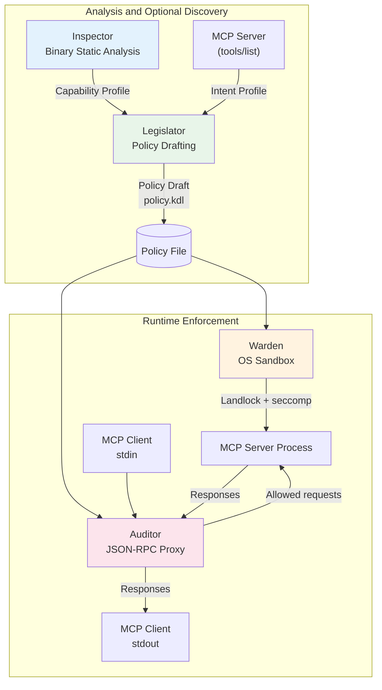
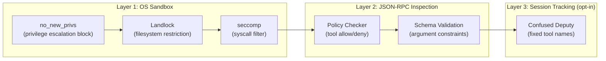
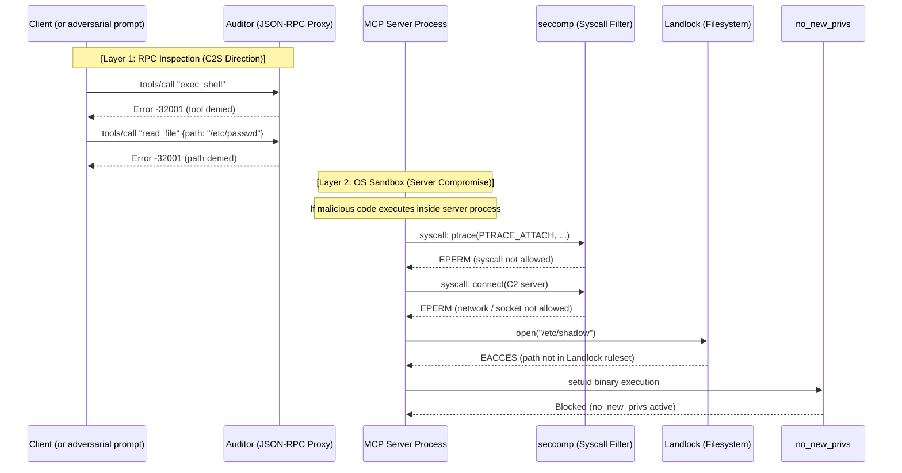
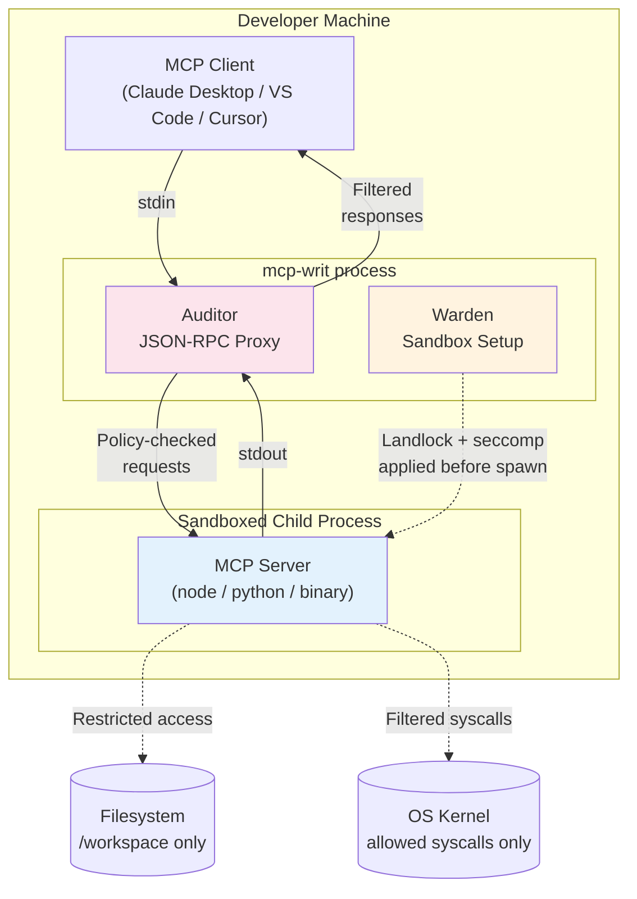
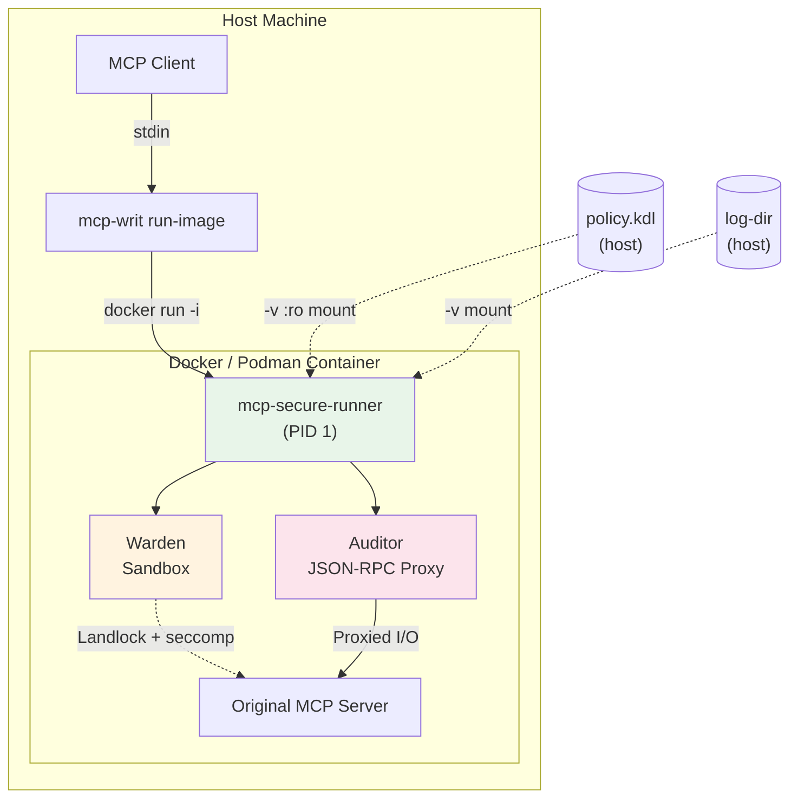
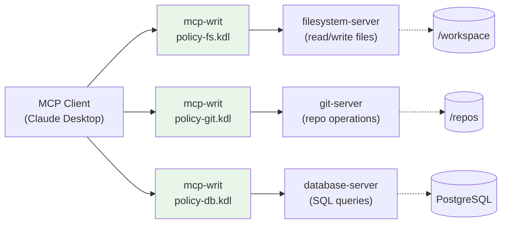
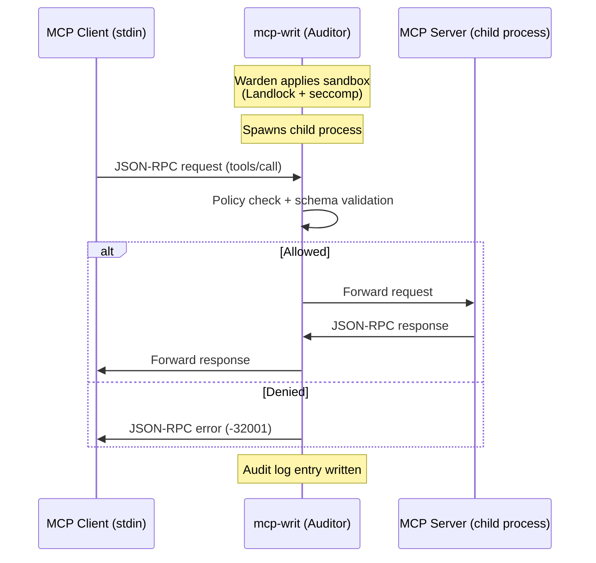
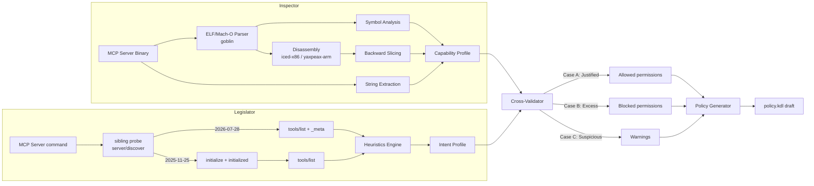
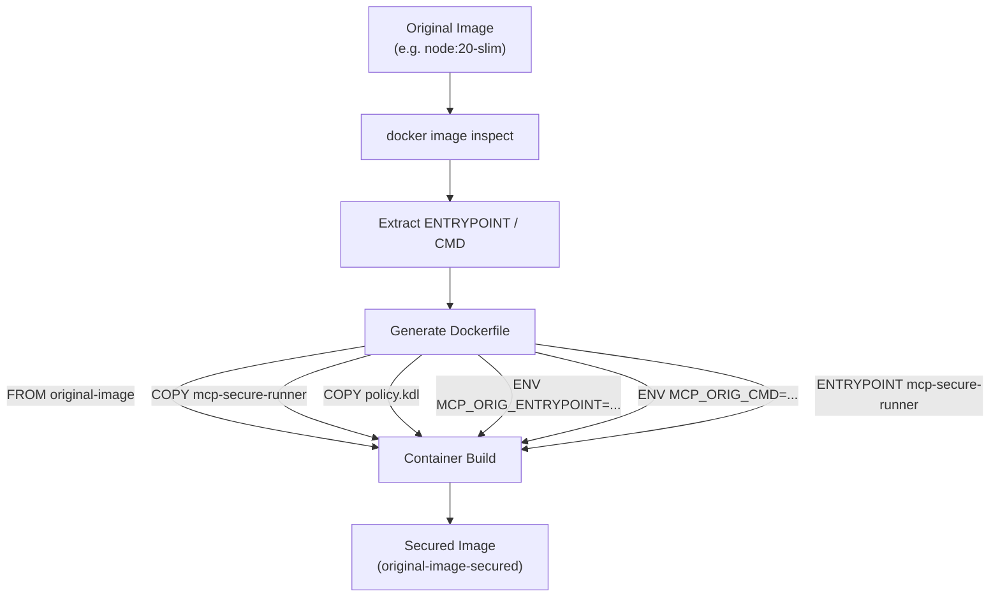
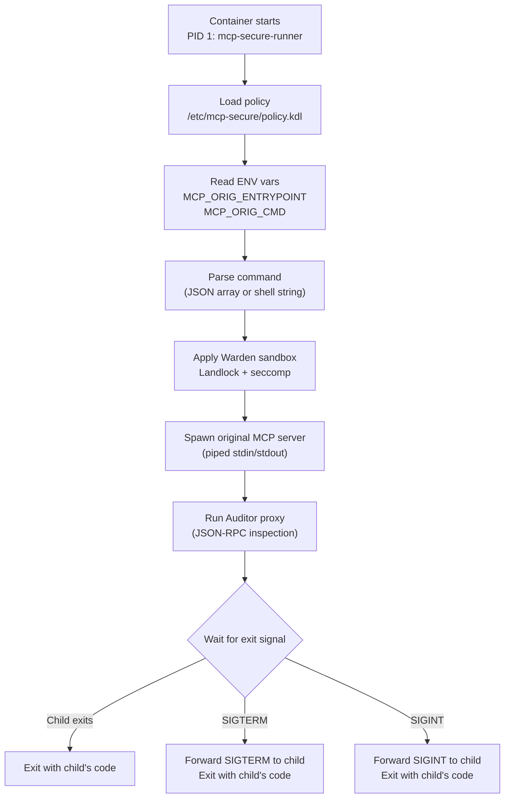

# MCP Writ User Guide

Read the [quick start](../README.md#quick-start) first. Reference sections: [commands](#4-subcommands), [policy](#5-policy-reference), [containers](#6-container-wrapping-deep-dive), and [troubleshooting](#7-faq--troubleshooting).

For a step-by-step workflow with editing examples and verification, see [Writing a policy](policy-authoring.md).

MCP Writ is a Rust-based security runner for [Model Context Protocol (MCP)](https://modelcontextprotocol.io/) servers. It wraps existing MCP servers — without modification — to enforce policy-based access control, OS-level sandboxing, and audit logging.

---

## 1. Design Philosophy

MCP Writ follows a **four-component architecture** inspired by the separation-of-concerns principle. Each component handles one security dimension, and together they form a defense-in-depth stack.

### Component Roles

| Component | Responsibility | Key Technologies |
|-----------|---------------|-----------------|
| **Inspector** | Static analysis of a **native** ELF or Mach-O binary. Produces a Capability Profile detailing syscalls, imported symbols, extracted strings (URLs, paths, env vars), and a risk score. For interpreters (`python` / `node` / `npx`), the binary is **not** the capability source of truth — Legislator follows the source/AST path instead. | goblin (ELF/Mach-O parser), iced-x86 + yaxpeax-arm (disassemblers), backward slicing; source/AST for interpreters |
| **Legislator** | MCP client for exactly `2026-07-28` and `2025-11-25`: probes `server/discover` on a disposable sibling process, then fetches `tools/list` via `2026-07-28` `_meta` or a `2025-11-25` `initialize` handshake. Heuristics infer Intent Profiles; cross-validation against native binary or interpreter AST capabilities drafts a policy. Optional `--self-test` collects Warden-backed evidence (draft aid, not auto-apply). | simultaneous stdio support (`2026-07-28` `_meta` + `2025-11-25` `initialize`), explicit rejection of unimplemented revisions, heuristic rules, cross-validation, Warden-backed self-test |
| **Warden** | Applies OS-level sandboxing before the MCP server process starts. Restricts filesystem access, syscalls (Linux), and process/network capabilities (platform-specific) so the server can only do what the policy permits. | Linux: Landlock + seccomp + `no_new_privs`. Windows: AppContainer, Job Object, DACL grants. macOS: `sandbox-exec` SBPL |
| **Auditor** | Acts as a JSON-RPC proxy between the MCP client and server. Inspects every `tools/call` against the policy (`side_effect`, secret-path overlay, optional trajectory), scans first-seen `tools/list` manifests (CC-001–015) and revalidates `list_changed`, tracks process-local session state for the opt-in Confused Deputy check, and writes an audit log. | nojson (zero-serde JSON), session state machine |

### Architecture Diagram


```mermaid
graph TB
    subgraph "Analysis and Optional Discovery"
        I[Inspector<br/>Binary Static Analysis] -->|Capability Profile| L[Legislator<br/>Policy Drafting]
        T["MCP Server<br/>(tools/list)"] -->|Intent Profile| L
        L -->|Policy Draft<br/>policy.kdl| P[(Policy File)]
    end

    subgraph "Runtime Enforcement"
        P --> W[Warden<br/>OS Sandbox]
        P --> A[Auditor<br/>JSON-RPC Proxy]
        W -->|Landlock + seccomp| S[MCP Server Process]
        C[MCP Client<br/>stdin] --> A
        A -->|Allowed requests| S
        S -->|Responses| A
        A -->|Responses| O[MCP Client<br/>stdout]
    end

    style I fill:#e3f2fd
    style L fill:#e8f5e9
    style W fill:#fff3e0
    style A fill:#fce4ec
```

---

## 2. Security Model

MCP Writ implements **defense in depth** — multiple independent security layers so that if one layer is bypassed, the others still provide protection.

### Defense Layers


```mermaid
graph LR
    subgraph "Layer 1: OS Sandbox"
        W1["no_new_privs<br/>(privilege escalation block)"]
        W2["Landlock<br/>(filesystem restriction)"]
        W3["seccomp<br/>(syscall filter)"]
    end

    subgraph "Layer 2: JSON-RPC Inspection"
        A1["Policy Checker<br/>(tool allow/deny)"]
        A2["Schema Validation<br/>(argument constraints)"]
    end

    subgraph "Layer 3: Session Tracking (opt-in)"
        S1["Confused Deputy<br/>(fixed tool names)"]
    end

    W1 --> W2 --> W3 --> A1 --> A2 --> S1
```

### Attack Scenarios and Mitigations

| Attack Vector | Defense Layer | Mechanism |
|--------------|-------------|-----------|
| Unauthorized filesystem access | Warden (Landlock) | Filesystem paths restricted to policy-defined `read_only` / `read_write` lists |
| Unallowed syscalls (ptrace, socket) | Warden (seccomp) | Only explicitly allowed syscalls pass; all others trigger `EPERM` |
| Unauthorized tool invocation | Auditor (checker) | `tools/call` requests for unknown or denied tools are blocked with a JSON-RPC error in normal execution (under `--dry-run` the violation is forwarded for auditing instead), and those tools are also hidden from `tools/list` responses |
| Sensitive data in arguments | Auditor (schema validation) | `args_schema` validates tool arguments against a JSON Schema |
| Privilege escalation | Warden (`no_new_privs`) | Set before any sandbox, prevents the process from gaining new privileges via setuid/setgid |
| Confused Deputy attack | Auditor (`confused_deputy_protection`, opt-in) | **Default off**. Discovery-role tools' successful responses seed one per-process `known_paths`; a use-role call for a path not in the set is denied. Roles come from per-tool `deputy` blocks (schema v2); without one, `list_files` / `list_directory` discover and `read_file` uses. Tools with no bound role run no check from this feature (their normal policy checks still apply). Clients sharing one child process share the set |
| Hidden instructions / homoglyphs / fs+net schema (CC-001–015) | Verifier (first-seen `tools/list` scan and `list_changed` revalidation) | Critical/High abort the session (including CC-005/CC-007/CC-011/CC-012). Medium is warn/audit only. Descriptions are not pruned or rewritten. After scan and hash verification, only the verified hash-v4 fields are forwarded (unknown vendor keys dropped) |
| Reserved secret paths under an allow glob | Auditor (secret-overlay) | Default on. Allow globs cannot override reserved paths. TOCTOU after the check is Warden's job |
| `read_only` tool with a URL/host argument | Auditor (`side_effect`) | Load-time consistency plus runtime reject |
| Read-then-exfiltrate across tools | Auditor (opt-in `trajectory`) | After a successful `read_only` call, deny the next other tool that is network-class or whose arguments contain a host/URL, and deny a same-tool call that sneaks a host/URL on a non-network tool. `result.isError` does not count as success. Default off. When enabled, every allowed tool needs `side_effect` |

The Landlock / seccomp / `no_new_privs` rows describe Linux. Windows uses AppContainer, Job Objects, and ACL grants; see [Platform notes (Windows)](#platform-notes-windows).

### Defense-in-Depth Scenario

The following diagram illustrates how MCP Writ's defense layers constrain unauthorized requests and compromised server processes. Each layer functions independently to maintain security even if another layer is bypassed.


```mermaid
sequenceDiagram
    participant CLI as Client (or adversarial prompt)
    participant AUD as Auditor (JSON-RPC Proxy)
    participant SRV as MCP Server Process
    participant SEC as seccomp (Syscall Filter)
    participant LL as Landlock (Filesystem)
    participant NNP as no_new_privs

    Note over CLI,AUD: [Layer 1: RPC Inspection (C2S Direction)]
    CLI->>AUD: tools/call "exec_shell"
    AUD-->>CLI: Error -32001 (tool denied)

    CLI->>AUD: tools/call "read_file" {path: "/etc/passwd"}
    AUD-->>CLI: Error -32001 (path denied)

    Note over SRV: [Layer 2: OS Sandbox (Server Compromise)]
    Note over SRV: If malicious code executes inside server process
    SRV->>SEC: syscall: ptrace(PTRACE_ATTACH, ...)
    SEC-->>SRV: EPERM (syscall not allowed)

    SRV->>SEC: syscall: connect(C2 server)
    SEC-->>SRV: EPERM (network / socket not allowed)

    SRV->>LL: open("/etc/shadow")
    LL-->>SRV: EACCES (path not in Landlock ruleset)

    SRV->>NNP: setuid binary execution
    NNP-->>SRV: Blocked (no_new_privs active)
```

**Key takeaways:**

- The **Auditor** inspects client-to-server JSON-RPC `tools/call` requests in real time, rejecting unauthorized tools or out-of-policy arguments before they reach the server.
- **Warden (seccomp + Landlock + no_new_privs)** applies OS-level sandboxing to the server process. Normal Linux startup requires an explicit `execve` or `execveat` allowance, which remains available in the child. The sample policies include that startup permission. Denying `exec_shell` is an RPC check and does not by itself stop a direct `execve`.
- Filesystem protection combines process-level Landlock rules (additive access control) with RPC-level argument checks (fine-grained deny rules).
- **Landlock** restricts filesystem access to policy-defined paths.
- **`no_new_privs`** prevents privilege escalation via setuid binaries.
- The net result: unauthorized operations are prevented at both the **application** layer (Auditor `side_effect`, secret-overlay, first-seen `tools/list`, optional trajectory, opt-in Confused Deputy) and the **OS** layer (Warden).

### Fail-Secure Principle

MCP Writ follows a **default-deny** approach:

- Tools not listed in the policy are blocked (not allowed by default).
- `tools/list` responses show only policy-allowed tools; denied and unlisted tools are filtered out of the verified response (the verification hash still covers the full advertised set). Under `--dry-run` nothing is filtered — the full advertised list is forwarded and the hypothetical filtered result is recorded as a `tools_list.filtered` audit event.
- Syscalls not in the allowlist are blocked.
- Network destinations not listed under `defaults.network` `allow` are blocked by the Auditor when `deny host="*"` is set. On **Windows** under the default `appcontainer` mechanism, that same combination (`allow host="…"` plus `deny host="*"`) is **rejected at policy load**: AppContainer cannot pin outbound destinations, so the OS layer is deny-all (empty allow list) or unrestricted (`allow host="*"` / `deny_all_others=false`). Under `--windows-mechanism psec` the combination is expressible for bare IPv4 destinations (other forms still refuse). Per-tool `network` rules remain Auditor checks on every platform.
- Invalid JSON or unparseable requests are rejected.

---

## 3. Deployment Scenarios

MCP Writ adapts to different deployment patterns in the MCP ecosystem. The following diagrams show how it fits into common configurations.

### Local MCP Server (`run` command)

The most common setup: an MCP client (Claude Desktop, VS Code, Cursor, etc.) launches a local MCP server through `mcp-writ run`. The guard process wraps the server, applying sandbox and proxy layers transparently.


```mermaid
graph TD
    subgraph "Developer Machine"
        CLIENT["MCP Client<br/>(Claude Desktop / VS Code / Cursor)"]
        subgraph "mcp-writ process"
            AUDITOR["Auditor<br/>JSON-RPC Proxy"]
            WARDEN["Warden<br/>Sandbox Setup"]
        end
        subgraph "Sandboxed Child Process"
            SERVER["MCP Server<br/>(node / python / binary)"]
        end
        CLIENT -->|stdin| AUDITOR
        AUDITOR -->|"Policy-checked<br/>requests"| SERVER
        SERVER -->|stdout| AUDITOR
        AUDITOR -->|"Filtered<br/>responses"| CLIENT
        WARDEN -.->|"Landlock + seccomp<br/>applied before spawn"| SERVER
    end
    SERVER -.->|"Restricted access"| FS[("Filesystem<br/>/workspace only")]
    SERVER -.->|"Filtered syscalls"| KERNEL[("OS Kernel<br/>allowed syscalls only")]

    style AUDITOR fill:#fce4ec
    style WARDEN fill:#fff3e0
    style SERVER fill:#e3f2fd
```

**Key points:**
- The MCP client launches `mcp-writ run` instead of the server directly
- Warden applies Landlock + seccomp **before** spawning the server process
- Auditor inspects client-to-server `tools/call` requests against the policy. Server responses pass through except `tools/list` (scan + hash, then verified response forwarding) and `notifications/tools/list_changed` (held until revalidation)
- On the first assembled `tools/list`, a manifest scan (CC-001–015) runs. Critical/High findings abort the session; Medium findings are audit/warn only. See [Tool controls and limits](#tool-controls-and-limits)

### Containerized MCP Server (`wrap-image` + `run-image`)

For MCP servers distributed as container images, `mcp-writ wrap-image` injects `mcp-secure-runner` and then `run-image` launches the secured container.


```mermaid
graph TD
    subgraph "Host Machine"
        CLIENT2["MCP Client"]
        GUARD2["mcp-writ run-image"]
        subgraph "Docker / Podman Container"
            RUNNER["mcp-secure-runner<br/>(PID 1)"]
            AUDIT2["Auditor<br/>JSON-RPC Proxy"]
            WARD2["Warden<br/>Sandbox"]
            SRV2["Original MCP Server"]
            RUNNER --> WARD2
            WARD2 -.->|"Landlock + seccomp"| SRV2
            RUNNER --> AUDIT2
            AUDIT2 -->|"Proxied I/O"| SRV2
        end
        CLIENT2 -->|stdin| GUARD2
        GUARD2 -->|"docker run -i"| RUNNER
    end
    POLICY[("policy.kdl<br/>(host)")] -.->|"-v :ro mount"| RUNNER
    LOGS[("log-dir<br/>(host)")] -.->|"-v mount"| RUNNER

    style RUNNER fill:#e8f5e9
    style AUDIT2 fill:#fce4ec
    style WARD2 fill:#fff3e0
```

**Key points:**
- Host-side `mcp-writ` handles container lifecycle and I/O relay only
- Inside the container, `mcp-secure-runner` (PID 1) applies all security layers
- Policy file is mounted read-only from the host — the container cannot modify it
- Log directory is optionally mounted for audit trail persistence

### Multi-Server Environment

In real-world development environments, multiple MCP servers run simultaneously. Each server gets its own `mcp-writ` instance with a tailored policy, providing separation between server processes. The isolation depends on the paths and capabilities granted to each policy; shared writable resources can still connect their trust boundaries.


```mermaid
graph LR
    CLIENT3["MCP Client<br/>(Claude Desktop)"]

    CLIENT3 --> G1["mcp-writ<br/>policy-fs.kdl"]
    CLIENT3 --> G2["mcp-writ<br/>policy-git.kdl"]
    CLIENT3 --> G3["mcp-writ<br/>policy-db.kdl"]

    G1 --> S1["filesystem-server<br/>(read/write files)"]
    G2 --> S2["git-server<br/>(repo operations)"]
    G3 --> S3["database-server<br/>(SQL queries)"]

    S1 -.-> FS1[("/workspace")]
    S2 -.-> FS2[("/repos")]
    S3 -.-> DB[("PostgreSQL")]

    style G1 fill:#e8f5e9
    style G2 fill:#e8f5e9
    style G3 fill:#e8f5e9
```

**Key points:**
- Each MCP server gets its own `mcp-writ` instance with a tailored policy
- Policies are isolated only as far as their configured paths and permissions allow: with non-overlapping grants (as in this example), the filesystem server cannot access git repos and the git server cannot run SQL
- Review shared writable paths, credentials, and network grants across server policies

### Execution methods and support status

`run` launches a host command, `run-image` launches a wrapped image, and
`plan` diagnoses either without launching. Each row names the host, the
workload target, and the method, then classifies the combination. A
*verified environment* bounds the claim — it is the configuration the
evidence was produced on, not a general-support statement. This table is
about which execution method exists at all; how each policy area lands per
OS is the [per-OS enforcement matrix](#per-os-enforcement-matrix).

| Host | Workload | Method | Operations | Status | Verified environment |
|---|---|---|---|---|---|
| Linux x86-64 · AArch64 | host command | native Warden (Landlock + seccomp + `no_new_privs`) | `run`, `plan` | **adopted** | `ubuntu-latest` + `ubuntu-24.04-arm` CI legs and real-hardware runs; kernels exposing only Landlock ABI V1 (e.g. WSL2 5.15) run partially and only under `sandbox allow_degraded=#true` |
| macOS arm64 | host command | native Warden (`sandbox-exec` SBPL) | `run`, `plan` | **adopted** — a legacy mechanism; see [Platform notes (macOS)](#platform-notes-macos) | `macos-latest` CI; macOS 26.6.2 arm64 host |
| macOS x86-64 | host command | native Warden (`sandbox-exec` SBPL) | `run`, `plan` | builds — sandbox enforcement **unverified** | release archive target exists; no x86-64 macOS test leg |
| Windows x86-64 | host command | native Warden (AppContainer + Job + DACL) — `--windows-mechanism appcontainer`, the default | `run`, `plan` | **adopted** | `windows-latest` CI; Windows 11 25H2 (26200.9457) host |
| Windows x86-64 | host command | native Warden — `psec` (ProcessSecurityEnvironment v1.0 + Job; explicit `--windows-mechanism psec`) | `run`, `plan` | **adopted, conditional** — capability-probed before every launch; an unsupported host or an inexpressible policy refuses and never falls back to AppContainer. The wire contract is preview-documented; see the [Windows isolation evaluation](validation/windows-isolation.md) | Windows 11 Pro 25H2 (26200.9457) x86-64 host; probe + live launch + refusal legs in the [PR-31 record](validation/windows-isolation.md#pr-31-product-integration--psec) |
| Windows arm64 | host command | native Warden | `run`, `plan` | builds — sandbox enforcement **unverified** | release archive target exists; no arm64-Windows test leg |
| Linux · macOS · Windows | Linux OCI image | `container` (default isolation) on the `docker` or `podman` engine (`buildah` builds images only) | `wrap-image`, `containerize`, `run-image`, `plan --image` | **adopted** | Container tests workflow (ubuntu-22.04 + Docker daemon); `podman` is an accepted engine without a recorded verification leg |
| Linux | Linux OCI image | `kata` — dedicated Kata VM, docker engine only | `run-image`, `plan --image` | **adopted, conditional** — needs a `kata` runtime registered with dockerd plus `/dev/kvm` and `/dev/vhost-vsock` | docker 29.1.3 + Kata 4.2.0 + QEMU on WSL2 Ubuntu 24.04 x86-64 — [Kata validation](validation/kata.md) |
| macOS 26+ arm64 | linux/arm64 image | `apple-container` — Apple's `container` tool | `run-image`, `plan --image`; image build stays a separate `container build` | **adopted, conditional** — needs `container system` running | macOS 26.6.2 arm64, `container` 1.5.0 — [Apple container validation](validation/apple-container.md) |
| Windows x86-64 | windows/amd64 image | `hyperv` — docker engine in Windows-containers mode | `wrap-image`, `run-image`, `plan --image` | **adopted, conditional** — needs `OSType=windows` plus the `vmcompute`/`hns` services; the image's recorded OS build must not exceed the host's | Windows 11 25H2 (26200.9457), docker 29.7.2, Server Core ltsc2025 — [Hyper-V validation](validation/windows-hyperv.md) |
| Windows x86-64 | command payload directory | `windows-sandbox` — Store `wsb` CLI behind the relay | `run`, `plan` (never `run-image`) | **adopted, conditional** — interactive session, one disposable VM, trusted host + Default Switch | Windows 11 25H2 (26200.9457), Store Sandbox 0.8.107.0 — [Windows Sandbox backend](validation/windows-sandbox-product.md) |
| Windows x86-64 | linux/amd64 image | `container` (default isolation) on the `wslc` engine — WSL Containers units inside the per-user shared session VM | `wrap-image`, `containerize`, `run-image`, `plan --image` | **adopted, conditional** — explicit `--engine wslc` only (never auto-detected, never an implicit substitute for docker/podman); WSL ≥ 2.9.3 and `wslc` resolvable (PATH, `C:\Program Files\WSL\wslc.exe`, or `MCP_WRIT_WSLC_EXE`); the session VM is substrate plumbing, not an isolation boundary — launches record `unit=container`, never `vm` | Windows 11 25H2 (26200.9457), WSL 3.0.1.0 / `wslc` client 3.0.1.0, kernel 6.18.40.1-1 — [WSL Containers validation](validation/wslc.md) |

Candidate and refused combinations:

| Combination | Status | Note |
|---|---|---|
| Windows host, Win32 app isolation / IsolationSession | **candidate — not implemented** | preview- or Insider-stage mechanisms under per-method evaluation; no release contract exists. PSEC left this list: it is the opt-in `--windows-mechanism psec` row above |
| `podman` engine + `kata` isolation | **not supported** | only the docker engine serves the Kata backend; other engines are refused rather than inferred |
| `buildah` as the run engine | **not supported** | `buildah` builds images (`wrap-image`, `containerize`); it cannot run them |
| Windows arm64 guest images | **out of contract** | no Windows arm64 runner artifact exists |
| `hyperv` / `windows-sandbox` off Windows x86-64, `apple-container` off Apple-Silicon macOS, `kata` off Linux | **not supported** | each backend declares its host capability; a mismatch refuses at selection or `plan` time, never falls back silently |
| `--engine wslc` on a non-Windows host, WSL below the 2.9.3 floor, or no resolvable `wslc` | **refused** | `plan` reports `engine.resolve` fail naming the missing prerequisite (`wsl.product`/`wslc.cli` checks); no docker/podman substitute is ever picked |
| `--windows-mechanism psec` on a host failing the capability probe, or with a policy the spec cannot express | **refused** | probe or `policy-check` stage fails the launch/policy-load outright — never falls back to AppContainer |

Every refused method reports why — `run-image` rejects the selection and
`plan` returns a `blocked` result naming the missing prerequisite instead
of planning a normal container launch.

---

## 4. Subcommands

### 4.1 `run` — stdio Wrapper

Wraps a local MCP server process with policy enforcement via stdio proxy.

**Usage:**

```bash
mcp-writ run [OPTIONS] -- <command> [args...]
```

**Options:**

| Option | Short | Default | Description |
|--------|-------|---------|-------------|
| `--transport <type>` | `-t` | `stdio` | Transport type (currently only `stdio` is supported) |
| `--policy <path>` | `-p` | *(default policy)* | Path to policy KDL file |
| `--verbose` | `-v` | off | Increase log verbosity (INFO → DEBUG) |
| `--dry-run` | | off | Run the server without OS sandboxing; log `tools/call` policy violations without blocking those requests. Effective first-seen `tools/list` blocking (default: Critical/High) still fail-closed (JSON-RPC error, no `result`). Server execution may have side effects |
| `--fail-on <level>` | | `high` | `high` / `critical` / `none`. CC abort threshold for first-seen, `list_changed`, and `--dry-run`. `critical` demotes **all High** (not only CC-005). `none` **never aborts on CC** (dangerous; Critical/High audited only; stderr warning at startup). No `--no-fail`. CLI overrides `MCP_WRIT_FAIL_ON` |
| `--server <name>` | | *(single declared server)* | Select the server policy; required when multiple servers are declared |
| `--audit-log <path>` | | **required** when `logging.fail_closed` (default) | Path to audit log file (JSONL format) |
| `--audit-sync` | | off | Flush **and** fsync every audit record as it is written — a storage round-trip per record in exchange for the emitted stream staying durable up to the last record the writer reached, even under SIGKILL. Requires `--audit-log`; rejected with `--isolation windows-sandbox`. See [Audit durability, sync modes, and external forwarding](#audit-durability-sync-modes-and-external-forwarding) |
| `--report <path>` | | *(none)* | Write the machine-readable launch report — plan, observations, and final result in one schema — to `<path>` as JSON. The destination is validated before the workload starts; an unwritable path fails the launch. Report JSON never goes to stdout. See [Launch and plan reports](#48-launch-and-plan-reports) |
| `--windows-mechanism <kind>` | | `appcontainer` | Native Windows launch only: `appcontainer` is the platform default; `psec` selects the conditional ProcessSecurityEnvironment mechanism — capability-probed before launch, and an unsupported host or a policy PSEC cannot express refuses instead of falling back. Rejected together with `--isolation windows-sandbox`; meaningless off Windows. See [Platform notes (Windows)](#platform-notes-windows) |

**Example:**

```bash
# Basic usage with a policy
mcp-writ run --policy policy.kdl --audit-log ./audit.jsonl -- node my-mcp-server.js

# Dry-run mode for testing (no OS sandboxing; `tools/call` violations logged
# but not blocked; effective first-seen blocking still fail-closed;
# default --fail-on high)
mcp-writ run --dry-run --policy policy.kdl --audit-log ./audit.jsonl -- python -m my_mcp_server

# Observe the entire High set (CC-002/003/005/007/008/009/011/012/014 High, not only CC-005)
mcp-writ run --fail-on critical --policy policy.kdl --audit-log ./audit.jsonl -- node my-mcp-server.js

# With audit logging to a file
mcp-writ run --policy policy.kdl --audit-log /var/log/mcp-audit.jsonl -- ./my-server
```

**First-seen `tools/list` scan:** After pagination is assembled, Auditor scans the advertised tools (CC-001–015) **before** the client sees a result. A hash match does **not** waive Critical/High findings. Under the default `--fail-on high`, blocking findings (Critical/High, including CC-005 same-tool fs+net, CC-007 read-named write schema, CC-011 annotation/schema contradiction, and CC-012 intra-list name collision) abort the session with a JSON-RPC error — the `tools/list` result is not forwarded. This fail-closed path applies even under `--dry-run` (only the dial's effective blocking changes). Descriptions are not pruned or rewritten. After scan and hash verification, Auditor **rebuilds** each tool from the hash-v4 / scanned field set only (`name`, `description`, `title`, `inputSchema`, `outputSchema`, `annotations`, `icons`, `execution`, `_meta`). Unknown vendor keys (for example `x-system`) are dropped. A non-string `title` fails closed at parse. Descriptions of known fields are not pruned or rewritten. Medium findings (CC-004, CC-006, CC-013, CC-014 remote http(s) or protocol-relative raster icons, CC-015) are written to the audit log as `observed` and do not stop `run` (under the default, CC-014 `file:` / `javascript:` / `vbscript:` / `blob:` / non-image `data:` / SVG is High and does abort). The threshold is `--fail-on` / `MCP_WRIT_FAIL_ON` (below). Hash pin, verified response forwarding, secret-overlay, Warden, and `generate-policy` `deny=#true` are outside the dial.

`notifications/tools/list_changed` **does** trigger an internal re-list. The notification is not forwarded until pagination is reassembled, `scan_manifest` runs, and the tools-list hash verifies. Effectively blocking CC findings abort like first-seen at the **same** `--fail-on` threshold (notification is dropped). A JSON-RPC error on the internal relist also aborts; `list_busy` stays set until the session abort completes so concurrent `tools/call` cannot slip through. While the list is stale or a re-list is in flight, `tools/call` is denied (fail-secure). `last_verified` is updated only after a successful scan + hash.

**Hash v4 re-pin:** Canonical bytes are prefixed with `mcp-guard-tools-list-v4:`. The digest includes `name`, `description`, optional `title`, `inputSchema`, `outputSchema`, `annotations`, `icons`, `execution`, and `_meta` (key-sorted JSON per tool). There is no v3 compatibility. `generate-policy --live-discovery` emits a v4 `tools-list-hash` with a re-pin comment. Existing policies pinned under v3 must be regenerated.

**Launch-target hash verification:** When the policy's `server` block carries `binary-hash` / `entrypoint-hash` / `lockfile-hash` / `docker-manifest-hash` entries, `run` verifies them before the server process exists. The order is fixed: (1) `argv[0]` is resolved to a canonical path, (2) every configured target file is hashed and compared (`hash.verified` / `hash.mismatch` audit events), (3) the workload is **bound** — a `binary-hash` target must canonicalize to the launched executable (a mismatch is `hash.mismatch` and fails the launch), an `entrypoint-hash` target must be the launched executable or its first payload argument (`server.py` in `python server.py`), and (4) the binding re-runs immediately before spawn — the executable's content is re-hashed, and a separate entrypoint script is re-checked for both path correspondence and content, so a file swapped in after the initial verification is caught fail-closed. This narrows but does not close the hash-to-exec window: nothing holds the files immutable between the last hash read and `exec`, and code the workload loads at run time stays unpinned. The launch report's `code_identity` records which check points each pin passed. Any verification failure exits `run` with `Supply chain verification failed` and never reaches spawn. Hash entries that are only `lockfile-hash` / `docker-manifest-hash` cannot bind a process, and inline evaluation (`-c` / `-e` / `--eval` / `--command`; `-p` / `--print` on node, `-E` on perl — including attached spellings like `-c'…'` and `--eval=…` / `--print=…`, and clusters like `-Ec'…'` or `-pe'…'`) is never hash-bindable — both fail closed. `python -m <module>` and `npx <pkg>` cannot bind their payload from argv either; `generate-policy` therefore emits `binary-hash` for the interpreter plus a `// REVIEW:` comment naming the unbound payload, and never fabricates a hash for it. The *first payload argument* is the first non-option token after the interpreter once the operands of known value-taking options (`--require` / `-r`, `--import`, `--loader`, `--input-type`, `-W`, `-X`, and similar) are skipped; an unlisted option that takes a value can still leave its operand pinned as the entrypoint, so confirm the emitted `target=` names the real script. A script launched directly (`./server.py` or a PATH-installed entry script) is pinned itself, but the interpreter its `#!` line selects is not — the draft flags that with a `// REVIEW:` comment. Delegating launchers (`env`, `py`, `npx`, `uvx` / `uv run`, `npm exec`, `docker run`, `sudo`, `timeout`, and similar) pin only the launcher binary — the draft records that the command they select is unbound. Because the digests cover this host's files (interpreter paths, virtualenv pythons, script locations), recompute them on the deployment host — `generate-policy` emits that reminder as a REVIEW comment — and regenerate the draft when the server or its interpreter is updated.

**Stdio Proxy Flow:**


```mermaid
sequenceDiagram
    participant Client as MCP Client (stdin)
    participant Guard as mcp-writ (Auditor)
    participant Server as MCP Server (child process)

    Note over Guard: Warden applies sandbox<br/>(Landlock + seccomp)
    Note over Guard: Spawns child process

    Client->>Guard: JSON-RPC request (tools/call)
    Guard->>Guard: Policy check + schema validation
    alt Allowed
        Guard->>Server: Forward request
        Server->>Guard: JSON-RPC response
        Guard->>Client: Forward response
    else Denied
        Guard->>Client: JSON-RPC error (-32001)
    end

    Note over Guard: Audit log entry written
```

#### Windows Sandbox command execution

On an interactive Windows x86-64 desktop, select `run --isolation windows-sandbox`
with `--sandbox-payload <directory>`, `--sandbox-state <existing-directory>` and
an explicit `--policy`. The trailing executable is relative to the payload;
the guest receives it at `C:/mcp-secure/workload`. `plan` accepts the same
options without launching a VM. Install the matching Windows runner and
`mcp-writ-wsb-relay.exe` beside the CLI, or select `--sandbox-runtime <directory>`.

This path requires the ID-based Store `wsb` CLI, guest logon and no existing
Sandbox. It keeps the guest Warden/Auditor, records audit and guest reports,
and stops only its reserved VM ID. The host and Default Switch TCP path are
trusted; transport credentials are plaintext. See [setup, fixed paths,
limits and product acceptance](validation/windows-sandbox-product.md).

### 4.2 `inspect` — Binary Static Analysis

Analyzes a **native ELF or Mach-O** binary and produces a capability profile with risk assessment.

For interpreters (`python` / `python3` / `node` / `npx`) and script paths (`.py` / `.js` / `.mjs` / `.cjs` / `.ts`, or a shebang), the native binary is **not** the capability source of truth. `inspect` skips native analysis, prints `native analysis skipped; source payload = …`, and reports handler capabilities from the source/AST path (`source_tools` in `--format json`). Inspecting the interpreter binary itself (for example `inspect /usr/bin/python3` with no script) is unresolved: CPython/Node syscalls are not treated as the server's Intent. `-c` / `--eval` is not statically parseable — `inspect` warns and skips both source AST and native binary capability.

**Usage:**

```bash
mcp-writ inspect [OPTIONS] <binary>
mcp-writ inspect [OPTIONS] -- <command> [args...]
```

**Options:**

| Option | Short | Default | Description |
|--------|-------|---------|-------------|
| `--format <fmt>` | `-f` | `human` | Output format: `human`, `json`, or `kdl` |
| `--output <path>` | `-o` | *(stdout)* | Write output to file instead of stdout |
| `--verbose` | `-v` | off | Increase log verbosity |
| `--project <dir>` | | *(none)* | Analyze a project directory for permission hints (no CWD fallback) |

**Example:**

```bash
# Human-readable analysis
mcp-writ inspect /usr/local/bin/my-mcp-server

# Interpreter / script: native analysis is skipped; source/AST is the capability source
mcp-writ inspect --format json server.py

# Inline eval: warn and skip both source AST and native binary capability (same as generate-policy)
mcp-writ inspect -- python -c "print(1)"

# JSON output for programmatic use
mcp-writ inspect --format json -o profile.json /usr/local/bin/my-mcp-server

# KDL output
mcp-writ inspect --format kdl /usr/local/bin/my-mcp-server
```

**Output includes:**

- **Symbol profile**: imported symbols categorized by risk (network, filesystem, process, crypto, memory)
- **Resolved syscalls**: detected `syscall` instructions with backward-sliced register values identifying the syscall number
- **String findings**: extracted URLs, filesystem paths, and environment variable references
- **Risk score**: 0–100 composite score with human-readable summary
- **Risk flags**: stripped binary, Go wrapper detection, sensitive path access
- **Target + analysis state**: detected format/ISA/ABI/endianness and the per-component analysis status (`analyzed` / `partial` / `unsupported` / `not_applicable` / `failed`) with a reason code. In JSON these are the `target` and `analysis` objects; in KDL the `target`, `code_region`, and `analysis` nodes; in human output the `Target:` and `Analysis:` lines. An empty syscall list is meaningful **only** under `analyzed` — `unsupported` (for example a non-Linux `EI_OSABI`, a big-endian or ELF32 AArch64 ELF, a non-arm64 Mach-O slice, or a PE container) means the binary was not decoded, not that it makes no syscalls. AArch64 ELF64 little-endian Linux binaries are analyzed through the same pipeline as x86-64, resolving `svc` entries against the AArch64 syscall table (the `svc` immediate is auxiliary info under Linux).
- **Mach-O / Darwin ARM64**: thin and fat (`universal`) Mach-O files are identified per slice. The analyzable plain `arm64` slice is decoded; every other slice (x86-64, arm64e, arm64_32) keeps its own `unsupported` state so a fat binary never looks fully validated from the arm64 slice alone. Under the Darwin ABI only `svc #0x80` is a syscall entry and the number register is `x16`: non-negative values resolve against the XNU BSD syscall table, negative values against the Mach trap table (`kind="mach_trap"`, signed numbers in output). Darwin findings are never emitted into Linux seccomp `allow` lines in generated policies — the `syscalls` section carries review comments only.

### 4.3 `generate-policy` — Policy Auto-Generation

Combines binary analysis (Inspector) with MCP tool discovery (Legislator) to produce a policy KDL draft.

Legislator implements and tests exactly **MCP 2026-07-28 and MCP 2025-11-25 in the same build** ([MCP 2026-07-28 versioning](https://modelcontextprotocol.io/specification/2026-07-28/basic/versioning), [stdio probe](https://modelcontextprotocol.io/specification/2026-07-28/basic/transports/stdio)). It first sends `server/discover` with `2026-07-28` `_meta` on a **disposable sibling process** (the [TypeScript SDK](https://ts.sdk.modelcontextprotocol.io/v2/migration/support-2026-07-28) uses the same pattern because some rmcp servers exit on pre-`initialize` traffic). A compatible response selects the `2026-07-28` path (`tools/list` with required `_meta`). A response selecting `2025-11-25`, a non-reserved error, malformed response, exit, or timeout tries `2025-11-25` on a fresh child via `initialize` → `notifications/initialized` → `tools/list`; the returned `protocolVersion` must be `2025-11-25`. If `server/discover` or `-32022` advertises only an unimplemented revision, discovery fails explicitly. Dates later than `2026-07-28` and earlier than `2025-11-25` are not inferred to be compatible. The parser keeps per-tool `name` / `description` / `title` / `inputSchema` / `outputSchema` / `annotations` / `icons` / `execution` / `_meta` (and ignores result-envelope `ttlMs` / `cacheScope` / `resultType`). `generate-policy --live-discovery` writes a v4 `tools-list-hash` so operators can re-pin after upgrading from v3.

**Usage:**

```bash
mcp-writ generate-policy [OPTIONS] -- <mcp-server-command> [args...]
```

**Options:**

| Option | Short | Default | Description |
|--------|-------|---------|-------------|
| `--binary <path>` | `-b` | *(command[0])* | Path to binary to inspect (defaults to first element of command) |
| `--output <path>` | `-o` | *(stdout)* | Write generated policy to file |
| `--verbose` | `-v` | off | Increase log verbosity |
| `--live-discovery` | | off | Execute the MCP server to discover tools (not the default) |
| `--unsafe-unsandboxed-discovery` | | off | Live discovery with the ambient environment |
| `--static-only` | | **on** | Do not execute the server; inspect the binary only |
| `--project <dir>` | | *(none)* | Analyze a project directory for permission hints (explicit dir or script parent only; no CWD fallback) |
| `--self-test` | | off | After drafting, spawn the server **via Warden** (restricted env + private TMPDIR, 8s) and collect Auditor / Warden evidence. Auditor probes are `checker::check_request` (not a live proxy). Warden `pass` is Linux SIGSYS only. Spawn failure is `inconclusive`, not `skipped`. Reports a `probe-policy:` overlay distinct from the original draft. Draft aid only — does not auto-apply. Never uses `--unsafe-unsandboxed-discovery` |

**Example:**

```bash
# Generate a static-only policy draft to stdout (no server execution)
mcp-writ generate-policy -- node my-mcp-server.js

# Opt in to live tools/list discovery
mcp-writ generate-policy --live-discovery -- node my-mcp-server.js

# Save to file with explicit binary path
mcp-writ generate-policy --binary /usr/bin/node --output policy.kdl -- node my-mcp-server.js

# Warden-backed evidence on the draft (stdout still prints the KDL; exit 0 = evidence, 2 = insufficient, 1 = parse/generate failure)
mcp-writ generate-policy --self-test -- python server.py
```

`--self-test` always prints the draft, then reports `auditor: pass/fail` and a separate `warden:` line on stderr. Auditor probe details are labeled as checker results, not live-proxy observations. A JSON-RPC policy error, MCP `isError`, or fabricated `EACCES` text is never a Warden pass. Warden `pass` is Linux SIGSYS after a successful handshake and control call. Non-Linux: `warden: skipped` when the child starts, `warden: inconclusive` when spawn fails. stderr includes `spawn:` and, on Linux, `probe-policy:` describing the diagnostic overlay (not the original draft). The draft is never applied automatically.

**Launch-target hashes in the draft:** The `server "auto-generated"` block pins the launch target the same way `run` binds it. `binary-hash` covers the resolved `argv[0]` (a native server binary, or the interpreter for `python server.py` / `node index.js`); `entrypoint-hash` covers the first payload argument when it is a script file. The digests are **this host's** — REVIEW comments in the draft tell the operator to recompute them on the deployment host and to regenerate the draft when the server or interpreter is updated. When the payload cannot be bound from argv — `python -m <module>`, `npx <pkg>`, or inline eval (`-c` / `-e` / `--eval` / `--command`; `-p` / `--print` on node, `-E` on perl — incl. attached and `=` spellings) — no hash is fabricated; a `// REVIEW:` comment records the reason. See [Launch-target hash verification](#41-run--stdio-wrapper) for what `run` enforces.

**Policy Generation Flow:**


```mermaid
flowchart LR
    subgraph Inspector
        B[MCP Server Binary] --> EP[ELF/Mach-O Parser<br/>goblin]
        EP --> SY[Symbol Analysis]
        EP --> DI[Disassembly<br/>iced-x86 / yaxpeax-arm]
        DI --> SL[Backward Slicing]
        SY --> CP[Capability Profile]
        SL --> CP
        B --> ST[String Extraction]
        ST --> CP
    end

    subgraph Legislator
        CMD["MCP Server command"] --> PROBE["sibling probe<br/>server/discover"]
        PROBE -->|2026-07-28| TL["tools/list + _meta"]
        PROBE -->|2025-11-25| INIT["initialize + initialized"]
        INIT --> TL2["tools/list"]
        TL --> HE[Heuristics Engine]
        TL2 --> HE
        HE --> IP[Intent Profile]
    end

    CP --> XV[Cross-Validator]
    IP --> XV

    XV -->|Case A: Justified| AL[Allowed permissions]
    XV -->|Case B: Excess| BL[Blocked permissions]
    XV -->|Case C: Suspicious| WA[Warnings]

    AL --> PG[Policy Generator]
    BL --> PG
    WA --> PG
    PG --> PT[policy.kdl draft]
```

**Cross-Validation Cases:**

| Case | Meaning | Policy Action |
|------|---------|---------------|
| **A** | Capability matches Intent — permission is justified | `allowed = true` |
| **B** | Capability exists but no tool needs it — excess | `allowed = false` (blocked, with warning comment) |
| **C** | Intent requires it but binary / AST lacks evidence — suspicious or dynamic | Warning comment, allowed with review note. **No `side_effect` is written** — `read_only`×URL enforcement and trajectory arming do not apply until a human adds `side_effect` (and related sub-policies). Overlay and first-seen scan still apply independently |

Tools without binary/AST evidence (Case C / unbound handlers) therefore stay unbound in the draft: overlay and first-seen scan still apply, but `side_effect`-gated checks do not until a human fills them in.

### 4.4 `wrap-image` — Container Wrapping

Wraps an existing MCP server container image with `mcp-secure-runner` as PID 1.

**Usage:**

```bash
mcp-writ wrap-image [OPTIONS] <image>
```

**Options:**

| Option | Short | Default | Description |
|--------|-------|---------|-------------|
| `--policy <path>` | `-p` | `./policy.kdl` | Policy KDL copied into the image at `/etc/mcp-secure/policy.kdl` |
| `--tag <tag>` | `-t` | `<image>-secured:latest` | Output image tag |
| `--engine <kind>` | `-e` | *(auto-detect)* | Container engine: `docker`, `podman`, or `buildah` — or `wslc` on a Windows x86-64 host with WSL ≥ 2.9.3 (explicit selection only; auto-detect never picks it; builds via `wslc build -f/-t/--no-cache`) |
| `--runner-binary <path>` | | *(auto-detect)* | `mcp-secure-runner` binary to embed |
| `--output-dockerfile <path>` | | *(none)* | Write the generated Dockerfile and exit (no build) |
| `--server <name>` | | *(single declared server)* | Select the server policy to embed in the image |
| `--crt-dll <path>` | | *(auto-detect)* | MSVC redistributable DLL to ship app-local next to the runner (Windows guest only; repeatable) |
| `--no-cache` | | off | Disable the engine build cache |

**Workflow:**

1. Inspects the original image to extract `ENTRYPOINT`/`CMD` — and the
   guest OS, which selects the whole layout contract below
2. Generates a Dockerfile that:
   - Uses the original image as base (`FROM`)
   - Copies `mcp-secure-runner` to the guest's runner path
     (`/usr/local/bin/mcp-secure-runner` on Linux,
     `C:/mcp-secure/mcp-secure-runner.exe` on Windows)
   - Copies `policy.kdl` to the guest's policy path
     (`/etc/mcp-secure/` or `C:/etc/mcp-secure/`)
   - On Windows only: copies any required MSVC CRT DLLs app-local next
     to the runner — Server Core ships none, so an MSVC-built runner
     would otherwise fail loader lock
   - Saves original `ENTRYPOINT`/`CMD` as environment variables
   - Sets `mcp-secure-runner` as the new `ENTRYPOINT`
3. Builds the secured image using Docker, Podman, or Buildah

A Windows base image produces the Windows variant (`# escape=\`,
JSON-form `COPY`/`ENTRYPOINT`, no `RUN`/`chmod`); a Linux base the OCI
one. The embedded binary must match the guest: a PE `.exe` for Windows,
an ELF for Linux — a cross-format or cross-architecture pick is refused
before the build.

Note that the guest filesystem control (the AppContainer DACL on
Windows) auto-grants the workload only its executable image and ancestor
traverse. DLLs or data files the workload ships next to its own exe need
an explicit policy `filesystem allow` on the install directory
(e.g. `allow "C:/probe" mode="read"`) or the sandboxed child cannot
open them.

**Container Wrapping Flow:**


```mermaid
flowchart TD
    OI["Original Image<br/>(e.g. node:20-slim)"] --> DII["docker image inspect"]
    DII --> EP["Extract ENTRYPOINT / CMD"]

    EP --> DF["Generate Dockerfile"]
    DF --> |"FROM original-image"| BUILD
    DF --> |"COPY mcp-secure-runner"| BUILD
    DF --> |"COPY policy.kdl"| BUILD
    DF --> |"ENV MCP_ORIG_ENTRYPOINT=..."| BUILD
    DF --> |"ENV MCP_ORIG_CMD=..."| BUILD
    DF --> |"ENTRYPOINT mcp-secure-runner"| BUILD[Container Build]
    BUILD --> SI["Secured Image<br/>(original-image-secured)"]
```

**Engine Selection:**

| Engine | Notes |
|--------|-------|
| Docker | Default and most widely available |
| Podman | Rootless container support |
| Buildah | Build-only engine (does not support `run`) |

### 4.5 `run-image` — Run Secured Container Image

Runs a previously wrapped container image with policy and log volume mounts.

**Usage:**

```bash
mcp-writ run-image [OPTIONS] <image>
```

**Options:**

| Option | Short | Default | Description |
|--------|-------|---------|-------------|
| `--engine <kind>` | `-e` | *(auto-detect)* | Container engine for `container`/`kata`/`hyperv` isolation: `docker` or `podman` — or `wslc` on a Windows x86-64 host (explicit selection required, never auto-detected, never an implicit substitute for docker/podman; pairs with `container` isolation carrying linux/amd64 images, and the unit runs inside WSL's per-user shared session VM — substrate plumbing, not an isolation boundary, so the report records `unit=container`, never `vm`. `buildah` cannot run containers; `hyperv` is docker-only — a non-docker selection refuses; `wslc` refuses other isolations and non-Linux/amd64 guests). Does not apply to `apple-container` — that substrate is driven by Apple's own `container` CLI, so passing `--engine` refuses |
| `--isolation <kind>` | | `container` | Isolation method for the workload, selected separately from the engine: `container` is the default OCI container on the resolved engine. `kata` runs the workload in a dedicated Kata Containers VM via `docker run --runtime kata` — a Linux host with the `kata` runtime registered with dockerd and `/dev/kvm` + `/dev/vhost-vsock` present (see [Kata validation](validation/kata.md)); only the docker engine serves it, and a missing prerequisite refuses the launch. `apple-container` boots the workload in its own Virtualization.framework Linux VM via Apple's `container` tool — a macOS 26+ Apple Silicon host with `container system` running and a linux/arm64 image (see [Apple container validation](validation/apple-container.md)); other OSes/architectures refuse rather than run emulated, and `image build` stays an explicit `container build` step, not part of `run-image`. `hyperv` runs the workload in a dedicated Hyper-V utility VM via `docker run --isolation hyperv` — a Windows x86-64 host with a docker engine in Windows-containers mode (`OSType=windows`) and the Hyper-V stack installed (`vmcompute`/`hns` services), carrying a windows/amd64 image whose recorded OS build is not newer than the host's (see [Hyper-V validation](validation/windows-hyperv.md)); the daemon-applied isolation is re-read from `HostConfig.Isolation` before the workload is trusted, so a silent process-isolation substitute refuses and tears the unit down. `windows-sandbox` uses `run` with a command payload; it is refused by `run-image` (see [Windows Sandbox](validation/windows-sandbox-product.md)) |
| `--policy <path>` | `-p` | `./policy.kdl` | Path to policy KDL file (mounted read-only at `/etc/mcp-secure/policy.kdl`) |
| `--server <name>` | | *(single declared server)* | Select the server policy to mount |
| `--allow-mutable-tag` | | off | Allow a tag instead of requiring an immutable `@sha256:<digest>` reference |
| `--log-dir <path>` | | *(none)* | Directory for container log files (mounted at `/var/log/mcp-secure`) |
| `--report <path>` | | *(none)* | Write the launch report (plan + host observations + final result, same schema as `run --report`) to `<path>` as JSON. The destination is validated before any engine call; an unwritable path fails the run. Guest-side enforcement is never assumed on the host: when the runner carries the `guest-report-1` capability, the validated guest report is attached under `guest`. With `--report` requested, images whose runner lacks that capability are refused before launch |
| `--verbose` | `-v` | off | Enable verbose output |

**Example:**

```bash
# Pin the wrapped image to its actual registry digest
mcp-writ run-image --log-dir ./logs my-mcp-server-secured@sha256:<digest>

# With explicit engine and log directory
mcp-writ run-image --engine podman --policy /etc/mcp/policy.kdl --log-dir /var/log/mcp my-mcp-server-secured@sha256:<digest>

# Verbose mode for debugging
mcp-writ run-image -v --policy custom-policy.kdl --log-dir ./logs my-server-secured@sha256:<digest>
```

Replace `<digest>` with the actual digest. For a local image that has no registry
digest, `--allow-mutable-tag` explicitly opts into using its tag. The image must
have the guest contract's runner as its entrypoint
(`/usr/local/bin/mcp-secure-runner` on Linux,
`C:/mcp-secure/mcp-secure-runner.exe` on Windows). The image OS must be a
defined guest contract (Linux or Windows) and launchable by the selected
isolation backend. Windows images require the Hyper-V backend and its host
prerequisites. Windows Sandbox uses the separate command/payload path above.
`--report` additionally requires a runner with the `guest-report-1` capability
(recorded in the image's `MCP_WRIT_RUNNER_CAPS` env by `wrap-image` /
`containerize` when they embed a capable runner).

**Exit code:** the workload's own. An `exited` outcome propagates the
container's exit status — a nonzero workload exit is reported as that code,
not flattened to `1`, and a guest-side signal death surfaces through the
runner as `128 + sig`. An `interrupted` launch (SIGINT on the host) exits
`130`. Only host-side failures — a refused launch, an engine/substrate
error, a failed `--report` write — exit `1`. The report's
`result.exit_code` records the same value the process exits with.

**Volume Mounts:**

| Host Path | Container Path | Mode |
|-----------|---------------|------|
| `--policy` value | `/etc/mcp-secure/policy.kdl` | Read-only (`:ro`) |
| `--log-dir` value | `/var/log/mcp-secure` | Read-write |
| private temp dir (only with `--report` on a capable runner) | `/run/mcp-secure/report` | Read-write (guest report channel) |

---

### 4.6 `containerize` — Build from Source

Builds an MCP server image from a source directory and embeds a policy and Linux
`mcp-secure-runner`. Node.js, Python, and native source layouts are detected;
unsupported layouts need an explicit base image and a resolvable server command.

```sh
mcp-writ containerize --source-dir ./server --policy policy.kdl --tag my-server-secured:local
```

| Option | Short | Default | Description |
|---|---|---|---|
| `--source-dir <path>` | `-s` | required | MCP server source directory |
| `--policy <path>` | `-p` | required | Policy to embed |
| `--tag <tag>` | `-t` | derived from source directory | Output image tag |
| `--base-image <image>` | `-b` | detected from source | Override the base image |
| `--engine <kind>` | `-e` | auto-detect | `docker`, `podman`, or `buildah` — or `wslc` on a Windows x86-64 host with WSL ≥ 2.9.3 (explicit selection only; auto-detect never picks it; builds via `wslc build`) |
| `--server <name>` | | single declared server | Select the server policy |
| `--output-dockerfile <path>` | | none | Write a Dockerfile instead of building |

### 4.7 `plan` — Pre-launch Diagnostics

Computes what a launch *would* do — target identity, policy binding, the
enforcement plan, and prerequisite checks — **without starting anything**.
`plan` never spawns the workload, never runs live discovery, never pulls an
image, and never changes host, engine, or daemon configuration. A missing
prerequisite becomes a `blocked` result, not a workaround.

**Usage:**

```bash
# Native target
mcp-writ plan [OPTIONS] -- <command> [args...]

# Container image target (local image inspect only — never a pull)
mcp-writ plan --image <ref> [OPTIONS]
```

**Options:**

| Option | Short | Default | Description |
|--------|-------|---------|-------------|
| `--policy <path>` | `-p` | *(default policy)* | Path to policy KDL file |
| `--server <name>` | | *(single declared server)* | Select the server policy |
| `--image <ref>` | | *(none)* | Image mode: diagnose a `run-image` launch for `<ref>` (local inspect only) |
| `--engine <kind>` | `-e` | *(auto-detect)* | Container engine for image mode: `docker`, `podman`, or `buildah` — or `wslc` on a Windows x86-64 host (explicit selection adds the WSL environment checks `wsl.*`/`wslc.*` and plans a launch on the shared session VM's container substrate; does not apply to `apple-container`; `hyperv` plans against docker only) |
| `--isolation <kind>` | | `container` | Image mode: the isolation method to plan for — the same vocabulary as `run-image`; `kata` adds a `kata.runtime` check (registered runtime plus `/dev/kvm` and `/dev/vhost-vsock` on the host), `apple-container` adds an `apple.system` check (macOS/Apple-Silicon host, `container` CLI + apiserver identity and versions, `container system` running, guest kernel recorded), `hyperv` adds `hyperv.engine`/`hyperv.image` checks (Windows host, Windows-mode dockerd, Hyper-V services installed, image guest build ≤ host build), and an unimplemented or unavailable method comes back `blocked`, not planned as a normal container. Command mode: only `windows-sandbox` is valid (together with the `--sandbox-*` options); any other kind without `--image` is an `invalid` result. `windows-sandbox` combined with `--image` still parses, but plans as `blocked` — the method is a command-payload path, not an image backend |
| `--sandbox-payload <dir>` / `--sandbox-state <dir>` / `--sandbox-runtime <dir>` | | *(none)* | Windows Sandbox command mode only — payload directory, per-session state directory, and the directory holding the matching runner + relay (same meaning as the `run` flags). All three require `--isolation windows-sandbox` |
| `--windows-mechanism <kind>` | | `appcontainer` | Native command-mode plans only: selects the Windows mechanism the plan evaluates. `psec` runs the real capability probe as the `windows.mechanism` check — an unsupported host comes back `blocked`, never planned as AppContainer. Refused together with `--image` (a container/VM substrate) |
| `--allow-mutable-tag` | | off | Image mode: accept a tag instead of requiring `@sha256:<digest>` |
| `--report <path>` | | *(stdout)* | Write the JSON result to `<path>` instead of stdout |

**Results and exit codes:**

| `status` | Exit | Meaning |
|----------|------|---------|
| `ready` | 0 | The enforcement plan computed and every checked prerequisite passed. *Planned*, not yet observed — actual control application is only observed by `run`/`run-image` |
| `blocked` | 1 | A prerequisite is missing, unsupported, or unverifiable — for example a policy file that does not exist, a command that does not resolve on `PATH`, a failed sandbox ruleset build, no usable container engine, or an image that is not digest-pinned or missing locally |
| `invalid` | 2 | The CLI invocation or the policy's syntax/semantics are malformed — for example no target given, `--image` combined with a `--` command, an unreadable KDL file, or an unbound `--server` name |
| `error` | 1 | The diagnostics or result storage itself failed — for example `--report` pointing at an unwritable destination |

The machine-readable result is one JSON object (`schema_version: "1"`) with
`status`, `reason` (`{code, detail}` when not `ready`), `target`, `policy`
identity, a `checks` array (`pass` / `warn` / `fail` / `skipped` per check
with detail and remediation), top-level `remediation` steps, and the
computed `plan` (`controls`, `grants`, `tools`, `limitations`) whenever it
could be built. Without `--report` it goes to **stdout** — `plan` owns
stdout outright, no MCP traffic relays through it. The human summary and
remediation steps go to **stderr**. With `--report`, the JSON goes to the
file and stdout stays empty; a write failure is itself the `error`
result, emitted on **stdout** as the fallback machine channel.
Stable `reason.code` values include `invalid_input`, `policy_not_found`,
`policy_invalid`, `policy_bind_failed`, `command_not_found`,
`sandbox_plan_failed`, `engine_not_found`, `image_not_pinned`,
`image_not_available`, `runner_missing`, `digest_mismatch`,
`report_write_failed`, `remote_daemon`, `unsupported_guest_os`,
`runner_incapable`, and `isolation_unsupported`.

**Example:**

```bash
# Does this host satisfy the launch prerequisites?
mcp-writ plan --policy policy.kdl -- node my-mcp-server.js

# Diagnose a container launch without touching the daemon
mcp-writ plan --engine docker --image my-server-secured@sha256:<digest> --policy policy.kdl

# Save the result for a CI gate
mcp-writ plan --report ./plan.json --policy policy.kdl -- node my-mcp-server.js
```

`plan` and `--dry-run` are different things: `plan` starts nothing and
answers "would this launch work"; `--dry-run` is an *execution* mode that
still spawns the real server unsandboxed and forwards `tools/call`
violations as `observed`. Use `plan` before wiring a client, `--dry-run`
when you need real server behavior without the OS sandbox.

On all three host OSes `plan` reports what the sandbox layer *would* build:
Landlock + seccomp rulesets on Linux, the SBPL profile on macOS,
AppContainer grant intents on Windows — plus env allow-listing,
`MCP_WRIT_SKIP_SANDBOX`, `MCP_WRIT_FAIL_ON` (the resolved dial a launch
would audit — `none`/`critical` warn, an invalid value fails), audit-log
requirements, and hash-pin coverage as
`warn`/`fail` checks with remediation. Checks that cannot run (for example
image inspection with no engine) come back `skipped`, never silently `pass`.
Image mode additionally diagnoses engine locality (a remote `DOCKER_HOST` /
`CONTAINER_HOST` endpoint cannot be reached by host bind mounts — `warn`),
image OS (non-Linux is `fail` — the same contract `run-image` refuses on),
and runner capability (without `guest-report-1` in `MCP_WRIT_RUNNER_CAPS`,
`--report` is unusable — `warn`). The audit-log check is `warn`, not `fail`: `logging.fail_closed` (the
policy default) makes `run` require `--audit-log <path>` and `run-image`
require `--log-dir <dir>` — run-time flags `plan` cannot verify, so it
reports them as warnings with remediation rather than blocking `ready`.

Every `plan` report also names the diagnosed host: `host.os` records
os/arch everywhere, and on Windows adds edition, display version, and
`build.UBR` from one bounded `reg query` of the CurrentVersion key — a
non-Windows host records the compile-time facts only and never spawns a
Windows tool. Windows/WSL diagnostics keep three evidence tiers
distinct, and none is promoted into another: a CLI resolving on PATH is
*presence*, `wsl --version` / `wsl -l -v` / `wslc --version` answers are
*version facts* (the WSL 3.x product version and a distro's WSL-1/2 mode
are different facts and are reported on separate checks), and the
*runtime contract* — what a WSLC session start would prove — is never
exercised by `plan`, so it reports `skipped` with the reason rather than
a guess. All of these probes are read-only, time-bounded, and
output-capped: `plan` never runs `wsl --update`, never enables a Windows
feature, never starts a distro/VM/session, never pulls an image, and
never elevates. `--engine wslc` under the default `container`
isolation — other methods carry their own engine contract and emit no
WSL evidence — emits `wsl.cli` (presence),
`wsl.product` (product version + packaged guest kernel, checked against
the WSL Containers floor of WSL ≥ 2.9.3), `wsl.distro` (registered
distros and their modes), `wslc.cli` (the binary's resolved
path — PATH, `C:\Program Files\WSL\wslc.exe`, or `MCP_WRIT_WSLC_EXE` —
and the *validated* version line it prints; output in an unrecognized
layout stays unverified rather than being read as a version, and the
`container.exe` alias is deliberately not treated as WSLC, since that
name is Apple's driver), and `wslc.runtime` (always
`skipped` — unverified). UTF-16 and Japanese/English output are both
accepted; an answer in an unrecognized layout is recorded as
unverified, not parsed into a version. `--isolation windows-sandbox`
adds `wsb.store`, the Windows Sandbox *Store package* version
(`Get-AppxPackage`), kept separate from the `wsb.exe` client string the
`isolation.backend` prerequisite validates. Native plans never require
WSL: no `wsl.exe` probe runs unless the selected target asks for it.

### 4.8 Launch and Plan Reports

`run --report`, `run-image --report`, and `plan --report` produce
machine-readable JSON reports that share one schema family
(`schema_version` — currently `"1"` for both). Compatibility is handled by
schema version: additive fields may appear within a version; a reader must
tolerate unknown fields. A bump of `schema_version` signals a breaking
shape change and is recorded in the migration guide.

A launch report carries:

| Field | Content |
|---|---|
| `schema_version` | `"1"` |
| `launch_id` | UUIDv7 — the same value stamped on this launch's audit events (`correlation_id`) so report ↔ audit join is one lookup |
| `created_at` | UTC ISO-8601 with milliseconds |
| `target` | `host_os`, `substrate_os`, `workload_os`, `workload_arch`, `substrate`, `engine` |
| `policy` | Bound policy `{id, version, hash}` or `null` |
| `dry_run` | Whether the session ran unsandboxed |
| `plan` | The enforcement plan: `controls` (`os` / `rpc` / `launch` layers with `state` and `reason`), `grants`, `tools`, `limitations`, `egress_layers` (the name-layer/IP-layer correspondence table for outbound rules — `null` when no policy was available to evaluate) |
| `observations` | Per-control observed `state` (`verified` / `partially_applied` / `skipped` / `unknown` / `failed` / …) with `basis` and `phase` |
| `code_identity` | What the launch's hash pins fixed: `kind` (`native_file` / `interpreted_script` / `launcher_or_module` / `inline_eval` / `image_digest` / `image_tag`), the `resolved` executable or image reference, `pins` (per entry: `type`, `target`, `hash`, `role`, `checks`), and the `pinned` / `mutable` scope notes. `null` when no launch pipeline ran (pre-launch CLI/policy failures) |
| `result` | Final outcome `{status, detail, exit_code}` — `running`, `exited`, `failed`, or `interrupted` |
| `isolation` | The isolation record for a `run-image` launch: `configured` (the requested method, from `--isolation`), `verified` (what the backend confirmed it applied — `null` when the launch was refused before confirmation), `unit` (the boundary granularity — `container` or `vm`), `unit_id` (the substrate-assigned unit identifier, e.g. the container id), and `detail`. `null` when no isolation backend was involved (native `run`) |

Inside `code_identity`, each pin's `checks` lists the points where its
check ran and passed, in launch order: `initial` (configured target
hashed before binding), `bind_path` + `bind_content` (path correspondence
and content re-hash at workload binding), `pre_spawn_path` +
`pre_spawn_content` (the same checks re-run immediately before spawn),
`image_inspect` (the image's manifest digest matched at inspect). A point
absent from the list did not run or did not pass — `result` and the
`launch.identity` observation name the failure. `role` keeps the entry
types honest: `exec_image` (`binary-hash`) and `payload_file`
(`entrypoint-hash`) bind the launched process; `dependency_list`
(`lockfile-hash`) verifies the manifest file's own content only and never
binds a process; `image_manifest` (`docker-manifest-hash`) pins the image
digest. The `pinned`/`mutable` notes state the residual scope: the window
between the last hash read and `exec`, code loaded at run time (imports,
preloads, plugins, downloads), launcher- or module-selected payloads, the
interpreter a `#!` line selects, and — for container launches — the
mounts, writable layer, guest kernel, and engine. Note `pinned` describes
the scope the configured pins *intend* to fix — it is written even for a
launch refused before or during binding, so it is not a verified outcome;
what actually passed is per-pin `checks` plus the overall `result` and the
`launch.identity` observation.

A launch that fails before the session starts — command resolution, hash
verification, workload binding, sandbox/spawn — still writes a report with
`result.status: "failed"` and the plan it was built on; a failed launch is
never an empty success. A failure even earlier — CLI validation, policy
load/bind, the `fail_closed` `--audit-log` requirement — records a minimal
`failed` report (empty plan, the stage named in `result.detail`) instead
of leaving the pre-truncated file empty. On `run-image` the report covers
the host side (container launch plan and host observations). When the
runner supports `guest-report-1`, the guest's own LaunchReport — written
by `mcp-secure-runner` to the dedicated `/run/mcp-secure/report` area
(pointed to by `MCP_WRIT_REPORT_OUT`) — is validated and attached under
`guest`: launch-id match, runner version, format, and size are checked,
and a missing or mismatched report becomes `guest.state: "missing"` /
`"invalid"` rather than a success. The runner version and capabilities
read from the image's `MCP_WRIT_RUNNER_CAPS` are recorded at
`guest.runner` (the image-recorded identity); the guest's own
self-declaration lives inside the attached report at
`guest.report.guest_runner`. The top-level `guest_runner` is always
`null` in a host report — it is the guest writer's declaration slot, do
not confuse the two. Guest-derived information is never promoted to
host-independent proof — it does not enter `observations`. Guest audit events carry the host `launch_id` via
`MCP_WRIT_LAUNCH_ID`.

**Report output rules:**

- Report JSON is **never** written to the MCP stdout channel — stdout stays
  JSON-RPC only. Human summaries (`launch report (exited) written to …`,
  `plan: blocked — …`) go to stderr. (`plan` is the exception: it owns
  stdout for its result JSON, and a failed `--report` write falls back to
  stdout as the `error` result.)
- `--report <path>` replaces the destination file; each launch overwrites
  the previous report so the file always describes the most recent launch.
  During a session the file is updated stage by stage and ends with the
  final `result`.
- The destination is validated **before** the workload starts (the file is
  created/truncated up front). A path that cannot be opened fails the
  launch with exit 1 — no server is spawned.
- A report that cannot be written makes the run fail: an explicitly
  requested report never exits successfully without being saved.
- Reports record control intents, observed states, and reasons — they do
  not unconditionally persist secret command arguments, environment values,
  or response bodies.

`plan` emits the *result* schema (status/reason/checks/remediation plus the
computed plan) rather than a launch report: nothing was launched, so there
is no `launch_id` and no `observations`.

### 4.9 `dns-gate` — Policy-Evaluating DNS Resolver

`dns-gate` runs a standalone DNS resolver that evaluates the policy's name
layer at resolution time: a workload whose resolver is pointed at the gate
gets answers only for names `defaults.network` allows, and every refused
name is recorded. It is a **component**, not an isolation mode — nothing
rewires a workload's resolver automatically; pointing the workload (or a
namespace's `resolv.conf`) at the gate is the operator's/integration's job.

**Usage:**

```bash
mcp-writ dns-gate --policy <path> --upstream <ip>[:port] [OPTIONS]
```

**Options:**

| Option | Short | Default | Description |
|--------|-------|---------|-------------|
| `--policy <path>` | `-p` | *(required)* | Path to policy KDL file — the gate's only job is enforcing a policy's name layer, so running one with no policy would be a silently-unrestricted resolver |
| `--upstream <ip>[:port]` | | *(required)* | Upstream resolver allowed names are forwarded to. **IP literal only** (`ADDR`, `ADDR:PORT`, `[v6]`, `[v6]:PORT`) — a hostname would have to resolve through the gate itself |
| `--listen <ip>[:port]` | | `127.0.0.1:1053` | Listen address for **both** UDP and TCP (RFC 7766 framing) |
| `--server <name>` | | *(single declared server)* | Bind a server identity out of a multi-server policy |
| `--refuse-rcode <rcode>` | | `refused` | RCODE answered for policy-refused names: `nxdomain` or `refused` |
| `--allowlist-export <path>` | | *(none)* | Write the dynamic IP allow list snapshot after every registration batch — the file contract a separate-process IP-layer consumer (netns proxy, supervisor) reads |
| `--audit-log <path>` | | *(tracing sink)* | Write audit JSONL to this file; **required** when `logging.fail_closed` is true (the policy default), same contract as `run` |
| `--audit-sync` | | off | Flush + fsync every audit record (requires `--audit-log`) |
| `--verbose` | `-v` | off | Increase log verbosity |

**Policy loading differs from `run` on purpose:** the gate validates the
policy *document* (version, structure, consistency) but not
workload-OS enforceability. Checks like "AppContainer cannot pin a
per-destination allowlist" ask whether the sandbox that *launches* a
workload can express the rules — the gate launches nothing and is itself
the name-layer enforcement, so a `host=` allow list that `run` would
refuse on Windows still loads for `dns-gate` on that host. Whichever
component actually launches the workload re-validates under the real
execution target.

**What the gate does per query:**

1. Decode the question. Malformed packets get `FORMERR`/`NOTIMP` (or are
   dropped when no header exists to answer); non-`IN` classes get the
   configured refusal.
2. Canonicalize the query name through the same pipeline the Auditor
   applies to argument hosts (UTS-46/IDNA + URL-grammar fold) and evaluate
   `allow host=` / `deny host=` with the shared `host_matches` rule —
   wildcard and deny-precedence semantics are identical. IP-literal query
   names are additionally checked against `allow cidr=`/`deny cidr=`. A
   `deny_all_others` posture with no allow rules (`deny host="*"` alone,
   an empty `network` block, or no `network` block at all) refuses every
   name — the gate is the terminal name-layer enforcement point, so
   `allow host="*"` is the only open posture.
3. Denied names get the configured refusal RCODE and a
   `sandbox.network_denied` audit record carrying `name`, `qtype`,
   `session_id`, the decision (`deny-host`/`deny-cidr`/`not-allowed`), and
   the matched rule.
4. Allowed names are re-encoded under the canonical spelling and relayed
   to the upstream (UDP, with a TCP retry on a truncated answer — the gate
   performs the fallback so UDP-only clients still get full answers). The
   answer's CNAME chain is followed for the audit record but **never
   re-judged**: the workload chose the query name, not the aliases the
   zone returned. `sandbox.network_resolved` records the chain, the
   answer addresses, the chain-minimum TTL, and the minted grants.
5. Every A/AAAA answer mints a `name → address` grant in the dynamic
   allow list with the **chain-minimum TTL** — an address reached through
   an alias must not outlive the record that vended it. Grants expire on
   TTL, refresh on re-resolution, and several names may share one address.
   A CNAME chain the gate could not walk to its end mints nothing —
   unseen deeper links may carry a shorter TTL than the observed prefix
   minimum.

**Limits and failure contract:** the gate never caches (each query
re-resolves upstream — there is no cache to bound or poison), upstream
exchanges are bounded by a fixed 5-second budget (timeout/unreachable →
`SERVFAIL`), in-flight queries are capped at 256 (saturation → `REFUSED`),
TCP connections at 64 with a 60-second idle timeout, and the dynamic allow
list at 16384 live grants (capacity refusal is recorded, never silently
dropped). With `logging.fail_closed`, a dead audit sink turns *allowed*
queries into `SERVFAIL` — resolution never proceeds unaudited — while
denied names still refuse (a refusal needs no upstream). A clean stop is
SIGINT/SIGTERM (exit 130 on SIGINT, 143 on SIGTERM).

**Scope — read this before relying on it:** the gate only sees traffic
that resolves through it. A workload that talks DoH (port 853/443 to a
resolver service), carries a hardcoded resolver, or connects by literal IP
bypasses the name layer entirely; containing those paths is the IP layer's
job (`deny cidr=` / `cidr` default-deny plus, where available, an IP-layer
enforcement point consuming the exported allow list). `run`/`plan` native
paths do **not** wire the workload's resolver to the gate — plan output
reports them as Auditor-only for the name layer rather than implying
gate coverage. The opt-in [`unotify-run`](#410-unotify-run--seccomp-user-notification-ip-layer-poc)
PoC and the privileged opt-in [`ebpf-run`](#412-ebpf-run--cgroup-ebpf-inet46_connect-privileged-opt-in)
route are the current IP-layer consumers of that exported allow list
on Linux.

### 4.10 `unotify-run` — seccomp user-notification IP-layer PoC

`unotify-run` is a **Linux-only, opt-in proof of concept** (improvement
plan PR-07): it launches `-- <command>` under the ordinary sandbox
pipeline (`no_new_privs` → Landlock → seccomp) plus a seccomp
user-notification filter that intercepts `connect(2)`. An in-process
supervisor reads each connection's destination `sockaddr` out of the
child, evaluates the policy's IP-layer rules — `allow`/`deny cidr=`,
IP literals in `host=`, and live grants from a `dns-gate`
`--allowlist-export` snapshot — then continues allowed connects
(`SECCOMP_USER_NOTIF_FLAG_CONTINUE`) after emitting
`sandbox.network_allowed` (`layer=ip`), or fails denied ones with
`EACCES` after emitting `sandbox.network_denied` (`layer=ip`).

**Usage:**

```bash
mcp-writ unotify-run [--policy <path>] [--server <name>] \
    [--allowlist <path>] [--audit-log <path>] [--audit-sync] \
    [--report <path>] [-v] -- <command> [args...]
```

**Options:**

| Option | Short | Default | Description |
|--------|-------|---------|-------------|
| `--policy <path>` | `-p` | built-in default | Path to policy KDL — the workload launches natively so the policy validates against this host, same as `run` |
| `--server <name>` | | *(single declared server)* | Bind a server identity out of a multi-server policy |
| `--allowlist <path>` | | *(none)* | Watch a `dns-gate --allowlist-export` snapshot for TTL-scoped dynamic grants; a missing/stale file is an empty grant set (fail closed) |
| `--audit-log <path>` | | *(tracing sink)* | Write audit JSONL to this file; **required** when `logging.fail_closed` is true (the policy default) |
| `--audit-sync` | | off | Flush + fsync every audit record (requires `--audit-log`) |
| `--report <path>` | | *(none)* | Write the PoC report JSON: capability block (mechanism, kernel release, state), the two-layer egress disposition with the rule table, the fixed `limitations` list, and supervisor counters |
| `--verbose` | `-v` | off | Increase log verbosity |

**Behavior contract:**

- Capability is probed at startup (`SECCOMP_GET_NOTIF_SIZES` plus a live
  fork→filter→notify→`CONTINUE` round trip). A kernel without user
  notification or `CONTINUE` (Linux < 5.5) is refused with an explicit
  diagnostic — never silently degraded, regardless of
  `sandbox.allow_degraded`.
- The notification filter installs **before** the policy seccomp program
  inside `pre_exec` (the install + fd handoff needs `seccomp(2)`/
  `sendmsg(2)`, syscalls the policy may not grant the workload). Return
  precedence is fixed by the kernel: an `ERRNO` verdict from the policy
  filter still beats `USER_NOTIF`, so `connect` must be in
  `syscalls.allowed` for the IP layer to ever see it — a syscall-level
  deny stays denied, just unaudited at this layer.
- Denied connects return `EACCES` and emit `sandbox.network_denied`
  (`severity: "high"`, `outcome: "failure"`, `action: "denied"`) whose
  `details` carry `layer=ip`, `proto`, `dest`, `port`, `pid`,
  `decision` (`deny-host` / `deny-cidr` / `not-allowed` /
  `audit-unavailable` / `unreadable-dest`), the matched `rule` when one
  exists, and `session_id`. Under a fail-closed audit policy the record
  is committed (flushed + fsync'd) *before* the denial is answered, and
  a dead audit sink flips *allowed* connects to denied — a mid-run sink
  failure kills the supervised child.
- Allowed connects emit `sandbox.network_allowed` (`severity: "info"`,
  `outcome: "success"`, `action: "allowed"`) — `details` carries the
  same `layer=ip`, `proto`, `dest`, `port`, `pid`, and `session_id`
  shape plus `basis` (`allow-host` / `allow-cidr` / `allowlist-grant` /
  `open`) instead of `decision`. The event is emitted before the
  `connect` is answered, but the record is buffered (like the
  dns-gate's allow-side `sandbox.network_resolved`), not committed per
  connect — the `is_failed` gate above is what keeps an allow from
  passing unaudited. Buffered is not durable: a SIGKILL before the
  writer drains it, or a saturated audit channel (a counted drop), can
  still leave the event out of the audit file.
- The `run` launch contract applies unchanged: `argv[0]` resolves to
  the exec'd image (`resolve_command_path`), `defaults.environment`
  restricts the child's environment block, and `binary-hash`/
  `entrypoint-hash` entries run the verify → bind → reverify chain —
  a mismatch refuses the launch with `supply chain verification
  failed` before spawn.
- `deny host=` rules on names (not IP literals, not `*`) are name-layer
  only — a `connect` arrives as an address, never a hostname, so they
  cannot act here and a startup warning lists them (`dns-gate` is the
  name-layer enforcement point). `allow host=` name rules likewise need
  a `--allowlist` grant source to take effect; without one a warning
  lists them too.
- IPv4-mapped IPv6 destinations (`::ffff:a.b.c.d`) fold to the IPv4
  destination the kernel routes them as, matching the policy layer's
  canonicalization; the deprecated IPv4-*compatible* spelling
  (`::a.b.c.d`) stays IPv6 — it cannot slip into a v4 rule.
- A dead supervisor fails closed at the kernel: a released listener fd
  makes pending and future `connect` calls return `ENOSYS`; the command
  additionally SIGKILLs the supervised process group.
- Port-qualified `allow` rules refuse at startup — the IP layer cannot
  express ports and widening them silently would be a lie.
- The exit code propagates the child's; signals forward to the
  supervised process group (SIGHUP → 129, SIGINT → 130, SIGQUIT → 131,
  SIGTERM → 143); capability and policy-expression refusals exit 2.

**Fixed limitations (also emitted in `--report.limitations`):**
`connect(2)` only — `sendto`/`sendmsg` datagram egress (including TCP
setup via `MSG_FASTOPEN`, which never calls `connect`), io_uring
`IORING_OP_CONNECT`, and non-socket channels are out of scope; the
`sockaddr` read is a TOCTOU window (a
hostile workload may rewrite the buffer between inspection and use);
non-`AF_INET`/`AF_INET6` families pass through unsupervised;
foreign-arch (compat) tasks are killed rather than supervised; the
socket protocol is probed via `pidfd_getfd`+`SO_TYPE` and reports
`unknown` when that fails; supervisor death fails closed as above.

`unotify-run` does not change the ordinary `run` path — `plan` keeps
reporting the Linux IP layer as Auditor-only there; the supervisor
mechanism appears only in this command's own `--report` output.

### 4.11 `namespaced-run` — namespace + TUN TCP/UDP proxy PoC

`namespaced-run` is a **Linux-only, opt-in proof of concept**
(improvement plan PR-09): it launches `-- <command>` inside a user,
network, mount, and pid namespace created **without any host
capability**. The child netns contains only a loopback and a TUN
device carrying the default route, so every IP packet lands in an
in-process userspace proxy on the host side — there is no
uncontrolled native egress at all. The proxy DNATs TCP into a smoltcp
stack, evaluates each destination (static CIDRs, `host=` IP literals,
`proto`/`port` qualifiers, and live TTL-scoped DNS grants) before
relaying through its own socket, re-evaluates every UDP datagram
against its own destination, and answers port-53 queries through the
embedded `dns-gate` core — installing grants *before* the answer
returns. Denied flows emit `sandbox.network_denied` (`layer=ip`,
`proto`, `dest`, `port`, `decision`); denied names emit the same
event with `layer=name`.

**Usage:**

```bash
mcp-writ namespaced-run --policy <path> --upstream <ip> \
    [--server <name>] [--audit-log <path>] [--audit-sync] \
    [--report <path>] [-v] -- <command> [args...]
```

**Options:** same contract as `unotify-run`, plus `--upstream <ip>`
(required) — the resolver the embedded gate forwards allowed queries
to. There is no `--allowlist`: grants are minted in-process by the
intercepted DNS answers themselves.

**Behavior contract:**

- Capability is probed by *doing it* before launch — a throwaway
  grandchild unshares the namespaces, gets its `uid_map`/`gid_map`
  written by the init parent (self-written maps are `EPERM` on WSL2),
  creates the TUN, brings loopback up, and installs the default route.
  Any failure refuses the launch with a named stage and changes no
  host state.
- Inside the mount namespace: mount propagation goes `MS_PRIVATE`,
  a tmpfs-backed `resolv.conf` pointing at the proxy gateway is
  bind-mounted over `/etc/resolv.conf` (host file untouched), a
  private tmpfs covers `/run` so host `AF_UNIX` sockets (dbus,
  docker.sock — live daemon proxies) stop resolving, and a private
  `/proc` is mounted once the workload enters its pid namespace as
  pid 1 — the supervisor is unobservable and unsignalable.
- The TUN fd crosses to the parent via `SCM_RIGHTS` on the handshake
  socketpair; the workload keeps only stdio (setup fds are scrubbed
  pre-exec). IPv6 is disabled in the netns *and* dropped at the proxy;
  fragments, malformed packets, and non-TCP/UDP protocols are dropped
  counted.
- Landlock + seccomp + `no_new_privs` still apply inside the
  namespaces — the only relaxation is seccomp's socket-family
  narrowing (sockets of any kind dead-end at the TUN), and Landlock's
  `ConnectTcp` port rules are kept only when every TCP-covering allow
  is port-qualified — never silently widened to all destinations.
- A `PR_SET_PDEATHSIG` chain (supervisor → init → namespaced init →
  pidns init) tears the whole subtree down if the parent dies; the
  TUN fd closing with it stops all egress — fail-closed by
  construction. Exit codes and signals propagate exactly like `run`.
- `--report` JSON carries the `capability` block (per-namespace
  booleans, kernel release), `child_sandbox` disposition, per-protocol
  `data_plane` entries, the `egress_layers` rule table (with
  `proto`/`port` columns), live `proxy_stats`, and the fixed
  `limitations` list.

**Fixed limitations** are emitted in `--report.limitations` and
recorded in [validation/linux-namespaced-proxy.md](validation/linux-namespaced-proxy.md):
IPv4 only; no fragment reassembly; TCP judged at accept, UDP per
datagram; encrypted DNS (DoT/DoH) bypasses the name layer but not
IP/CIDR rules; host `AF_UNIX` paths outside `/run` rely on the fs
policy; QUIC needs no special casing (UDP destination control is
uniform); the userspace stack itself is part of the boundary.

`namespaced-run` does not change the ordinary `run` path — `plan`
keeps reporting the Linux egress layers as Auditor-only there.

### 4.12 `ebpf-run` — cgroup eBPF INET4/6_CONNECT privileged opt-in

`ebpf-run` is a **Linux-only, opt-in privileged route** (improvement
plan PR-10): it launches `-- <command>` under the ordinary sandbox
pipeline (`no_new_privs` → Landlock → seccomp) plus **in-kernel**
IP-layer enforcement — `BPF_CGROUP_INET4_CONNECT`/`INET6_CONNECT`
socket-addr programs attached to a **private cgroup** the child joins
in `pre_exec`. The programs evaluate `connect(2)` destinations against
the policy's IP-layer projection — `allow`/`deny cidr=` rules,
IP-literal `host=` rules, `proto`/`port` qualifiers, and live
TTL-scoped grants from a `dns-gate --allowlist-export` snapshot — and
deny in-kernel with `EPERM`. A ring buffer carries each kernel-side
denial to a drain thread that commits `sandbox.network_denied`
(`layer=ip`, `proto`, `dest`, `port`, `pid`, `decision`, `rule`,
`session_id`) under the launch's correlation.

**Usage:**

```bash
mcp-writ ebpf-run [--policy <path>] [--server <name>] \
    [--allowlist <path>] [--audit-log <path>] [--audit-sync] \
    [--report <path>] [-v] -- <command> [args...]
```

**Options:** same contract as `unotify-run` — `--policy`, `--server`,
`--allowlist` (a `dns-gate` export snapshot, resynced live into the
grant maps; a missing/stale file is an empty grant set — fail
closed), `--audit-log` (required when `logging.fail_closed` is true),
`--audit-sync`, `--report`, `--verbose`.

**Behavior contract:**

- Capability is checked at startup *and* by doing every real setup
  step before a child exists (`check_support` probe → program compile
  → `Runtime::prepare`). The route needs `CAP_BPF`/`CAP_SYS_ADMIN`,
  `CAP_NET_ADMIN`, a writable cgroup v2 hierarchy, and kernel
  cgroup-BPF with the socket-addr hooks. Any gap refuses the launch
  with a named stage — `state: "unsupported"` in `--report` — audited,
  exit 2. There is **no silent degrade**: this route never falls back
  to `unotify` or the ordinary pipeline, regardless of
  `sandbox.allow_degraded`.
- Each launch creates a **private cgroup** directly under the cgroup
  v2 root (`/sys/fs/cgroup/mcp-writ-ebpf-<pid>-<nonce>`); the workload
  tree moves into it via the child's
  `cgroup.procs` write in `pre_exec`. Unrelated processes are never
  enrolled, and the directory is removed on normal completion and on
  every refuse/kill path. Enforcement attaches with legacy
  `BPF_PROG_ATTACH` (`BPF_LINK_CREATE` is rejected for this hook on
  some kernels); detach plus cgroup removal releases the programs.
- Denied connects fail `EPERM` **in-kernel** and are still observed:
  the programs reserve a deny record on the ring buffer (pid, family,
  protocol, destination, port, matched-rule index) and the drain
  thread turns it into a committed `sandbox.network_denied` — flushed
  + fsync'd under a fail-closed audit policy before the drain
  continues. A saturated ring buffer cannot weaken the verdict — the
  kernel denies regardless — it only loses the audit record, counted
  in `--report.drain_stats.denied_dropped`. A dead drain or a dead
  fail-closed audit sink kills the supervised child: running
  enforced-but-unobserved is not the launch contract.
- Because the cgroup hook is the IP layer, this route **omits
  Landlock's `ConnectTcp` handling** — a Landlock `EACCES` would
  preempt the cgroup hook and lose the denial event. Filesystem
  Landlock rules and the seccomp program are unchanged; the policy's
  `defaults.network` rules are projected entirely onto the eBPF maps.
- Dynamic grants live in the same map evaluation as static rules —
  keyed by family/protocol/destination/port with an expiry word the
  program checks against `ktime_get_boot_ns` plus a boot-epoch offset.
  `sync_grants_once` populates the maps *before* spawn (the drain's
  resync cadence covers updates only); a launch whose initial grant
  write fails refuses rather than running with silently-absent
  grants.
- The `run` launch contract applies unchanged: `argv[0]` resolves to
  the exec'd image, `defaults.environment` restricts the child's
  environment, `binary-hash`/`entrypoint-hash` pins run the
  verify → bind → reverify chain, `deny host=` name rules are
  name-layer only (a startup warning lists them; `dns-gate` is the
  name-layer enforcement point), `allow host=` name rules without a
  `--allowlist` warn as unenforced.
- Rule sets that exceed the generated-program bound refuse at
  startup — no rule is silently dropped. `connect` verdicts are
  deny-first like the rest of the IP layer.
- The exit code propagates the child's; signals forward to the
  supervised process group (SIGHUP → 129, SIGINT → 130, SIGQUIT →
  131, SIGTERM → 143); capability and policy-expression refusals
  exit 2.

**Fixed limitations (also emitted in `--report.limitations`):**
`connect(2)` only — UDP send paths that never call `connect`
(`sendto`/`sendmsg` on an unconnected datagram socket), TCP
`MSG_FASTOPEN` setup, io_uring `IORING_OP_CONNECT`, `SCM_RIGHTS` of an
already-connected socket into the cgroup, and non-socket channels are
outside this layer; IPv4/IPv6 only (`AF_UNIX`, `AF_PACKET`, and other
families do not reach the hooks); enforcement is cgroup-scoped — a
process moved out of the private cgroup escapes the hooks (only a
privileged outside process can do that); ring-buffer loss as above;
the capability requirements above; the in-kernel expiry clock may let
a grant live marginally past its second-granularity TTL; and **no
fallback** — an unsupported launch refuses rather than substituting a
weaker mechanism.

`ebpf-run` does not change the ordinary `run` path — `plan` keeps
reporting the Linux IP layer as Auditor-only there; the mechanism
appears only in this command's own `--report` output
(`capability.mechanism: "cgroup-ebpf"`, `hooks:
"BPF_CGROUP_INET4_CONNECT+INET6_CONNECT"`, egress layer
`os: "cgroup-ebpf INET4/6_CONNECT"`).

## 5. Policy Reference

Policy files are written in [KDL](https://kdl.dev/). MCP Writ validates the policy on load and rejects invalid configurations. See [policy.example.kdl](../policy.example.kdl) for a complete sample.

### Field Reference

| Node / property | Type | Required | Default | Description |
|-----------------|------|----------|---------|-------------|
| `policy version` | integer | Yes | — | Policy format version (`1` or `2`; `2` is required for schema-v2 features such as `deputy` blocks and `mcp` rules) |
| `transport` | node | No | stdio | `type="stdio"` (HTTP listen is parsed but not a v1 runtime path) |
| `extends` / `include` | string path | No | — | Inherit or split KDL files (relative to the including file; cycles rejected) |
| `defaults.filesystem` | `allow` / `deny` | No | empty | Linux Landlock paths; `mode="read"` (default) or `mode="write"`. Landlock is additive; policies that deny a child path beneath an allowed parent are rejected because the OS layer cannot express that restriction. **Windows:** these paths become AppContainer ACL grants from the **global** lists only; matching is **case-insensitive**. POSIX roots such as `/workspace` are not rewritten to the current drive |
| `defaults.filesystem` `secret-overlay` | bool | No | `#true` | Reserved secret paths stay denied even when an allow glob matches. `#false` opts out. Allow globs cannot override the reserved set. TOCTOU (swap between the Auditor check and the child's `open`) is Warden's job |
| `defaults.syscalls` | `allow` names | No | empty | seccomp allowlist |
| `defaults.environment` | `allow` names | No | absent = inherit all | Child-process environment allowlist. When the node is present (even empty) the server gets `PATH`, the Windows system vars, TMPDIR/TMP/TEMP overridden to the private temp dir only when the spawn path assigns one (macOS sandboxed, self-test, discovery; AppContainer remaps to `AC\Temp`), and each listed name copied from the parent — a listed name absent on the parent stays unset; every other variable is dropped. Without the node the parent environment is inherited unchanged. Applied by the Warden at spawn on Linux/macOS/Windows, including `--dry-run` and `MCP_WRIT_SKIP_SANDBOX` runs. `environment` under a tool/profile/server-defaults/server is rejected at load. Names must be non-empty and contain no `=` or NUL; lookup is case-insensitive on Windows, exact elsewhere. Under `--windows-mechanism psec` a non-empty `allow` list is refused (PSEC manages the child environment itself — see Platform notes) |
| `defaults.network` | `allow` / `deny` `host=` | No | empty | Outbound host check at the Auditor. Accepted `host` values are a hostname, `*`, `*.example.com`, IPv4, or IPv6 (`::1` or `[::1]`). A URL or `host:port` value **is accepted** and folded to that hostname by `normalize_policy_host` before comparison (scheme and port are not enforced separately). Linux Landlock ABI 4 TCP port controls do not cover hostnames or UDP. **Windows:** AppContainer cannot enforce a per-host allowlist — a nonempty `allow` list together with `deny host="*"` (`deny_all_others=true`) is rejected at load, so use an empty allow list (OS deny-all) or unrestricted outbound (`allow host="*"`) and keep destination checks on `tool.network` / Auditor. Under `--windows-mechanism psec` the combination loads when every `allow` entry is a bare IPv4 literal (real egress rules); hostnames, IPv6, and `host:port` forms refuse. `allow`/`deny` also take `cidr="ADDR/PREFIX"` (IPv4/IPv6): an IP-layer rule distinct from the `host=` name layer — canonicalized by masking host bits, matched against literal-IP destinations, and under `psec` only IPv4 `/32` entries are expressible. An IP literal in `host=` still projects onto the IP layer as a `/32`/`/128` rule. `host=` entries are also the name policy of the [`dns-gate` resolver](#49-dns-gate--policy-evaluating-dns-resolver) for workloads whose resolver is pointed at it. On Linux the opt-in [`unotify-run` PoC](#410-unotify-run--seccomp-user-notification-ip-layer-poc) enforces the IP-layer projection — `cidr=` rules, IP-literal `host=` rules, and live `dns-gate` grants — on `connect(2)`; the privileged opt-in [`ebpf-run` route](#412-ebpf-run--cgroup-ebpf-inet46_connect-privileged-opt-in) enforces the same projection in-kernel |
| `server` / `tool` | nodes | No | no tools | Tools not listed are denied (default-deny) |
| `tool` `deny` | bool | No | `false` | `deny=#true` blocks the tool |
| `tool` `args_schema` | string | No | — | JSON Schema for `params.arguments` only |
| `tool` `input_responses` | string | No | `auto` | MRTR `params.inputResponses`: `auto` (deny on tools with a schema, `side_effect`, or effective filesystem/network/syscall constraints), `deny`, `allow`, `inspect` |
| `tool` `side_effect` | string | No | — | `"read_only"` / `"write"` / `"network"` / `"execute"`. Unknown values fail at load. `read_only` cannot combine with write globs, a tool `network` sub-policy, or process exec. `write` plus process exec (anything other than `process deny-all`) is a load error. Auditor also rejects host/URL arguments on `read_only` |
| `tool.filesystem` | `allow` / `deny` | No | empty | Per-tool path globs |
| `tool.filesystem` `require-path` | bool child node | No | `#true` | `#false` permits calls without a path only with an explicitly empty allow-list (`allow none=#true`). Every supplied path remains forbidden. Available in tool, profile and server-defaults filesystem blocks, not global defaults |
| `tool` `deputy` | `role=` + `extract` / `shape` children | No | — | Schema v2 only; requires `confused_deputy_protection`. `role="discover"` (a successful correlated response seeds `known_paths`), `role="use"` (extracted request paths must be discovered; extraction failure or truncation denies), `role="none"` (opts a fixed-name tool out of the compatibility mapping). See [`confused_deputy_protection`](#confused_deputy_protection) |
| `when environment=` | node | No | — | Applied only when `MCP_WRIT_ENV` matches |
| `confused_deputy_protection` | bool | No | `false` | Opt-in list→read check driven by explicit roles: `deputy` blocks (schema v2) bind discovery/use roles; the fixed names `list_files` / `list_directory` (discover) and `read_file` (use) remain an explicit compatibility mapping. Tools with no bound role get no check from this feature (all other policy gates still apply). One process-local `known_paths` per child — not an MCP session, not `requestState`; interleaved clients share the set. See [`confused_deputy_protection`](#confused_deputy_protection) |
| `trajectory` | bool + `after` children | No | off (omit or `trajectory #false`) | Opt-in process-local chaining. Not bound to `requestState`. Requires `side_effect` on every allowed tool. Success-only state (`isError` / JSON-RPC error / `input_required` do not arm); a forwarded cancel or a refused response stays an unverified deny candidate instead. Same-tool URL sneak is denied; path-only same-tool retry is not. `deny-next` accepts `read_only` / `write` / `network` / `execute`; only `network` currently expands to host/URL argument checks. Example: `after side_effect="read_only" deny-next="network"` |
| `logging` | `level=` | No | `"info"` | Log level (`"trace"`, `"debug"`, `"info"`, `"warn"`, `"error"`). The regular CLI and runner initialize logging from this value when `-v` is not set. CLI `-v` takes precedence when specified |
| `server` `binary-hash` | `"sha256:<64hex>"` + `target=` | No | — | `sha256` digest of the resolved `argv[0]` image (native exe or interpreter). At launch the target must canonicalize to the launched executable and match, else fail-closed. Optional `approved=` note |
| `server` `entrypoint-hash` | `"sha256:<64hex>"` + `target=` | No | — | `sha256` digest of the script payload; target must be the launched executable or its first payload argument. `python -m`, `npx`, and inline eval have no bindable target — no hash may be invented for them |
| `server` `lockfile-hash` | `"sha256:<64hex>"` + `target=` | No | — | `sha256` digest of a dependency lockfile (package-lock.json, requirements.txt, …). Verified at launch but cannot bind the process alone |
| `server` `docker-manifest-hash` | digest + `target=` | No | — | Pinned container image manifest digest; verified at launch, cannot bind the process alone |
| `server` `tools-list-hash` | `"sha256:<64hex>"` | No | — | v4 digest over the **full advertised** `tools/list` set (not the filtered view). See the first-seen scan text above |

### Path-free tools and runtime filesystem access

An echo, calculator or runtime-status tool may need no path argument even when its process
needs filesystem access to load the executable. Keep that OS grant in `defaults.filesystem`
and explicitly close the tool's path allow-list:

```kdl
server "example" {
    tool "runtime_info" side_effect="read_only" {
        filesystem {
            allow none=#true
            require-path #false
        }
    }
}
```

Omitting `require-path` keeps the existing mandatory-path check. `#false` with any effective
read/write path grant is a load error. Path extraction, secret-path protection, network checks
and the secure `inputResponses` default still apply. This setting does not create a separate
OS sandbox per tool or remove the process's global runtime grants; review the server implementation.
The integration tests cover this contract and stdio shutdown; see [Development](development.md).

### MCP 2026-07-28 / 2025-11-25 / MRTR (Auditor)

The Auditor remains a **stdio JSON-RPC proxy**. The same build inspects both supported revisions. Every frame is classified and decided before it crosses the wire — requests need a rule or the protocol-machinery pass, responses must answer a tracked request — and `tools/call` additionally runs the tool allowlist / `args_schema` / fs / network / trajectory gates.

- **`inputRequests` (MRTR):** A `resultType: "input_required"` interim result is not forwarded blindly — each `inputRequests` entry (`elicitation/create` / `sampling/createMessage` / `roots/list`) is judged against the tracked original request. The entry passes only when the original request was an allowed `tools/call` / `resources/read` / `prompts/get`, the original request's `_meta.clientCapabilities` declared the entry's capability, and the server policy has an explicit `mcp` `allow` rule (schema v2). One failing entry rejects the whole response — the client gets a `-32001` JSON-RPC error. A dry-run forward of a denied original request stays `allowed: false`, so its `input_required` is still denied (and observed-forwarded under `--dry-run`).
- **Retries:** MRTR retries are new JSON-RPC ids but still `tools/call` with the same tool name — the allowlist, `args_schema` (on `arguments` only), fs/network, `side_effect`, and (when enabled) trajectory checks run again. Trajectory matches tool name + `side_effect`, not `requestState`.
- **`requestState`:** Opaque passthrough. Never parsed as structured policy input (no HMAC). Presence is audit-logged. Values over **64 KiB** are rejected (fail-secure) — the cap covers `params.requestState` on every client→server request method, and `result.requestState` on `input_required` interim results. Neither Confused Deputy nor `trajectory` is bound to it.
- **`inputResponses`:** Sibling of `arguments`, so it bypasses `args_schema`. KDL knob `input_responses` (`auto` / `deny` / `allow` / `inspect`). **Secure default (`auto`):** `inputResponses` is **denied** on tools with a schema, `side_effect`, or effective filesystem/network/syscall constraints unless you opt in with `allow` or `inspect`.
- **`-32001`:** mcp-writ application error (grandfathered JSON-RPC range). **Not** MCP-reserved; `HeaderMismatch` is `-32020`. Do not treat `-32001` as a spec code.
- **Confused Deputy:** Opt-in (`confused_deputy_protection`, default off). Roles are explicit via per-tool `deputy` blocks (schema v2); the fixed names `list_files` / `list_directory` (discovery) and `read_file` (use) remain as an explicit compatibility mapping for tools without one. An `input_required` interim result, a JSON-RPC error, and an `isError` result never seed `known_paths`. Process-scoped `known_paths` for one child; tools with no bound role get no check from this feature. Spec: stdio process ≠ session. Interleaved clients share the set — one client per child is the recommended shape.

Live spec: [MRTR](https://modelcontextprotocol.io/specification/2026-07-28/basic/patterns/mrtr), [tools](https://modelcontextprotocol.io/specification/2026-07-28/server/tools), [versioning](https://modelcontextprotocol.io/specification/2026-07-28/basic/versioning), [base / error codes](https://modelcontextprotocol.io/specification/2026-07-28/basic/).

### Platform notes (Windows)

Warden on Windows uses an AppContainer, not Landlock/seccomp. The default is a regular AppContainer token; `MCP_WRIT_WINDOWS_LPAC=1` opts into LPAC, which additionally drops `ALL_APPLICATION_PACKAGES`. LPAC is stronger but unusable for typical interpreters — the Winsock catalog and other system resources rely on `ALL_APPLICATION_PACKAGES` ACEs, so Node exits at `WSAStartup` and a non-elevated user cannot ACL-grant those registry keys. User-private files lack package ACEs, so filesystem isolation is unchanged under the default. `--windows-mechanism psec` replaces the AppContainer layer entirely with a ProcessSecurityEnvironment (see the PSEC paragraph below); the following rules are the `appcontainer` contract:

| Control | Behavior |
|---------|----------|
| Outbound network (OS) | Coarse capability SIDs only (`internetClient`, `internetClientServer`, `privateNetworkClientServer`). There is **no** per-host or per-port filter at the AppContainer layer. |
| `defaults.network` allowlist + `deny host="*"` | **Rejected at policy load** under `appcontainer`. Choose OS deny-all (empty `allow` list) or OS unrestricted (`allow host="*"` / `deny_all_others=false`). Under `psec` the combination is expressible for bare IPv4 destinations only — other entry forms refuse; see below. |
| Per-tool `network` | Auditor-only on every platform, including Windows. It inspects `tools/call` arguments; it does not mediate raw sockets. |
| Filesystem paths | Comparison is **case-insensitive**. POSIX-style roots such as `/workspace` stay POSIX and are **not** rewritten to the current drive (`D:/workspace`). Per-tool `filesystem` is an Auditor check; AppContainer ACLs use the **global** filesystem lists. |
| Process lifetime | The child is assigned to a Job Object with `KILL_ON_JOB_CLOSE`, so closing the job handle terminates every process in it — descendants included. That flag does not *prevent* descendant creation, and the spawn does not set `PROC_THREAD_ATTRIBUTE_CHILD_PROCESS_POLICY`/`PROCESS_CREATION_CHILD_PROCESS_RESTRICTED`; a child of an AppContainer process normally inherits the container token. Under the observed launch conditions — an inherited working directory outside the container's grants, no console, and handle inheritance restricted to the stdio pipes — the workload's attempts to spawn a child were denied. Treat that denial as a property of this launch configuration, not a guaranteed restriction. |
| Handle inheritance | Only the stdio pipe handles are inherited (`PROC_THREAD_ATTRIBUTE_HANDLE_LIST`). |
| DACL grants | Access granted to the AppContainer SID is restored when the sandbox is dropped. A failed grant (for example an unmodifiable system path) logs a warning and continues — it never widens access, but it does not guarantee denial either: effective access follows the object's existing ACL, and a pre-existing ALL_APPLICATION_PACKAGES ACE can still allow the container to reach the path. The failed grant is recorded `Failed` in the launch report. |
| Per-destination network | Policy entries under `defaults.network allow` that survive loading (an unrestricted-outbound policy) appear in the launch report as `net_destination` grants marked `skipped` — AppContainer capabilities are all-or-none, so the entry is enforced at the RPC layer only. |

Loopback exemption still follows HTTP transport configuration; stdio remains the only implemented runtime.

**PSEC (`--windows-mechanism psec`, opt-in).** ProcessSecurityEnvironment replaces the AppContainer machinery with a FlatBuffers v1.0 spec (`PSEC` identifier) passed to `CreateProcessW` via `PROC_THREAD_ATTRIBUTE_SECURITY_ENVIRONMENT`. Before anything is built, the launch probes `processmodel.dll` out of System32 (`LOAD_LIBRARY_SEARCH_SYSTEM32`), resolves the export set, and requires `QueryProcessSecurityEnvironmentSupport` plus `IsProcessSecurityEnvironmentVersionSupported` to accept schema 1.x — a host that fails any leg refuses the launch. The spec carries `fs_read_write`/`fs_read_only`/`fs_deny` path lists and an egress policy with an explicit default-deny and IPv4-destination allow rules; the Job Object, stdio piping, identity/hash verification, Auditor relay, and audit trail are unchanged, and the report records `target.native_windows_mechanism: "psec"`. Measured constraints that narrow the expressible policy surface — every one refuses at policy load or at the PSEC policy-check stage, never falls back:

- **Environment is mechanism-managed.** A PSEC child does not inherit the parent environment, and `CreateProcessW` rejects a caller-supplied `lpEnvironment` (error 203). `defaults.environment` `allow` entries and `tmpdir` overrides are refused; a bare `environment` restriction node holds by construction (the child sees only the mechanism-managed set).
- **Filesystem entries must be absolute paths** — globs and relative/drive-relative forms refuse. The same ro/rw/deny semantics apply, encoded in the spec instead of DACL writes.
- **Outbound `allow` entries must be bare IPv4 literals.** Ports, hostnames, and IPv6 refuse; unrestricted egress (`allow host="*"` without `deny host="*"`), inbound/listen requirements, and HTTP transports refuse. Unlike the AppContainer `skipped` `net_destination` grants, a surviving IPv4 entry is a real OS egress rule — deny coverage is enforcement, not RPC-only.
- **No capability SIDs and no loopback exemption exist under PSEC.** Loopback TCP stays unreachable even when egress allows it (same limitation the AC path shows, with no CheckNetIsolation equivalent to exempt it).

`MCP_WRIT_WINDOWS_LPAC` does not apply to PSEC — LPAC is an AppContainer token mode, and PSEC already grants no `ALL_APPLICATION_PACKAGES`-style ambient access. The wire contract is preview-documented and validated on one host build (25H2 26200.9457); treat `psec` as conditional, verify it on each new build with `plan --windows-mechanism psec` (the `windows.mechanism` check runs the same probe a launch gates on), and keep `appcontainer` as the default. Adoption evidence and limits: [Windows isolation evaluation](validation/windows-isolation.md).

**Launch reporting.** The per-launch enforcement report on Windows records only what the apply pipeline observably did, records the selected mechanism as `target.native_windows_mechanism`, and an abort names the pipeline stage: `profile-creation` (`CreateAppContainerProfile`), `grant-application` (capability SIDs and the HTTP loopback exemption — per-path DACL writes are best-effort inside this stage and mark only their own grant entries), `process-setup` (stdio pipes and the proc-thread attribute list), `create-process` (`CreateProcessW` itself), `job-setup` (Job object creation and the kill-on-close limit), `job-assignment` (`AssignProcessToJobObject`), and `execution-start` (`ResumeThread`). Under `psec` the pipeline gains three earlier stages — `capability-probe` (the `processmodel.dll` contract probe), `policy-check` (policy-to-spec translation, the expressibility gate) and `environment-create` (`CreateProcessSecurityEnvironment`) — replaces `profile-creation`/`grant-application`, and keeps `process-setup` through `execution-start` identical. A `create-process` failure is undetermined — the attribute and image checks are fused in one call — so the controls read `unknown`, never `failed`; every other stage names its failure explicitly (`failed`), and the partially built launch (suspended process, profile, pipes, Job) is cleaned up under the same ownership rules as a finished launch. The stage label is folded into the propagated error text as well, and on a `grant-application` abort the grant list stays complete — intents the pipeline never reached read `skipped` rather than disappearing, so 'planned but unapplied' stays distinguishable from 'not an intent'. After a successful spawn, `os.process` is `verified` (CreateProcessW is authoritative for the container token), `os.fs` is `verified` or `partially-applied` according to the per-path DACL outcomes, and the capability and loopback controls mirror their apply results — an HTTP loopback exemption CheckNetIsolation leaves unconfirmed reads `unknown`, not `verified`. A `verified` ACL grant records the `SetNamedSecurityInfoW` result only; whether access is actually allowed or denied follows each object's resulting ACL — the deny coverage is exercised by the warden tests, not by the report.

### Platform notes (macOS)

Warden on macOS uses `sandbox-exec` with a dynamically generated Seatbelt (SBPL) profile (`src/warden/macos_sandbox.rs`), not Landlock/seccomp. The profile starts from `(deny default)` and adds targeted `allow` rules. The following rules are part of the product contract:

| Control | Behavior |
|---------|----------|
| Filesystem (OS) | `file-read*` / `file-write*` `subpath` rules generated from the **global** `defaults.filesystem` lists, plus fixed system paths and a per-launch private `TMPDIR`. Per-tool `filesystem` is an Auditor check only. |
| Outbound network (OS) | Deny-all mode (`deny host="*"`): only **loopback** TCP ports are expressible. Entries that resolve to a local port — `"443"`, `localhost:8080`, `*:443`, `127.0.0.1:80` — become `(remote tcp "localhost:PORT")` rules. A remote hostname such as `api.example.com` makes the spawn **fail** rather than silently map to localhost. A bare `localhost` with no port produces no OS rule. Unrestricted mode (`allow host="*"` / `deny_all_others=false`) emits a blanket `network-outbound` allow, plus `network-bind` when `inbound allow=#true`. |
| Per-tool `network` / `filesystem` | Auditor-only (unlike Linux, where allowed tools' `filesystem` paths merge into the Landlock ruleset). Passing the Auditor does not prove the OS layer permits the access. |
| Syscall policy | **Not applied.** SBPL has no seccomp-style syscall allowlist; `defaults.syscalls` has no OS effect on macOS. |

**SBPL support status.** `sandbox-exec` and the SBPL profile language are a legacy mechanism: Apple does not document SBPL as a stable, supported contract for third-party use (see the [Apple DTS explanation](https://developer.apple.com/forums/thread/661939)). Do not treat macOS coverage as equivalent to Linux Landlock/seccomp guarantees. SBPL behavior can change across macOS releases. The generated profile is exercised on the CI `macos-latest` runner by the `warden::` tests, which include real `sandbox-exec` spawns (write denial, private `TMPDIR`, loopback denial) and launch-report checks. After a macOS upgrade on a host that runs mcp-writ, re-run `cargo test --locked --lib warden::` on that host and record the OS version on which the sandbox was last verified.

**Launch reporting.** The per-launch enforcement report records only what is observable on macOS: SBPL profile generation and private `TMPDIR` creation (build phase, `verified`), the `sandbox-exec` spawn result, and a bounded initial-exit check (~150 ms) on the spawned process — a profile `sandbox-exec` rejects, or a workload that cannot exec, exits within milliseconds, but a workload that simply finishes quickly exits the same way, so an exit inside the window is recorded on `os.sandbox` as the child's termination state while the control stays `unknown` (the exit alone is not evidence the sandbox failed to apply). The per-domain controls (`os.fs`, `os.net.outbound`, `os.net.inbound`, `os.process`) stay `unknown` after a successful spawn: `sandbox-exec` exposes no query for kernel acceptance of individual rules, and a process that survives the window is not proof of it. A missing `sandbox-exec` binary fails the spawn itself (`os.sandbox` → `failed`).

### Per-OS enforcement matrix

The same policy text is interpreted by two layers: the **OS sandbox** applied to the server process (Warden), and the **Auditor** JSON-RPC proxy that inspects `tools/call` arguments. Auditor checks — tool allowlist, path/host arguments, `args_schema`, `side_effect`, secret overlay — are identical on every platform. Cells below use these categories:

- **OS-enforced** — the kernel or container mechanism denies the operation itself.
- **Auditor-checked** — enforced only on RPC arguments; server-internal access is not covered.
- **Rejected** — the policy fails to load, or the spawn fails, rather than run with a weaker guarantee.
- **Warning** — the entry is skipped with a log warning; the default-deny posture is unchanged.
- **Not applied** — the setting has no OS-level effect on that platform (no warning).

| Area | Linux | macOS | Windows |
|---|---|---|---|
| Filesystem | **OS-enforced** (Landlock default-deny). Global `defaults.filesystem` **plus** the `filesystem` of every *allowed* tool merge into one process-wide ruleset — grants are not scoped per tool call. `mode="read"` maps to Landlock read rights including `Execute`; `mode="write"` adds write rights including `Truncate` (enforced on kernel ≥ 6.2). Trailing globs reduce to a real directory; mid-path globs such as `/home/*/.ssh` and missing paths → **warning**, the rule is skipped (default-deny still applies). A `deny` beneath an allowed parent → **rejected** at load on every OS (Landlock re-checks it at spawn). | **OS-enforced** (SBPL `subpath` rules) for the **global** lists only. Per-tool `filesystem` → **Auditor-checked**. | **OS-enforced** — under `appcontainer`, DACL grants to the AppContainer SID for global paths that exist at spawn; missing paths are skipped silently. Under `psec`, the same lists are encoded into the security-environment spec instead of DACL writes — entries must be literal absolute paths (globs and relative forms refuse at the policy-check stage) and missing paths are skipped. Per-tool `filesystem` → **Auditor-checked** under either mechanism. Matching is case-insensitive. |
| Network (outbound) | **OS-enforced** per TCP *port* only: a bare numeric entry (`allow host="443"`) becomes a Landlock `ConnectTcp` rule for that port to **any** destination (kernel ≥ 6.7). Hostnames, URLs, and `host:port` entries → **warning**, skipped — they remain **Auditor-checked** host rules. `inbound allow` → **not applied** (TCP bind is never granted). | Deny-all mode: **OS-enforced** loopback TCP ports only; remote hostname → **rejected** at spawn; bare `localhost` without a port produces no OS rule. Unrestricted mode → blanket allow (+ `network-bind` if `inbound allow=#true`). | `appcontainer`: **OS-enforced** as deny-all (no capabilities) or unrestricted (`internetClient` + `privateNetworkClientServer`, plus `internetClientServer` when `inbound allow=#true`); deny-all plus a nonempty `allow` list → **rejected** at load; no per-destination OS control — host checks stay **Auditor-checked**. `psec`: **OS-enforced** egress is explicit default-deny plus per-destination allow rules — `allow` entries must be bare IPv4 literals; hostnames, IPv6, `host:port` forms, unrestricted egress, `inbound allow`, and HTTP transports → **rejected** at load / policy-check; no loopback exemption exists. |
| Syscall | **OS-enforced**: seccomp-BPF allowlist from `defaults.syscalls`, applied in the child after `no_new_privs`. An allowlist without `execve`/`execveat` → **rejected** at spawn unless `sandbox allow_degraded=#true`. Per-tool `syscalls` → **rejected** at load on every platform. `socket` under `deny_all_others` is limited to `SOCK_STREAM` by a seccomp condition (UDP/raw fail closed). | `defaults.syscalls` → **not applied** (no OS equivalent). | `defaults.syscalls` → **not applied** (no OS equivalent). |
| Environment | **Applied at launch** by the Warden: a `defaults.environment` allowlist restricts the child to `PATH`, temp vars, and the listed names. Applies identically with or without the OS sandbox (including `--dry-run` and `MCP_WRIT_SKIP_SANDBOX`). Per-tool `environment` → **rejected** at load. | Same — applied at launch by the Warden. | Same — applied at launch by the Warden under `appcontainer` (the AppContainer spawn additionally requires `LOCALAPPDATA`, which is always supplied in restricted mode). Under `psec` the child environment is mechanism-managed — a nonempty `allow` list or a `tmpdir` override → **rejected** at load. |
| Apply failure | Landlock ruleset not fully enforced (kernel older than the requested ABI rights) → **rejected** at spawn unless `sandbox allow_degraded=#true`, which accepts the partially enforced sandbox — the tolerance is on the audit record (`policy.loaded` `allow_degraded=true`, `server.connected` `os.*` state) and in the report's `observations`, never promoted to `verified`. | `sandbox-exec` missing → spawn fails (**rejected**); a profile rejected at startup exits the child within milliseconds — the report records the exit on `os.sandbox` as `unknown` (an early exit cannot be distinguished from a workload that finished quickly), and the launch fails at the MCP handshake. | Under `appcontainer`: profile or capability setup failure → spawn fails (**rejected**). Individual DACL grant failures → **warning** — the grant is not guaranteed, but effective access still follows the object's existing ACL (a pre-existing ALL_APPLICATION_PACKAGES ACE may keep it reachable); the failure is recorded `Failed` in the report. Under `psec`: capability-probe, policy-translation, or environment-creation failure → launch refuses (**rejected**) at the named stage; there are no per-path best-effort grants. |
| Non-isolated execution | `--dry-run` → **warning**, child runs unsandboxed and `tools/call` violations are forwarded (logged as `observed`, not blocked). `MCP_WRIT_SKIP_SANDBOX=1` → **warning**, child runs unsandboxed (side effects are possible), but Auditor `tools/call` checks still **block** violations (`denied`). Any OS other than Linux/macOS/Windows → **warning** ("sandbox not available on this platform"), child runs unconstrained. | Same — dry-run and the skip env bypass `sandbox-exec`. | Same — dry-run and the skip env bypass the sandbox under either mechanism. |
| Verified environments | `ubuntu-latest` CI: unit and integration tests; `linux-tests` workflow on `ubuntu-latest` and `ubuntu-24.04-arm` (real AArch64 hardware: Landlock/seccomp enforcement incl. the sandboxed path-resolution e2e); sandboxed Go fixture (`go-runtime` workflow). Kernels without Landlock are a degraded path, not a tested target. | `macos-latest` CI: `generate_sbpl` unit tests plus real `sandbox-exec` spawn tests; local Apple Silicon verification (macOS 26.6.2): all integration targets incl. the sandboxed path-resolution e2e. | `windows-latest` CI: AppContainer profile create/delete unit tests; sandboxed Go fixture on Windows; local verification on Windows 11 (build 26200). |

### KDL examples and rejection messages

The examples below show what the same `defaults.network` text does on each OS.

```kdl
defaults {
    network {
        deny host="*"
    }
}
```

Loads on all three OSes; the OS layer denies all outbound connections, and every tool inherits a closed network allow-list, so the Auditor denies any host argument that reaches `tools/call`.

```kdl
defaults {
    network {
        allow host="443"
        deny host="*"
    }
}
```

- **Linux:** `443` is a bare port → Landlock allows outbound TCP connect to port 443 on **any** host (kernel ≥ 6.7). The Auditor still checks host arguments against `"443"` (which matches nothing useful).
- **macOS:** becomes a loopback rule `(remote tcp "localhost:443")`.
- **Windows (`appcontainer`):** **load error** — `Invalid policy: Windows AppContainer cannot enforce per-destination outbound allowlists; use an empty allow list (deny all) or deny_all_others=false (unrestricted), or place a network broker in front of the sandbox`.
- **Windows (`psec`):** also refused — `443` is not a bare IPv4 destination (a port-only entry is not expressible), so the policy fails at load / policy-check rather than degrade.

```kdl
defaults {
    network {
        allow host="localhost:8080"
        deny host="*"
    }
}
```

- **Linux:** `localhost:8080` is not a bare port → **warning** `Landlock: skipping non-numeric network entry 'localhost:8080' (hostnames are Auditor-only)`; the OS layer keeps denying the connect, while the Auditor allows `localhost` arguments.
- **macOS:** loopback rule `(remote tcp "localhost:8080")`.
- **Windows (`appcontainer`):** same load error as above. **(`psec`):** also refused — hostnames and `host:port` forms are not expressible egress destinations, and PSEC has no loopback exemption.

```kdl
defaults {
    network {
        allow host="api.example.com:443"
        deny host="*"
    }
}
```

- **Linux:** warning + skipped; the hostname is enforced only by the Auditor on `tools/call` arguments.
- **macOS:** **spawn error** — `Sandbox setup failed during 'policy' stage on macos: macOS SBPL cannot pin remote host 'api.example.com:443'; refuse rather than mapping to localhost`.
- **Windows (`appcontainer`):** same load error as above. **(`psec`):** same refusal — a hostname is not a bare IPv4 literal.

```kdl
defaults {
    network {
        allow host="192.0.2.10"
        deny host="*"
    }
}
```

- **Linux:** `192.0.2.10` is not a bare port → warning + skipped; the entry stays an Auditor host check.
- **macOS:** **spawn error** — remote destinations are not expressible as SBPL rules.
- **Windows (`appcontainer`):** same load error as above. **(`psec`):** **loads** — the address becomes a real egress allow rule under the explicit default-deny, enforced by the security environment (not just the Auditor).

```kdl
defaults {
    network {
        allow cidr="192.0.2.0/24"
        deny cidr="192.0.2.99/32"
        deny host="*"
    }
}
```

A `cidr=` entry is an IP-layer rule, distinct from the `host=` name layer: it matches the literal IP destination of a connection (and Auditor arguments carrying IP literals), never a hostname. Host bits are masked (`192.0.2.7/24` normalizes to `192.0.2.0/24`). `deny cidr=` is the IP-layer deny; it wins over overlapping allows and also swallows any IP literal in `allow host=`. It never matches a hostname, though — the Auditor does not resolve names — so it does not override an `allow host=` *name* entry: it is effective against `allow cidr=` and literal `allow host=` entries under the default-deny + allowlist posture. Conversely an IPv4/IPv6 literal in `allow host=` — such as `192.0.2.10` above — projects onto the IP layer as a `/32`/`/128` rule, so mechanisms that express only destinations still see it.

The `host=` rules also drive the [`dns-gate` resolver](#49-dns-gate--policy-evaluating-dns-resolver):
a workload whose resolver is pointed at a running gate gets DNS answers only for allowed names — the same `host_matches`/deny-precedence semantics the Auditor applies — and denied names return `NXDOMAIN`/`REFUSED` with a `sandbox.network_denied` record. Answer addresses feed a TTL-scoped dynamic allow list for an IP-layer consumer. The gate is opt-in: no `run`/`plan` path rewires a workload's resolver, so name-layer coverage exists only where the resolver is actually pointed at it.

- **Linux:** Landlock netport rules bind a port, never a destination → every `cidr` entry is skipped and stays an Auditor check on literal-IP arguments.
- **macOS:** skipped as well — SBPL remote rules express `localhost` ports only; the OS layer keeps denying everything except the loopback ports.
- **Windows (`appcontainer`):** same load error as above. **(`psec`):** refused unless every allow entry is an IPv4 `/32` host route — broader prefixes, IPv6, and port-qualified CIDRs are not representable. A `deny cidr=` that overlaps a surviving allow is also refused: PSEC cannot carve an exception out of an allow rule.

`mcp-writ plan` reports the two layers in `plan.egress_layers`: a `rules` table maps every host/cidr entry to the name layer, the IP layer, or both, and a `layers` table shows which layer an OS mechanism enforces for the selected path — entries that reach neither (Auditor-only rules) stay visible rather than silently dropped.

Rejection examples that apply on **every** OS at policy load:

```kdl
defaults {
    filesystem {
        allow "/workspace/**" mode="read"
        deny "/workspace/secret/**"
    }
}
```

→ `Invalid policy: global path '/workspace/secret/**' is denied under global allowed parent path '/workspace/**'. Landlock additive rulesets cannot carve out sub-path denials under an allowed directory`. The OS models are additive on all platforms; list sibling directories instead of carving out a child.

```kdl
server "files" {
    tool "read_file" {
        syscalls {
            allow "read" "write"
        }
    }
}
```

→ `Invalid policy: tool 'read_file' declares per-tool syscalls, which are not enforced; move syscall rules to defaults.syscalls`. A syscall allowlist is a process-wide `defaults` setting and exists only on Linux.

```kdl
defaults {
    syscalls {
        allow "read" "write"
    }
}
```

Loads on every OS. On **Linux** the spawn fails with `Sandbox setup failed during 'policy' stage on linux: syscalls.allowed must include execve (or execveat) to spawn a child process, or set sandbox.allow_degraded=#true to accept leftover execve in the inherited filter`, unless `sandbox allow_degraded=#true` is set (which logs a warning and keeps execve available). On macOS and Windows the list is not applied at all.

### Tool controls and limits

The following controls enforce tool policies and inspect advertised definitions. They do not analyze arbitrary program behavior or provide response DLP.

#### `side_effect`

Allowed values: `read_only`, `write`, `network`, `execute`. Unknown values fail at policy load.

Load-time consistency:

- `read_only` forbids write globs (`mode="write"` / `read_write_paths`), a tool-explicit `network` sub-policy, and process execution.
- `write` combined with process execution (anything other than `process deny-all`) is a load error. v1 is strict.

Auditor enforcement: a tool with `side_effect="read_only"` is rejected when arguments contain a host or URL.

#### `secret-overlay`

Default **on** (`#true` when omitted). Opt out with `secret-overlay #false` under `defaults.filesystem`.

An allow glob cannot override reserved secret paths (`/etc/passwd`, `/etc/shadow`, `/etc/sudoers`, `**/.ssh/**`, `**/.gnupg/**`, `**/.aws/credentials`, `**/.env`, `**/.env.*` except `.env.example`). Ordinary new files under an allow glob (for example `/workspace/notes.txt`) are not rejected. Auditor normalizes `tools/call` arguments (NFKC, bounded percent-decode, `file:` URIs, symlink follow when resolvable). TOCTOU — a swap between that check and the child's `open` — is **Warden's** job. Passing the Auditor check does not claim TOCTOU is closed.

#### `trajectory`

Opt-in. Default **off** — omit the node or set `trajectory #false`. Process-local: one child process, same session state as [Confused Deputy](#confused_deputy_protection), **not** bound to MRTR `requestState`. Same-tool fs+net in `inputSchema` is CC-005 (manifest), not a trajectory rule.

Enabling `trajectory` requires every **allowed** tool to declare `side_effect` (denied tools may omit it). Load fails otherwise.

```kdl
trajectory #true {
    after side_effect="read_only" deny-next="network"
}
```

`deny-next` accepts `read_only` / `write` / `network` / `execute`. Only `deny-next="network"` currently expands to host/URL argument checks (in addition to matching a tool whose `side_effect` is `network`). Other `deny-next` values match the next tool's documented `side_effect` only.

A `tools/call` updates the verified trajectory marker only when it **succeeds**. JSON-RPC `error`, MCP `result.isError=true`, and MRTR `input_required` do not. Server-originated requests (`method` present) never complete a pending client call, even if they reuse the same JSON-RPC id. A call released **without an execution verdict** — a forwarded `notifications/cancelled`, or a response the policy refused to relay — is instead kept as an *unverified candidate*: its `side_effect` can satisfy the `after` side of a deny rule (the call may already have run server-side), but it never becomes the verified marker and it breaks the same-tool exemption for a different tool. The next verified success clears all pending candidates.

After a successful `read_only` call:

- the next *other* tool is denied if it has `side_effect="network"` or its arguments contain a host/URL
- a **same-tool** follow-up is denied when it sneaks a host/URL on a non-network tool; a path-only retry of the same tool is not

Disable by omitting `trajectory` or setting `trajectory #false` (current default). Property order is not significant (`kdl_canon`); child `after` order is.

#### `confused_deputy_protection`

Opt-in. Default **off** — omit the node or set `confused_deputy_protection #false`.
Process-local: one `known_paths` set per `mcp-writ` proxy process — not an MCP
session and never bound to MRTR `requestState`. Every client interleaved on the
same child shares the set, so the recommended deployment is **one client per
child process**; running the workload in an extra isolation layer (container,
VM) does not subdivide a shared set.

Two explicit roles drive the check. A tool's role comes from a `deputy`
block inside the `tool` node (schema v2); when no block exists, the fixed
names `list_files` / `list_directory` (discovery) and `read_file` (use)
apply as an explicit compatibility mapping.

- **Discovery role** (`deputy role="discover"`): the call's JSON-RPC id is
  tracked, and a **successful, correlated** response to that pending call
  seeds `known_paths` using the block's rules (bounded — 4096 paths /
  1 MiB total; overflow is dropped with a warning). JSON-RPC errors,
  `result.isError=true`, and `input_required` interim results never seed.
  Recorded values are canonicalized with the same argument normalization
  the use side applies (NFKC, bounded percent-decode, `file:` URI →
  filesystem path), so a payload naming `file:///workspace/a.txt` seeds
  the key a client's `/workspace/a.txt` produces.
- **Use role** (`deputy role="use"`): every path the block's rules extract
  from the request must already be in `known_paths`; extraction failure,
  a truncated (over-cap) match set, or no resolvable target denies the
  call. Path-classified values inside `params.inputResponses` (the MRTR
  retry channel) are always included — a retry's responses are
  request-side input the tool may consume as paths. `../` traversal —
  including single- and double-encoded percent forms — is always denied,
  listed or not.
- `role="none"` opts a fixed-name tool out of the compatibility mapping
  (it cannot carry rules).

A tool with an explicit `deputy role="use"` block counts as a security
contract — the compatibility `read_file` binding does not — so the
`input_responses` secure default denies MRTR `inputResponses` unless the
tool opts in.

Extraction rules are deliberately closed — `extract` is a restricted JSON
Pointer (member names, `*` wildcards, decimal indices, `~0`/`~1` escapes;
`split="lines"` splits resolved strings on newlines) and `shape` names a
built-in structure (`fs_targets` for use, `mcp_list_result` for discover).
No code or arbitrary expressions are representable. Discovery pointers
must start `/result/` and use pointers `/params/`. Bounds are fixed:
at most 16 rules per block, a 256-byte / 16-segment pointer, and 256
resolved values per pointer — on `use`, hitting the value bound is an
extraction failure (fail-closed); on `discover`, only the bounded prefix
is recorded. A `deputy` block is a load error under `version=1`, without
`confused_deputy_protection`, or anywhere except directly under `tool`
(the v2 closed tool schema makes pre-change binaries reject it outright).

```kdl
policy version=2
confused_deputy_protection #true
server "files" {
    tool "list_workspace" {
        deputy role="discover" {
            shape "mcp_list_result"
            extract "/result/files/*/path"
        }
    }
    tool "read_workspace" {
        deputy role="use" {
            shape "fs_targets"
            extract "/params/arguments/path"
        }
    }
}
```

Any other tool name runs **no** check from this feature; that says nothing
about the rest of the policy — the tool's allowlist / `args_schema` /
`side_effect` / filesystem / network / trajectory gates still apply unchanged.
Roles are not session separation: the whole process shares one bounded
`known_paths` set.

#### `generate-policy --self-test`

Warden-backed evidence on a draft. The KDL is still printed; nothing is auto-applied. Spawn uses the same restricted Warden path as `run`, never `--unsafe-unsandboxed-discovery`.

| Evidence | Meaning |
|----------|---------|
| Auditor | `checker::check_request` policy errors (deny tool, secret path, …), **not** a live proxy observation. The `auditor:` line never says `warden`. |
| Warden | Linux SIGSYS after handshake + control call (`warden: pass`). JSON-RPC `EACCES` / `isError` text is **not** OS evidence (`inconclusive`). Spawn failure is `inconclusive`. Non-Linux start: `skipped`. The probe uses a diagnostic overlay (`probe-policy:`), not the original draft. |

Exit codes: `0` evidence collected, `2` insufficient, `1` generate/parse failure.

#### First-seen manifest scan (`run`)

The manifest scanner reports the following **CC-001–015** rule IDs. The table shows the default `--fail-on high` behavior.

| Severity | Rules | `run` |
|----------|-------|-------|
| Critical | CC-001, CC-010 | Session abort. Result not forwarded (also under `--dry-run`). After a clean scan, only the verified hash-v4 fields are forwarded (unknown vendor keys dropped). |
| High | CC-002, CC-003, CC-005, CC-007, CC-008, CC-009, CC-011, CC-012, CC-014 (`file:` / `javascript:` / `vbscript:` / `blob:` / non-image `data:` / SVG) | Session abort (including CC-005 / CC-007 / CC-011 / CC-012). |
| Medium | CC-004, CC-006, CC-013, CC-014 (remote http(s) or protocol-relative PNG/JPEG/WebP), CC-015 | Warn / audit only (`observed`). `run` continues. |

| ID | What it looks at |
|----|------------------|
| CC-001 | Hidden instructions, including HTML comments with instruction-like words. Title poisoning stays on this surface. Also scans `execution` / `icons` string leaves and unknown vendor-key strings |
| CC-002 | Invisible / bidi / tag characters, including U+2060–206F |
| CC-003 | Cross-tool shadowing in advertised text (title / annotations / schemas / `_meta` included) |
| CC-004 | Template syntax in **description only** |
| CC-005 | Same-tool fs + net schema keys (key set is not widened) |
| CC-006 | Unconstrained `redirect_uri` |
| CC-007 | Read-like name (`getFoo`, `get.x`, `get-x`, …) with write property **keys** |
| CC-008 | Mixed-script tool name |
| CC-009 | Pre-fetch URI instruction in advertised text |
| CC-010 | Secret-echo instruction in advertised text |
| CC-011 | `readOnlyHint` / `destructiveHint` vs exact property keys. Missing annotations = no hit. String `"true"`/`"false"` and other non-bool hint types are fail-closed |
| CC-012 | Intra-list name collision (NFKC then static fold: exact, ASCII case-fold, fullwidth ASCII, Cyrillic/Greek lookalikes including capitals ΗΝΜΖ, `в/к/м/н`, and `т→t` / `г→r`, Latin ligatures such as `fi`, compatibility forms such as circled / math alphanumerics / `™`) |
| CC-013 | Name length 1–128 and charset `[A-Za-z0-9_.-]` |
| CC-014 | Icon `src` schemes and types |
| CC-015 | Sensitive-path lure in advertised text (same literals as secret-overlay; `.env.example` excluded) |

RIS comments in a generated draft never stop `run` by themselves.

#### Scope and limitations

Manifest checks inspect advertised tool metadata. They do not inspect arbitrary
argument strings for SQL or shell injection, redact tool responses, rewrite
descriptions, or prove that a tool's implementation matches its description.
Unknown vendor fields are inspected but are not included in forwarded tool definitions.

Name collision checks use NFKC followed by explicit visual mappings, including
Cyrillic and Greek lookalikes. They do not cover every script or font-dependent
similarity and do not import the complete Unicode confusables database. Icon checks
also have a finite set of recognized schemes and format characters.

HTTP/SSE gateways, authentication services, LLM-based moderation, exploit probes,
and dynamic tool hiding are outside this project's scope. The self-test collects
limited enforcement evidence and is not a vulnerability scan.

Severity is configured for the manifest scan as a whole. Per-rule overrides such
as `cc-005=warn` are not supported.

#### Severity dial (`--fail-on`)

`run` only. There is **no** KDL field. There is no `--no-fail` option.

| Value | Abort | Audit |
|-------|-------|-------|
| `high` (default; empty `MCP_WRIT_FAIL_ON` is the same) | Critical + High | Medium is `observed` |
| `critical` | Critical only | **All High** (CC-002 / 003 / 005 / 007 / 008 / 009 / 011 / 012 / 014 High) become warn/audit. Not a CC-005-only escape |
| `none` | **None. Never aborts on CC findings** | Critical/High are `observed` (audited only). Dangerous. Warns on stderr at startup |

Do not read `none` as “also stops Critical”. Abort happens only for effective blocking under `high` / `critical`. `none` forwards Critical and High.

Precedence: **CLI > `MCP_WRIT_FAIL_ON` > default `high`**. `--fail-on medium`, unknown values, and invalid env fail closed at startup. wrap-image / containerize Dockerfiles emit `ENV MCP_WRIT_FAIL_ON=""` so an image cannot silently inherit `critical` / `none`. Runtime `-e` is user-explicit.

### Complete Policy Example

```kdl
policy version=1

defaults {
    filesystem {
        allow "/usr/lib/**" mode="read"
        allow "/etc/ssl/certs/**" mode="read"
        allow "/workspace/**" mode="write"
        // Default on. Allow globs cannot override reserved secret paths.
        // secret-overlay #false
        secret-overlay #true
    }
    syscalls {
        allow "read" "write" "openat" "close" "fstat" "newfstatat"
        allow "stat" "lstat" "access" "getcwd" "mmap" "munmap"
        allow "pread64" "pwrite64" "rt_sigaction" "rt_sigprocmask"
        allow "brk" "exit_group"
        allow "execve" "execveat"
    }
    network {
        // OS sandbox: deny all outbound by default.
        // Windows AppContainer cannot pin destinations, so a host allowlist
        // plus deny-others is rejected on Windows. Linux/macOS may use
        // `allow host="api.example.com"` plus `deny host="*"`.
        // The Auditor still enforces per-tool network rules on every platform.
        deny host="*"
    }
}

server "mcp-filesystem" {
    // input_responses="auto" denies separate inputs on constrained tools.
    // side_effect: read_only | write | network | execute (load-time + Auditor)
    tool "read_file" side_effect="read_only" {
        filesystem {
            allow "/workspace/**"
            deny "/home/*/.ssh/**"
        }
    }
    tool "write_file" side_effect="write" {
        filesystem {
            allow "/workspace/output/**" mode="write"
        }
    }
    tool "exec_shell" deny=#true
}

// Opt-in. Default off. Process-local; not bound to requestState.
// trajectory #true {
//     after side_effect="read_only" deny-next="network"
// }

logging level="info"
```

### Audit log schema

`--audit-log <path>` writes one JSON object per line (JSONL). The schema is a
stable integration contract — dashboards, SIEM pipelines, and test tooling
consume these fields directly. Renaming a field or changing a value spelling
is a breaking change and is documented in the migration guide
(`docs/migration.md`). Adding a new member (as `enforcement` was) or a new
`event_type` value is backward compatible within the same `schema_version` —
readers must tolerate unknown members and event types. Retiring either is a
breaking change — unobservable event types are kept in the schema and
documented as reserved rather than removed — and only a breaking change
bumps `schema_version`.

Each line carries:

| Field | Type | Content |
|---|---|---|
| `schema_version` | string | Audit schema version (`"1.0"`) |
| `timestamp` | string | UTC ISO-8601 with milliseconds |
| `event_id` | string (UUIDv7) | Unique per event |
| `correlation_id` | string (UUIDv7) | Groups related events |
| `parent_event_id` | string (UUIDv7) or `null` | Set when an event is caused by another |
| `event_type` | string | Dotted event name (list below) |
| `event_category` | string | Category of `event_type` (list below) |
| `severity` | string | `info` / `low` / `medium` / `high` / `critical` |
| `severity_id` | number | `1`–`5` matching `severity` |
| `outcome` | string | `success` / `failure` / `unknown` |
| `action` | string | `allowed` / `denied` / `observed` / `modified` |
| `target_server` | string or `null` | MCP server name the event refers to |
| `target_tool` | string or `null` | Tool name for `tool_call.*` events; the MCP method name for `mcp_message.*` events |
| `request_id` | string or `null` | The client's own JSON-RPC `id` of the request the event answers — kept verbatim (a string id keeps its quotes, a numeric id stays bare; parse the stored string as a JSON value). Internal request ids are never echoed |
| `policy_id` / `policy_version` / `policy_hash` | string or `null` | Bound policy identity context |
| `details` | string or `null` | Free-form reason (for example the hidden tool names) |
| `enforcement` | object or `null` | On `server.connected`/`server.error`, the structured digest of the launch's enforcement plan + observations (shape below); `null` on every other event |
| `guard_version` | string | mcp-writ package version |

`event_type` values, grouped by `event_category`:

- `policy_enforcement`: `tool_call.allowed`, `tool_call.denied`,
  `tool_call.modified`, `tools_list.filtered`, `mcp_message.allowed`,
  `mcp_message.denied`, `mcp_message.dropped`, `mcp_message.undecided`
- `sandbox`: `sandbox.file_denied`, `sandbox.network_allowed`,
  `sandbox.network_denied`, `sandbox.network_resolved`,
  `sandbox.process_denied`
- `validation`: `validation.path_traversal`, `validation.argument_invalid`
- `system`: `guard.started`, `guard.stopped`
- `configuration`: `policy.loaded`, `policy.reloaded`, `policy.error`
- `session`: `session.started`, `session.ended`
- `server`: `server.connected`, `server.disconnected`, `server.error`
- `supply_chain`: `hash.verified`, `hash.mismatch`, `tools_list.changed`,
  `manifest.finding`

`mcp_message.*` records the per-frame verdict on MCP traffic that is not a
`tools/call` — method-ledger requests, responses, and notifications in both
directions. `mcp_message.denied` (`severity: "high"`, `outcome: "failure"`)
carries the denial code in `details` (`verdict=deny reason=<code>`, e.g.
`no-rule` for a request with no matching `mcp` rule, `shape` for a frame
that failed classification) with the method name in `target_tool` and the
client's JSON-RPC id in `request_id`; the same code appears in the
`-32001` error returned to the client only for the pre-classification
cases — a policy denial answers `request '<method>' denied by MCP policy`
without the internal reason. Under `--dry-run` a denied-but-forwarded
request logs `action: "observed"` with `forwarded=true` instead.

`tools_list.filtered` (`severity: "info"`, `policy_enforcement`) is emitted
once per listing when the allowlist filter hides one or more advertised
tools; `details` enumerates the hidden names ("would be hidden" under
`--dry-run`, which forwards the full list). `action` is `denied` in a
normal run and `observed` under `--dry-run`; `outcome` is `failure` in
both — in a normal run it is the same convention as `tool_call.denied`
(the requested full view was refused), and under `--dry-run` it records
the simulated policy result — the set a normal run would hide — rather
than an actual refusal. An internal re-list triggered by
`notifications/tools/list_changed` that reproduces the last verified
digest hides the identical set and is not re-logged.

`run` / `run-image` bracket a launch with lifecycle records that all
share `correlation_id` — the same launch id the `--report` artifact
carries as `launch_id` — and `details.session_id`, the emitting logger's
per-process id. `run` writes them from the host guard; for `run-image`
the in-guest `mcp-secure-runner` writes them (to the mounted `--log-dir`,
or the guest's stderr when none is mounted), correlated by the
host-minted `MCP_WRIT_LAUNCH_ID` — host-side steps before the guest
starts (image resolution, isolation check, container spawn) produce no
lifecycle records:

- `guard.started` (`system`) — the guard process opened its audit sink.
  `details` names `component` (`mcp-writ` on the host,
  `mcp-secure-runner` in a guest), `pid`, `session_id`, and every
  session-level weakening the launch was configured with:
  `sandbox=skipped via MCP_WRIT_SKIP_SANDBOX` and/or `dry_run=true`. A
  `guard.started` without them ran under full configured control.
- `policy.loaded` (`configuration`) — the effective policy loaded and
  bound. `details` repeats `version`, the effective-KDL `hash`, the
  resolved `fail_on` dial (`none` is recorded even when no finding
  fires), `source` (path or `default`), and `session_id`; `policy_id` /
  `policy_version` / `policy_hash` carry the same identity. A policy
  carrying `sandbox allow_degraded=#true` adds `allow_degraded=true` —
  the launch accepted a partially-enforced sandbox as valid.
- `session.started` (`session`) — the child spawned and the Auditor
  relay is running; pairs with `session.ended`. A launch that fails
  earlier emits `server.error` instead — never a started session that
  did not run.
- `server.connected` (`server`) — `details` is `spawned <exe>
  backend=<name>` — `backend` names the OS sandbox mechanism the launch
  ran under (`landlock+seccomp`, `appcontainer`, `psec`, `sandbox-exec`,
  or `none` when the OS sandbox was skipped, the platform has none, or
  the selected mechanism does not exist on this host) —
  with `(dry-run)` appended under `--dry-run`, `sandbox=skipped` when
  the launch bypassed the OS sandbox (`--dry-run` or
  `MCP_WRIT_SKIP_SANDBOX`), one `<control>=<state>` token for each
  `os.*` observation the launch tolerated below full enforcement
  (`partially_applied` / `not_applied` / `failed` — the tolerated
  `allow_degraded` outcomes and failed grants), plus `session_id`.
  Tokens come from the same `observations` the `--report` carries;
  `unknown` states are not listed (they record an observation limit,
  not an accepted weakening). Token-free therefore means only *no
  accepted weakening was observed* — `unknown`, `skipped`, and
  `not_applicable` controls emit no token either, so whether a control
  actually enforced is answered by the report's `observations`, never
  inferred from token absence. A skipped OS sandbox is the one absence
  that names itself: `sandbox=skipped`.

  The record also carries the structured `enforcement` member — the
  machine-readable digest of the same `plan`/`observations` the
  `--report` file holds:

  - `backend` — the mechanism the launch's OS-sandbox dispatch is bound
    to: the same mechanism name `details` spells on `server.connected`,
    and on `server.error` the binding the refused or failed launch was
    attempted under (`none` when sandboxing was skipped or the selected
    mechanism does not exist on this host);
  - `dry_run` — the launch's dry-run flag (a dry run never applied OS
    enforcement, whatever `controls` show);
  - `restriction` — the kernel-reported restriction level when one was
    observed: `fully_enforced` / `partially_enforced` / `not_enforced`
    (Landlock `RulesetStatus`), `null` when nothing reported a level;
  - `controls_applied` — controls whose effective state is `verified`;
  - `controls` — every planned control as `{id, mechanism, state}` with
    its *effective* state: the recorded observation where one exists,
    else the plan state;
  - `grants` — per-state counts (`planned`, `verified`,
    `partially_applied`, `not_applied`, `skipped`, `unknown`, `failed`,
    `not_applicable`);
  - `skipped_grants` — bounded human labels of skipped grant entries
    (the count is authoritative; the list folds into a `"(+N more)"`
    tail beyond eight entries);
  - `psec` — only on a PSEC launch (`--windows-mechanism psec`):
    `schema_version` (the spec `version` the encoder emitted),
    `egress_default_deny` (the spec always encodes deny-all egress —
    `false` means the `os.net.outbound` control's effective state was
    `not_applied` or `failed`),
    `egress_allow_rules` / `egress_rules_refused` (the IPv4-destination
    allow rules the policy→spec translation accepted vs refused).
    `null` on every other backend.

  `details` stays the flat human summary; the member is for machines —
  if an audit need ever outgrows this shape it graduates to a dedicated
  event rather than growing the object.
- `server.disconnected` (`server`) — the link to the child closed;
  `details` names `reason=` (`child_exited`, `auditor_closed`, `sigint`,
  `sigterm`, `wait_error`, `killed`) plus `session_id` and `exit_code`.
- `server.error` (`server`) — a pre-session launch failure (command
  resolve, hash verify, bind, spawn); `details` is `session_id` followed
  by the failure detail. The same `enforcement` member attaches, so a
  refused or failed launch states the plan it attempted — `controls`
  read `planned`/`failed`, never silently "applied", and `backend` names
  the mechanism the attempt's dispatch was bound to (`none` when the
  requested mechanism does not exist on this host).
- `session.ended` (`session`) and `guard.stopped` (`system`) — reuse the
  report `result`'s outcome vocabulary verbatim (`status`, `exit_code`,
  `detail`); `guard.stopped` adds `component` and reports
  `status=aborted` for pre-session refusals. `guard.stopped` also closes
  out the sink's own loss accounting: `dropped=<n>` counts records the
  audit channel shed because it was full, and `writer_failed=<bool>`
  reports any writer fault seen up to that record — a session whose
  audit trail is incomplete says so on its last line instead of implying
  completeness (losses after the record — the shutdown write itself —
  cannot be reported by it). On a clean exit the order is
  `server.disconnected` → `session.ended` → `guard.stopped`.

A refused launch still writes its abort bracket — `guard.started`,
`policy.error` (`stage=load|bind`, `severity: "high"`,
`outcome: "failure"`) when the refusal is a policy load/bind failure,
then `guard.stopped` (`status=aborted`) — through a one-shot sink on the
`--audit-log` destination, correlated by the same early-minted launch id
the failed `--report` carries. A `policy.error` record carries no
`policy_*` fields: the refused policy never became effective.

Lifecycle records state a fact the guard observed or a decision it made
(`action: "observed"`), never proof that an OS boundary blocked the
workload — `server.connected` says the spawn happened; whether the
sandbox actually applied is what the report's `plan`/`observations`
answer, with the `enforcement` member carrying the same digest on the
audit line itself.

`validation.path_traversal` and `validation.argument_invalid` are live:
a user-space validation refusal (the Confused-Deputy path check, or an
`args_schema` rejection) writes the typed `validation.*` record as a
companion to the `tool_call.denied` it produces, sharing
`correlation_id`, `target_tool`, and `request_id`.

`sandbox.file_denied` and `sandbox.process_denied` are **reserved — never
emitted**: kernel-internal denials (Landlock, seccomp, Job Objects,
AppContainer, sandbox-exec) produce no userspace notification, so no
observation path exists. Their absence in a log means "not observable",
never "did not happen" — what the OS was asked to enforce is what the
launch report's `plan` and `observations` record. `policy.reloaded` is
likewise reserved: no policy reload mechanism exists today.

`sandbox.network_denied` **is live** at two layers. The [`dns-gate`
resolver](#49-dns-gate--policy-evaluating-dns-resolver) emits it when a
name is refused (`severity: "high"`, `outcome: "failure"`, `action:
"denied"`): `details` carries `layer=name`, the canonical `name`,
`qtype`, the `decision` (`deny-host` / `deny-cidr` / `not-allowed` /
`protocol-error` / `unsupported-class`), the matched `rule` when one
exists, the answering `rcode`, the `client` socket, and the gate
session's `session_id`. Its allow-side companion,
`sandbox.network_resolved` (`severity: "info"`), records each allowed
query's outcome — upstream `rcode`, the followed `chain=a>b>c` (CNAME
aliases are observed, never re-judged), answer `addrs`, the
chain-minimum `ttl_min`, and `grants`/`grants_refused` for the dynamic
allow list. The [`unotify-run`
PoC](#410-unotify-run--seccomp-user-notification-ip-layer-poc) emits the
same event at the IP layer when its seccomp supervisor refuses a
`connect(2)` destination — `details` carries `layer=ip`, `proto`,
`dest`, `port`, `pid`, `decision` (`deny-host` / `deny-cidr` /
`not-allowed` / `audit-unavailable` / `unreadable-dest`), the matched
`rule` when one exists, and the launch's `session_id`. Its allow-side
companion is `sandbox.network_allowed` (`severity: "info"`), emitted
before the allowed `connect` is continued — same `layer=ip` fields
with `basis` in place of `decision`. The privileged
[`ebpf-run`](#412-ebpf-run--cgroup-ebpf-inet46_connect-privileged-opt-in)
route emits `sandbox.network_denied` `layer=ip` for its **kernel-side**
denials — the same `layer=ip`/`proto`/`dest`/`port`/`pid`/`decision`
shape carried over the cgroup ring buffer — but no allow-side record.
All these records exist only for traffic that crosses an enforcing
component — through the gate, or through a supervised/hooked
`connect` — the Landlock/seccomp kernel-level network denials
described above still leave no record.

#### Audit durability, sync modes, and external forwarding

The file sink is an asynchronous writer pipeline. `run` hands records to
a bounded in-memory channel (4096 records) that a dedicated writer task
drains into a 64 KiB `BufWriter`. By default (`buffered` mode) the
writer flushes on a 1-second tick or every 100 queued records, fsyncs on
a 5-second tick, and does a final flush + fsync on shutdown; a freshly
created log also fsyncs its parent directory once so the directory entry
survives a crash. These constants are part of the documented contract —
they may be retuned between releases, but the ordering guarantees below
are preserved.

Two paths skip the buffered tail:

- **Severity `high` and above** — a denial or failure record is exactly
  the evidence a forced kill most wants to lose, so `high`/`critical`
  records are flushed and fsync'd as soon as the writer dequeues them —
  a sync that also carries every earlier record still sitting in the
  buffer to stable storage. The threshold is a fixed contract, not a
  dial: making it configurable would let an operator silently weaken the
  durability this path exists to guarantee.
- **`--audit-sync`** — every record is flushed and fsync'd before the
  writer dequeues the next one (a storage round-trip per record). The
  launch records `audit_sync=true` on `guard.started`. This trades
  sustained fsync latency — on a hot stdio session, records serialize on
  disk latency — for the smallest possible force-kill loss window. It
  requires `--audit-log` (the tracing sink cannot fsync) and is rejected
  with `--isolation windows-sandbox`, where audit lives inside the
  sandbox state area.

What a SIGKILL can still lose, stated as a bound rather than hidden:

- **buffered mode**: at most the records the writer dequeued since its
  last sync point — roughly the last second of sub-`high` traffic plus
  whatever was still in the 4096-record channel. `high`+ and committed
  records already reached stable storage. A whole-host crash (power
  loss) additionally loses up to the last ~5 seconds of kernel-buffered
  writes that were flushed but not yet fsync'd.
- **`--audit-sync`**: at most the records still queued in the channel —
  everything the writer reached is durable. Throughput-bound sessions
  can still shed records into `dropped` if emission outruns the disk.
- **either mode**: a channel shed or writer fault is accounted on the
  closing `guard.stopped` record (`dropped=`/`writer_failed=`), and a
  fail-closed logger (`logging.fail_closed`, the default) treats those
  faults as session-fatal instead of silently degrading.

**External forwarding.** The durable record is the JSONL file; forward
it with an independent process so the stream outlives the guard:

```bash
# Guard writes the durable sink; a separate forwarder tails it.
mcp-writ run --policy policy.kdl --audit-log /var/log/mcp-audit.jsonl -- ./my-server &
tail -F /var/log/mcp-audit.jsonl | socat - UDP:siem.internal:514 &
```

Because the forwarder is a different process, a SIGKILL of `mcp-writ`
leaves it alive to drain and ship everything the writer already synced —
including the `high`+ records that bypassed the buffered tail. Keep the
file sink underneath: forwarding is a shipping convenience, not a
durable sink. A `tail`/stdout pipeline has its own buffers and loses
records when the collector or the pipe stalls or dies, and the
stderr/tracing stream (`run` without `--audit-log`) has no durability
contract at all — `logging.fail_closed` therefore requires the file
sink. The recommended deployment is the file sink (optionally
`--audit-sync`) plus a forwarder; never the forwarder alone.

**Regression coverage.** The claims in this section and the event list
above are pinned end to end by `tests/denial_audit_e2e.rs` (PR-08): the
denied-RPC legs prove `tool_call.denied`/`mcp_message.denied` reach the
log beside the refused client response; the `unotify-run` and `dns-gate`
legs prove `sandbox.network_denied` at the IP and name layers; the
Landlock/seccomp legs prove the kernel-internal denials above leave *no*
`sandbox.*_denied` record — the "unobservable" contract asserted as a
specification, with the workload's own EACCES/EPERM report as the
witness that the denial happened. SIGKILL tail-loss bounds are measured
by `tests/audit_durability_e2e.rs`. Scenario definitions, commands, and
recorded numbers live in
[`docs/validation/denial-audit.md`](validation/denial-audit.md).

---

## 6. Container Wrapping Deep Dive

### Preparing the runner

The runner executes inside the container's guest OS. Release archives contain a
`runners/` directory; keep it next to the CLI. For a source build, place the
runner at `<mcp-writ-dir>/runners/mcp-secure-runner-<os>-<arch>[.exe]` —
`mcp-secure-runner-linux-amd64` (or `arm64`) for Linux guests,
`mcp-secure-runner-windows-amd64.exe` for Windows guests. The equivalent
`x86_64`/`amd64` and `aarch64`/`arm64` spellings are accepted. Its architecture,
binary format (ELF vs PE), and C library must match the container image — a
Windows PE is never embedded into a Linux image, nor an ELF into a Windows one.

The release Windows runner is built `crt-static`, so it loads on a bare Server
Core image without any MSVC redistributable. A user-supplied
`--runner-binary` PE that imports `vcruntime140*`/`msvcp140*` needs those DLLs
app-local: `wrap-image`/`containerize` stage them from `--crt-dll`, a packaged
`runners/crt/` directory, or the host's `System32` — a needed DLL that cannot
be found fails the build instead of producing an image that cannot start.

`wrap-image --runner-binary <path>` and `MCP_SECURE_RUNNER_PATH` allow an explicit
runner location. Automatic discovery does not search the current working directory.
Windows arm64 guests are out of contract — no runner artifact exists for them.


### How `mcp-secure-runner` Works (PID 1)

When a secured container starts, `mcp-secure-runner` runs as PID 1 inside the container. It:

1. Loads the policy from `/etc/mcp-secure/policy.kdl`
2. Reads `MCP_ORIG_ENTRYPOINT` and `MCP_ORIG_CMD` environment variables
3. Parses the original command (JSON array or shell-style string)
4. Applies the Warden sandbox (Landlock + seccomp)
5. Spawns the original MCP server as a child process with piped stdin/stdout
6. Runs the Auditor proxy between container I/O and the child process
7. Handles PID 1 responsibilities: forwards SIGTERM/SIGINT to the child, exits with the child's exit code


```mermaid
flowchart TD
    START["Container starts<br/>PID 1: mcp-secure-runner"] --> LOAD["Load policy<br/>/etc/mcp-secure/policy.kdl"]
    LOAD --> ENV["Read ENV vars<br/>MCP_ORIG_ENTRYPOINT<br/>MCP_ORIG_CMD"]
    ENV --> PARSE["Parse command<br/>(JSON array or shell string)"]
    PARSE --> SANDBOX["Apply Warden sandbox<br/>Landlock + seccomp"]
    SANDBOX --> SPAWN["Spawn original MCP server<br/>(piped stdin/stdout)"]
    SPAWN --> PROXY["Run Auditor proxy<br/>(JSON-RPC inspection)"]

    PROXY --> WAIT{"Wait for exit signal"}
    WAIT -->|Child exits| EXIT["Exit with child's code"]
    WAIT -->|SIGTERM| FWD_TERM["Forward SIGTERM to child<br/>Exit with child's code"]
    WAIT -->|SIGINT| FWD_INT["Forward SIGINT to child<br/>Exit with child's code"]
```

### Dockerfile Generation

The `wrap-image` flow generates a Dockerfile with the following structure:

```dockerfile
FROM <base-image>
COPY <runner-path> /usr/local/bin/mcp-secure-runner
COPY <policy-path> /etc/mcp-secure/policy.kdl
ENV MCP_ORIG_ENTRYPOINT="<original-entrypoint>" MCP_ORIG_CMD="<original-cmd>"
ENV MCP_WRIT_SKIP_SANDBOX="" MCP_WRIT_FAIL_ON="" MCP_WRIT_ENV="" MCP_WRIT_SERVER=""
ENTRYPOINT ["/usr/local/bin/mcp-secure-runner"]
```

For a Windows base image the variant is COPY-only (`# escape=\`, JSON-form
`COPY`/`ENTRYPOINT`, no `RUN` or `chmod`) and places the runner at
`C:/mcp-secure/mcp-secure-runner.exe`, the policy at
`C:/etc/mcp-secure/policy.kdl`, and any required CRT DLLs beside the runner.

### ENTRYPOINT/CMD Preservation

The original image's `ENTRYPOINT` and `CMD` are serialized and stored in environment variables:

| Variable | Format | Example |
|----------|--------|---------|
| `MCP_ORIG_ENTRYPOINT` | JSON array or shell string | `["/docker-entrypoint.sh"]` |
| `MCP_ORIG_CMD` | JSON array or shell string | `["node","server.js"]` |

At runtime, `mcp-secure-runner` parses these back into a command line:
- If the value starts with `[`, it is parsed as a JSON array
- Otherwise, it is split using shell-style parsing (respecting quotes)
- `ENTRYPOINT` args come first, followed by `CMD` args

---

## 7. FAQ / Troubleshooting

### Does Warden work on Windows?

Yes. Warden uses an AppContainer, a kill-on-close Job Object, and stdio-only handle inheritance (`src/warden/windows_sandbox.rs`). LPAC mode is available as `MCP_WRIT_WINDOWS_LPAC=1` but is not the default — see [Platform notes (Windows)](#platform-notes-windows). Under the default `appcontainer` mechanism, outbound network is deny-all or unrestricted — it cannot pin destinations, so a nonempty `defaults.network` `allow` list plus `deny host="*"` is rejected at policy load; use OS deny-all (`deny host="*"` with an empty allow list) or OS unrestricted (`allow host="*"` / `deny_all_others=false`), and keep per-host checks on `tool.network` (Auditor). The opt-in `--windows-mechanism psec` path expresses real per-destination IPv4 egress rules instead, at the cost of a narrower policy surface (no environment allow-list, no globs — see Platform notes). Path matching is case-insensitive. See [Platform notes (Windows)](#platform-notes-windows).

### Does Warden work on macOS?

On macOS, Warden uses `sandbox-exec` with dynamically generated Seatbelt (SBPL) profiles (`src/warden/macos_sandbox.rs`) for process isolation. Note that `sandbox-exec` is a legacy macOS mechanism that Apple does not support as a stable third-party contract, with different capabilities and semantics than Linux Landlock/seccomp — see [Platform notes (macOS)](#platform-notes-macos). The Auditor (JSON-RPC proxy) layer provides identical application-level protection on all platforms; see the [per-OS enforcement matrix](#per-os-enforcement-matrix).

### How do I run the tests?

See [Development](development.md) for unit, integration, platform, and container
checks. Container tests require a running Docker daemon. Their dedicated CI workflow
fails when prerequisites are missing; ordinary local runs may skip those tests.

### How do I check prerequisites before launching?

Use `plan` — it computes the enforcement plan and checks prerequisites
without starting anything:

```bash
mcp-writ plan --policy policy.kdl -- node my-mcp-server.js
```

Exit `0`/`ready` means every checked prerequisite passed; `1`/`blocked`
names what's missing (command not on `PATH`, policy file absent, sandbox
ruleset that fails to build, no container engine, unpinned or missing
image); `2`/`invalid` means the invocation or policy itself is malformed;
`1`/`error` means the diagnostics or `--report` write failed. The JSON
result lists per-check `pass`/`warn`/`fail`/`skipped` with remediation
steps; stderr carries the human summary. `plan` never spawns the workload,
never pulls images, and never mutates daemon or host configuration —
unlike `--dry-run`, which still executes the real server unsandboxed.

### How do I use dry-run mode?

Dry-run mode runs the server without OS sandboxing; it records and forwards tool-call policy violations. Manifest checks still use the configured `--fail-on` threshold. Because the server runs unsandboxed, its execution may have side effects such as file changes or network communication — dry-run is not a side-effect-free verification mode (for a launch-free prerequisite check, use [`plan`](#47-plan--pre-launch-diagnostics)):

```bash
mcp-writ run --dry-run --policy policy.kdl --audit-log ./audit.jsonl -- node my-mcp-server.js
```

In dry-run mode:
- `tools/call` policy violations are logged with `[DRY-RUN]` prefix and still forwarded — except while a `tools/list` collection or `list_changed` revalidation is in flight, when `tools/call` is temporarily denied (fail-secure)
- With the default `--fail-on high`, Critical/High first-seen `tools/list` findings are **fail-closed**: the client gets a JSON-RPC error and no `result` (same as enforce mode). Failures during `list_changed` revalidation (a verification failure or an error on the internal re-list) also abort the session. Other verification failures on a client-initiated `tools/list` (for example a hash mismatch) are logged and still forwarded
- The Warden sandbox is **skipped** entirely, so server actions (file writes, network access, …) take effect for real
- `tools/list` is **not** filtered in dry-run — the full advertised set is forwarded, and the tools a normal run would hide are recorded as a `tools_list.filtered` audit event with `action: "observed"`
- Audit log entries for forwarded `tools/call` violations use the `action: "observed"` verdict instead of `action: "denied"`

### How do I check whether a real MCP server works under my policy?

Use the `check-server` scripts — they run the server through `mcp-writ` without
needing a Cargo build:

```bash
scripts/check-server.sh --policy policy.kdl \
  --call '{"name":"read_file","arguments":{"path":"/srv/data/marker.txt"}}' \
  -- node /opt/mcp-server/server.js /srv/data
```

```powershell
# No `--` separator on PowerShell; trailing arguments are the server command.
# Windows launches preload `win-realpath-stub.cjs` and disable symlink
# resolution — the same startup shape as the real-server e2e tests.
.\scripts\check-server.ps1 -Policy policy.kdl `
  -Call '{"name":"read_file","arguments":{"path":"C:/srv/data/marker.txt"}}' `
  node.exe --preserve-symlinks-main --preserve-symlinks `
  --require (Resolve-Path tests\fixtures\real_servers\node\win-realpath-stub.cjs).Path `
  server.js C:\srv\data
```

Each script first probes `server/discover` in dry-run to detect the protocol
generation, then runs the matching handshake and `tools/list` — `initialize` +
`notifications/initialized` for `2025-11-25`, or `server/discover` plus
per-request `_meta` (no `initialize`) for `2026-07-28`. It repeats the exchange
sandboxed and optionally performs one sandboxed `tools/call`. It exits non-zero when a response lacks
`result`, carries `error`, or a call reports `isError`, and prints the last 20
audit-log lines. Reviewed starting points for common servers — with pinned
`tools-list-hash` values — live in `examples/policies/`; see
[Writing a policy](policy-authoring.md) and
[real MCP server verification](development.md#real-mcp-server-verification).

### What happens if no policy file is provided?

MCP Writ uses a **default policy** that:
- Sets `policy version=1` with `stdio` transport
- Contains **no** tool entries (all tools are denied by default-deny)
- Has empty filesystem and syscall allowlists
- Blocks all outbound network traffic (`deny_all_others` defaults to true)

This is intentionally restrictive. Always provide a policy file for production use.

### How do I check which syscalls my MCP server needs?

Use the `inspect` subcommand to analyze the server binary:

```bash
mcp-writ inspect --format json /path/to/my-mcp-server
```

The output includes a `syscalls` section listing all detected syscall numbers resolved to names. Use this as a starting point for `defaults.syscalls { allow ... }`.

For interpreters and scripts, `inspect` does **not** treat the interpreter binary as the capability source of truth. Prefer `inspect server.py` (or `generate-policy -- python server.py`) so the source/AST path is used.

### How do I tell whether a failure came from the Auditor, the sandbox, spawn, or the server itself?

Diagnostics report only established facts, on stderr and in the JSONL audit
log — stdout always carries only JSON-RPC frames. Use this table:

| Symptom | Where it surfaces | What it means |
|---|---|---|
| JSON-RPC `error` response to your `tools/call`; `tool_call.denied` audit event | stdout frame + audit log (`request_id` keeps the raw JSON token verbatim — a string id keeps its quotes; parse the value as JSON to recover the typed id) | **Auditor policy denial** — the request violated the policy before reaching the server |
| Session aborts with `Server verification failed: ...` on stderr | stderr + session end | **Server-side verification failure** — an unverifiable `tools/list`, malformed server frame, or a server that closed stdout mid-verification. Not a per-request policy violation |
| `Error: failed to spawn MCP server ... Sandbox setup failed during '<stage>' stage on <os>:` | stderr + `server.error` audit event | **Sandbox setup/apply failure** at the named stage (`policy` translation, `prepare` artifacts, `apply` to OS state) |
| `Error: failed to spawn MCP server ... Process spawn failed:` | stderr + `server.error` audit event | **Generic spawn failure** — the exec itself failed (bad exe, EACCES, fork/pre-exec error). The failing stage is undetermined and is never reported as a sandbox-apply failure |
| `result.isError` tool result, e.g. `structuredContent.error: "EACCES"` | stdout frame (a normal tool result) | **Server-side (child) access failure** — the Auditor allowed the call and the server's own `open`/`stat` failed. This is never re-labeled as a Warden or policy denial |
| Child exits by signal; `mcp-writ` exits `128 + sig` (Unix) | exit code + stderr `MCP server exited with code N` | **Child signal death** — e.g. 137 for SIGKILL. A seccomp kill surfaces as SIGSYS (159), distinct from an ordinary exit 1 |

Two rules of thumb: a child-side `EPERM`/`EACCES` string — whether in a tool
result or on the child's stderr — is evidence about the **server's own**
access, not proof the Warden denied anything. And a policy denial always
leaves a `tool_call.denied` event naming the tool and carrying the client's
request id; when it is absent, the denial did not come from the Auditor.
