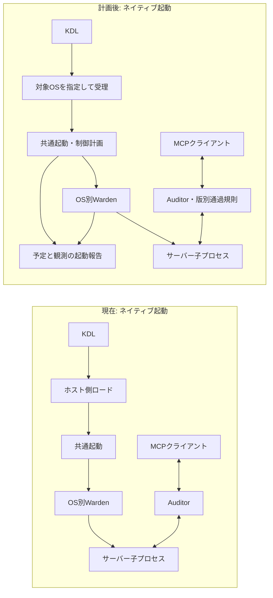

# mcp-writ 改善実装の全体計画

作成日: 2026-09-22

状態: 実装前の計画案。コード変更・VM実機検証の完了を示すものではありません。

関連資料: [分析・改善論点](assessment-116a111.ja.md)、[PR別実装手順書](implementation-pr-guide.ja.md)。

## 1. 到達点と計画の読み方

各OSのネイティブサンドボックスを維持しながら、利用者がOSごとの設定・制約を調べ直す負担を減らします。そのために、実行対象に合うポリシー検証、プロセス権限の把握、起動時に確認できた制御の報告を先に整えます。MCP通信の通過規則を同時に具体化し、その土台の上にVM隔離を追加します。

今回読み直した起動処理では、ネイティブ実行とコンテナ内ランナーが共通の起動関数を使い、OS制御の適用はWardenに分かれています。この構造は残します。共通化するのは実行条件・結果の表現と必要最小限の接続契約であり、OS固有の制御実装を一つに置き換える計画にはしません。

成果を「主計画と通信制御の完了」「採用したVM方式の提供」に分けます。追加方式の検証待ちでネイティブ経路の改善公開を止める必要はありません。一方、Kataは計画対象なので、検証不能のまま拡張計画全体を完了扱いにはしません。

この文書は目的、設計判断、段階、採用条件を定義します。もう一方の手順書は、PRごとの変更箇所、作業、試験、完了条件、戻し方を定義します。PR番号は計画内の識別子であり、GitHub上の実際のPR番号ではありません。

## 2. 根拠・対象コミット・未確認事項

| 入力 | 確認した内容・扱い |
|---|---|
| リポジトリ | `main` の `116a111028b39767ec69cb3fbe8e1a885f732571`。計画着手時のHEADも同じ |
| 分析資料 | [assessment-116a111.ja.md](assessment-116a111.ja.md)。合意済みの9項目と必須条件 |
| 分析資料SHA-256 | `ca23ed7eff62cb698abbe335b7307357a94fea981afabf4f3986d5e448aa611a`（リンク相対化・環境依存パス除去の改訂後。初回記録時は `c3096f5eb71a21b703366f49f3c1b0a8b3b7a316f05939293ba4a7f45fd0e3da`） |
| ソース確認 | ポリシーのロード・検証、共通起動、OS別Warden、MCP双方向転送、コンテナ起動、監査、既存テストとワークフロー |
| 外部仕様 | 2026-09-22にMCP、Kata、Apple container、Windows VM隔離の公式資料を確認。MCPの版差分は2026-09-23に再確認予定（未実施）。実装開始時に版を固定し直す |
| 検証の限界 | 製品の実行テスト・性能測定・VM実機検証は本計画策定では実施していない。文書の整合性確認とは区別する |
| 配布実態 | 未確認。READMEだけを根拠に公開済み・未公開を断定しない |

以降の構造体名、CLI追加、ポリシー形式、PR分割は**提案する設計**です。既存APIや合意済みの実装詳細として扱わないでください。実装開始時は対象コミットとの差分を確認し、境界・既定値・対応版が変わっていれば該当PRの計画を更新します。

本計画と手順書のローカルリンクは各文書からの相対パスとし、文書検査で参照先とアンカーを確認します。元の分析資料は記録したSHA-256の原文を証拠として維持し、本計画の更新で本文やリンクを上書きしません。分析資料内のソース参照は、同コミットのリポジトリ内相対リンクです。

## 3. 必ず維持する条件

1. LinuxのLandlock／seccomp／no_new_privs、macOSの現行ネイティブ経路、WindowsのAppContainer／Job Object／DACLによる制御を維持する。
2. VMは追加の隔離とする。全OSをLinuxへ移行すること、既存経路を削除すること、要求した制御を暗黙に省略することを目的にしない。
3. ホストOS、実行対象OS、実行基盤のOSを区別する。Dockerデーモンが別ホストやVM内にある場合も、CLIを実行したOSだけから決めない。
4. ネイティブ、既存イメージのラップ、ソースからのコンテナ化、イメージ実行を維持する。新方式に未対応の組み合わせは理由を示して拒否する。
5. MCPの標準入出力に起動診断・適用報告を混ぜない。通過判断と理由は既存の監査基盤へ記録する。
6. 設定値、適用予定、観測した適用結果、観測不能を区別する。`allow_degraded=true`、起動成功、VM選択指定だけから保護の成功を断定しない。
7. VM隔離を明示要求した場合、失敗時に通常コンテナや非隔離経路へ自動で切り替えない。
8. 手動CIの方針を維持する。実施できなかった試験を成功と数えない。
9. 応答の任意の文章・データに対するDLPとHTTP/SSEは対象外とする。仕様上の追加要求・制御フィールドはMCP通過規則に含める。
10. 現在のdry-run・明示的な制御省略を隠さない。通常実行・保護適用済みとして表示しない。

macOSの `sandbox-exec` / SBPLはOS提供の機構ですが、安定した第三者向け公開APIと同等のサポートを保証しません。既存ガイドの注意書きを残し、ネイティブ経路を維持する要件とサポート保証を分けます。

## 4. 論点と実装範囲の対応

| 論点 | 今回作る成果 | 担当PR | 改善後も残る境界 |
|---|---|---|---|
| A1 プロセス共通権限 | 既定・実行用・許可ツール由来の権限を、OS層とRPC層に分けて表示 | 03〜08 | 同一プロセス内の権限共有。ツール単位のカーネル隔離は作らない |
| A2 MCP通過規則 | 版・方向・要求／応答／通知・追加要求を制御し監査する | 09〜11 | 許可後の任意の応答内容、クライアントで実行済みの処理 |
| A3 コード同一性 | 固定対象、検証時点、実行時の可変部分を報告・文書化 | 12、21 | 対象外の依存先、検証後の変更。VM自体では解消しない |
| A4 Confused Deputy | 任意機能・名前固定・プロセス共有の説明を整合。一般化は独立PR | 13、条件付き14 | 既定オフ、プロセス単位のknown_paths共有 |
| A5 追加VM隔離 | Kataを計画対象にし、Mac／Windowsの候補を実機検証して採用 | 15〜25 | VM内の権限共有、ゲスト内制御・ログの信頼限界 |
| B1 対象OSで受理 | ポリシーの構文検証と対象OSでの適用可能性を分離 | 02、08、15 | OS・カーネル・マウント条件の差そのもの |
| B2 実効状態の可視化 | 一つの起動IDで予定・結果・スキップ・未確認を把握 | 03〜08、15 | 表示自体はOSの制御能力を増やさない |
| C1 製品境界 | 通過規則とDLPを区別し、文書を維持 | 11、26 | DLP、HTTP/SSEは対象外 |
| C2 CI・配布整合 | テストの実行担当、証跡、確認済みの配布記述 | 01、25、26 | 手動実行。全組み合わせの保証には別途実機証拠が必要 |

A4の一般化、Apple container・Windows方式の製品組み込みは条件付きです。候補の検証を計画へ含めたことと、製品対応を無条件に約束することは区別します。依存閉包の完全固定、ファイルの不変保持、DLP追加、複数クライアントの完全な状態分離、独自ハイパーバイザー開発は今回の必須成果に含めません。

## 5. 採用する設計

### 5.1 実行対象と制御の表現

最小限の共通モデルとして、以下を設けます。型名は仮称で、責務を固定します。

| 表現 | 必須情報 | 所有する責務 |
|---|---|---|
| ExecutionTarget | CLIホスト、実行基盤、ワークロードOS・arch、native／container／VM、エンジン | 実行入口が確定し、ポリシーとWardenへ渡す |
| EnforcementPlan | 制御ごとの対象、OS層／RPC層、予定、権限の由来、スキップ予定と理由 | 実際のルール構築に使う正規化結果から生成 |
| EnforcementObservation | 起動ID、制御、観測状態、取得箇所・時点・根拠、部分適用・失敗理由 | Wardenや実行バックエンドが生成 |
| LaunchReport | 対象・予定・観測・コード同一性・VM境界をまとめた結果 | runtime／起動側が合成し、人向け・JSONへ出力 |
| BackendCapabilities | 実行OS、イメージ／コマンド、stdio、共有・資源制御、観測手段 | 各実行方式が必要な能力だけ表明 |

能力の一覧と、当該起動で実際に適用された状態は別です。パスの欠落やネットワークの表現不能などを省略したあとでLandlockがFullyEnforcedになっても、元のポリシーを全部適用できたとは表示しません。

新しい共通データ型を低い層に置き、OS処理・ポリシー処理・表示処理は従来の所有者に残します。Wardenからruntimeを参照したり、同階層のcontainerとruntimeを相互依存させたりしません。新規モジュールを追加するPRは、[モジュール構成](modules.md)と[依存方向の試験](../tests/module_layering.rs)を同時更新します。

PR-02／03のExecutionTarget・LaunchReport等はexecution等の層0に定義し、Policyやcontainer::EngineKindを保持しません。エンジン識別も葉の値型とし、policy・Warden・containerからの変換は各所有者が行います。PR-09でPolicyを読む判定はpolicyへ、通信状態はAuditorへ置き、protocolは葉の値型・解析に留めます。

対象OSの検証ではネットワークだけでなく、validatorのパス正規化・大文字小文字・区切り文字・ドライブ表記も扱います。pathutilは呼出経路を調べ、対象側パスをホストのパス解決へ渡す箇所に限って分離します。workloadの実行ファイル解決やホスト上のポリシーファイル・マウント元の存在確認は、実際に処理する環境のOSに従わせます。PR-02では明示した対象OSコンテキストの契約を試験し、Windowsホスト→実Linuxコンテナの往復確認はPR-08が担当します。

### 5.2 現状からの変更点

ネイティブ経路の現在と計画後を同じ粒度で示します。OSサンドボックスの位置は変えず、判定と報告の責務を明確にします。

| 変更 | 現在 | 計画後 | 保護への効果 | 費用・制約 |
|---|---|---|---|---|
| ポリシー受理 | ホストビルドのOS検査 | 対象OSとホスト条件を分離 | 誤った受理・拒否を減らす | 呼び出し元・継承・再検証の更新 |
| OS権限の表示 | 設定と個別ログから推測 | 予定・実績・未確認を同じ起動で表示 | 権限共有や制御省略を把握できる | 観測経路が必要。権限分離自体は増えない |
| MCP通過 | tools/call中心の検査 | 通信全体の許可と応答内追加要求の判定 | 未定義要求を転送前に止める | 既存クライアントの移行、要求追跡メモリ |

VM経路ではこの内側の制御を残したうえで、ホストとの間にVM境界を追加します。最初は既存コンテナと同様にゲスト内のランナーがWardenとAuditorを持つ方式を検証します。起動報告には「ゲスト内で確認された情報」であることを記録します。ゲストカーネル侵害後もAuditor・監査が信頼できるとは約束しません。その保証を追加する場合は、ホスト側Auditorや改ざんを防ぐログ経路を別設計にします。

### 5.3 ポリシーの互換性とMCP通過規則

現行のKDLは `policy version=1` です。新しい通過規則を旧バイナリに無視されないよう、**通過規則を明示するポリシーはversion=2を使う設計案**とします。MCPのプロトコル日付とは別の番号です。PR-09で構文・継承・serverへの結び付けを定義し、PR-11で生成・実行・移行を一緒に公開します。

移行後の新バイナリでは、v1も読み込めますが、追加指定のない通信には安全な既定プロファイルを適用します。既存のtools/call許可・引数検査は維持し、resources・prompts・サーバー起点要求などは必要なものだけv2へ明記します。これは一部通信の互換性に影響するため、移行例とリリースノートを必須にします。旧動作へ戻すための無制限通過は既定にしません。

v2を解釈できるだけの中間実装を公開しません。PR-09〜11はまとめて公開する単位とし、PR-11より前はv2の実行受理・自動生成を有効にしません。v1ファイルにv2専用の制御ノードを書いた場合も、新バイナリでは明示的に拒否します。

PR-09で、v2のtool内の未知プロパティ・未知子ノードもロード時に拒否する契約を定め、PR-11の初回v2公開に含めます。継承・include・when・profile経由でも未知制御を無視しません。PR-14の役割・抽出規則は、PR-11時点のv2対応バイナリでも拒否されることを試験します。同じversion=2だけでは拒否を保証できないため、先行v2が新設定を無視して受理する場合は形式の版を更新してから公開します。

規則は対応版、方向、要求／応答／通知、method、必要なcapabilityを含めます。2025-11-25では初期化段階と交換したcapabilityを追跡します。2026-07-28には初期化待ちを設けず、各要求の_metaにあるprotocolVersion／clientCapabilitiesを検査し、過去のdiscoverや初期化状態で代用しません。版別・メソッド別の既定は[手順書PR-09](implementation-pr-guide.ja.md#pr-09)を正とし、削除済みメソッド、明示許可が必要な既存メソッド、未対応拡張を区別して移行例に列挙します。

要求表は実際に転送する要求を追跡し、通常時の許可／拒否判定とdry-runによる転送を分けて保持します。dry-runで転送した違反要求への正常応答・MRTRも相関を維持し、未転送要求への応答とは区別します。2026の通常結果はresultType=completeを必須とし、CacheableResultのttlMs／cacheScopeも検査・再出力します。2025にはこれらの新しい必須フィールドを要求しません。

2026-07-28のInputRequiredResultはtools/call・resources/read・prompts/getの追跡済み元要求だけに認め、他のメソッドへの応答は仕様違反として拒否します。応答内のinputRequestsはクライアントへ渡す前に判定し、通常実行では元要求が許可済みであることも必要です。再試行に付くinputResponsesの既存4値auto／deny／allow／inspectは独立した制御として維持します。Autoはセキュリティ上の契約があればDeny、なければAllow、Inspectは通過と存在の監査記録です。任意の文章やデータ内容の解析は追加しません。

2026-07-28では `subscriptions/listen` によるtoolsListChangedのみの購読を既定で許可し、他の通知種別とresourceSubscriptionsのURI範囲には明示規則を要求します。resourceSubscriptionsはURI文字列の配列で、初期の許可範囲は完全一致の一覧です。未知フィルター、不許可の通知種別のtrue、不許可URIを含む要求は全体を拒否します。subscriptionIdは購読要求のJSON-RPC IDと型・値を一致させ、PR-09〜10で要求・最初の承認通知・変更通知を承認済みフィルターへ照合します。購読は長寿命の要求として上限を設けて保持し、取消・正常終了応答・EOF・切断で解放します。これらはstdioにも適用し、tools/list_changedからの既存再検証を維持します。[MCP 2026-07-28 subscriptions](https://modelcontextprotocol.io/specification/2026-07-28/basic/patterns/subscriptions)

2026のprogressとmessageは進行中の要求に属する通知として扱い、購読とは分けます。progressはprogressToken、messageは元要求の_metaにあるio.modelcontextprotocol/logLevelとレベル条件を検査します。stdioではHTTPの応答ストリームによる相関を仮定せず、元要求を特定できない通知は破棄・監査します。この制限と移行方法もPR-09で明示します。

### 5.4 起動前診断と導入負担の低減

起動せずに対象・必要条件・適用予定を確認できる `plan` サブコマンドと、通常起動の結果を書き出す `--report` を追加する案を採ります。PR-07でCLI仕様を確定します。既存の `--dry-run` は実行を伴うため、起動前診断の代用品にはしません。

planの状態はready／blocked／invalid／errorとし、終了コードは順に0／1／2／1とします。前提不足と診断処理失敗はstatus・reasonで区別し、予定を算出できても必須前提が不足・未確認ならreadyにしません。--reportを指定して保存に失敗した通常起動も成功終了にしません。

ネイティブ実行はホストOSを自動判定します。コンテナは実行先とイメージのOSを確認し、合わないランナーを起動前に拒否します。診断は不足条件と次に実行する手順を示しますが、管理者設定、仮想化機能、エンジン設定を暗黙に変更しません。OSごとの導入経路は短くし、対応能力の差は結果に残します。

旧ランナーの互換性は[手順書PR-08](implementation-pr-guide.ja.md#pr-08)の表で固定します。wrap-image／containerizeはポリシー互換性を満たせば生成でき、報告能力を成果物に記録します。通常のrun-imageで--reportを指定しない場合だけ、既知の旧版を従来相当・ゲスト観測未確認として扱えます。--report指定時と後続のVM隔離では必要な報告能力を必須とします。対応版の報告欠落・不一致を旧構成として許容しません。

### 5.5 コード同一性とConfused Deputy

A3は、固定の実装範囲を拡大したように見せず、現在の検証が何を確認したかを報告する作業から始めます。初回内容照合と起動直前の再検証を区別し、別スクリプトの内容を直前に再ハッシュしていないこと、読み込みまで不変に保持していないことを明示します。ソースコメントの「TOCTOUを閉じる」等の過大な表現も合わせます。

A4は説明修正を必須にします。名前固定を一般化する場合のPR-14は、発見／利用の役割とパス抽出規則を追加する独立した変更です。`side_effect` だけで役割を代用せず、既定オフとプロセス単位の状態共有を維持します。

## 6. OS別の追加隔離計画と採用条件

| ホスト／方式 | 位置づけ | 初回の検証構成 | 製品組み込みの条件 |
|---|---|---|---|
| Linux／Kata | 計画対象 | Docker＋Kata＋QEMUの版を固定した1構成 | Linuxゲスト内Warden、双方向stdio、停止・ログ・VM選択の実績が確認できる |
| macOS／Apple container | 公式機構を使う追加候補 | Apple silicon・macOS 26、Linuxゲスト | ネイティブmacOS経路を維持し、Linuxゲスト制御を別途確認できる |
| Windows／Hyper-V分離コンテナ | Windows追加隔離の優先候補 | Windows用イメージ、Hyper-V分離、Windows版ランナー | AppContainer・Job・DACL等の併用と、Windows向けstdio・マウント・終了が成立する |
| Windows／Windows Sandbox | 追加候補 | 対応Windows環境と専用stdio中継の試作 | 対話要件・中継・状態取得・後始末を含めて継続運用可能と判断できる |

KataのDocker＋QEMUは公式資料に記載された構成です。実装前に登録したランタイム名・実体・設定を確認し、名前が「kata」であることだけを根拠にしません。[Kata導入資料](https://github.com/kata-containers/kata-containers/blob/main/docs/installation.md)

Apple containerの公式対応条件は確認時点でApple silicon・macOS 26です。LinuxゲストのLandlockを「macOSネイティブサンドボックスが適用された」と表示しません。[Apple container](https://github.com/apple/container)

Hyper-V分離はWindowsコンテナに個別のカーネルを持たせる方式です。Nano Serverはイメージの選択肢であって隔離方式ではなく、既存APIとの適合を確かめて選びます。標準のWindows Sandbox CLIはプロセスI/Oを提供しないため、CLIを呼ぶだけでMCPが接続できると扱いません。[Hyper-V分離](https://learn.microsoft.com/en-us/virtualization/windowscontainers/manage-containers/hyperv-container)、[Windows Sandbox CLI](https://learn.microsoft.com/en-us/windows/security/application-security/application-isolation/windows-sandbox/windows-sandbox-cli)

### 共通の採用ゲート

- 必須のネイティブ経路の回帰試験が通る。VM利用時のホスト側・ゲスト側の制御と、その非適用範囲を説明できる。
- まず1サーバー／1VMで検証する。VM共有・再利用がある場合は分離単位を正確に記録する。
- 明示要求した隔離が使えない場合は、代替で実行せず理由を返す。
- stdioが双方向・非TTYで機能し、起動メッセージと分離される。
- ポリシーの読み取り専用受け渡し、必要最小限の共有、監査の保存先・信頼範囲が成立する。
- 正常終了、EOF、キャンセル、親の中断、起動失敗、エンジン切断を扱い、資源を残さない。
- 取得できない観測はunknownとし、隔離の適用が必須な通常起動では、必要な確認を満たさなければ開始を認めない。
- 対応OS・arch・エンジン・ゲスト・イメージの版を記録し、手動CIまたは再現可能な専用環境で確認する。

試作PRは、証拠と「採用可能／条件付き／不採用／環境未確保」を記録すれば調査として閉じられます。ただし「環境未確保」は方式の対応完了ではありません。Apple・Windowsの候補を不採用にしてもネイティブ対応は残します。Kataの必須条件が満たせない場合は原因・必要な追加作業を残し、保護を弱めて対応済みにはしません。

各方式の試作コードは既定のCLIへ接続しません。通信制御・報告・実行契約が未完成なら該当項目を未完了と記録し、PR-17／19／22／24の製品組み込みでPR-10／11の通信制御と上限、PR-08／21の報告、PR-15の実行契約へ接続して再検証します。Windows Sandboxの中継も同じ上限・バックプレッシャー・停止契約に従わせます。試作を早期着手するための直接依存は増やしません。

## 7. 段階・依存関係・公開単位

| 段階 | 対象 | 終了時の成果 |
|---|---|---|
| M0 証拠と対象の土台 | PR-01〜03。通信設計PR-09も並行可能 | テストの担当、対象OS、制御計画・報告の契約 |
| M1 主計画の実装 | PR-04〜08 | 3 OSのネイティブ経路と既存コンテナ経路を診断・報告できる |
| M2 MCP通信制御 | PR-09〜11 | 双方向・版別・MRTRまで一体で制御し、移行手順を提供 |
| M3 保証の整理 | PR-12〜13。一般化する場合は14 | コード同一性とConfused Deputyの説明・結果が一致 |
| M4 追加隔離 | PR-15〜24 | 実機で成立した方式だけを選択可能にする |
| M5 検証と公開整合 | PR-25〜26 | 対応方式ごとの証拠・導入手順・配布記述が揃う |

M1とM2は共通ファイルの競合を調整しながら並行できます。M2を全OSの観測実装完了まで待たせません。M4の実機環境の確保は早期に始め、試作も前提PRが揃った方式から進めます。並行作業の許可や別エージェントへの実際の委譲を、この資料だけで自動実行する指示にはしません。

**主計画の公開条件:** PR-01〜13の必須成果、3 OSのネイティブ試験、既存コンテナ試験、MCP両版の移行試験が揃うこと。公開担当はPR-01で整えるチェックリストに従い、主計画分のREADME等の配布記述を実際の公開URL・版・資産と照合し、確認日と結果を記録します。未公開・未確認のものはその状態へ記述を合わせます。PR-14、未採用VM方式、PR-25／26は待ちません。各PRに含める導入文書・移行例もこの時点で公開可能にします。

**VM方式の公開条件:** 当該試作・組み込みPRと、PR-25の当該方式の検証が完了し、対応表に未確認範囲が明示されること。方式ごとに段階公開できます。

### PR一覧

下表の依存はコード・契約上の依存です。PR-01のテスト実行担当の整理は全PRの公開前条件として扱います。一覧ができる前に進めるPRは、対象テスト・担当ワークフロー・結果・未実施理由をPR本文に保持し、PR-01で先行PRの行を回収します。一覧完成後は各PRから更新し、公開前に必ず統合します。このためPR-01を全PRのコード上の直接依存には追加しません。「条件付き」のPRは該当する採用ゲートを満たした場合だけ実装します。

| PR | 内容 | 対応論点 | 直接依存 | 条件 |
|---|---|---|---|---|
| [PR-01](implementation-pr-guide.ja.md#pr-01) | 既存テストの実行担当と検証記録を整える | C2 | なし | 常設 |
| [PR-02](implementation-pr-guide.ja.md#pr-02) | 実行対象OSを明示したポリシー検証 | B1 | なし | 常設 |
| [PR-03](implementation-pr-guide.ja.md#pr-03) | 制御計画・観測結果・プロセス権限の共通モデル | A1 / B2 | PR-02 | 常設 |
| [PR-04](implementation-pr-guide.ja.md#pr-04) | Linuxの適用状態を子プロセスから回収 | B2 | PR-03 | 常設 |
| [PR-05](implementation-pr-guide.ja.md#pr-05) | macOSの適用根拠と未確認状態を報告 | B2 | PR-03 | 常設 |
| [PR-06](implementation-pr-guide.ja.md#pr-06) | Windowsの適用根拠と後始末を報告 | B2 | PR-03 | 常設 |
| [PR-07](implementation-pr-guide.ja.md#pr-07) | 起動前診断・起動結果・導入手順を統合 | A1 / B1 / B2 | PR-04, PR-05, PR-06 | 常設 |
| [PR-08](implementation-pr-guide.ja.md#pr-08) | 既存コンテナ経路の対象識別とゲスト報告 | B1 / B2 | PR-07 | 常設 |
| [PR-09](implementation-pr-guide.ja.md#pr-09) | MCP通過規則のポリシー形式と判定モデル | A2 | なし | 常設・PR-11まで単独公開しない |
| [PR-10](implementation-pr-guide.ja.md#pr-10) | 双方向RPC・応答・通知の制御 | A2 | PR-09 | 常設・PR-11まで単独公開しない |
| [PR-11](implementation-pr-guide.ja.md#pr-11) | MRTR追加要求の制御と安全な既定値への移行 | A2 / C1 | PR-10 | 常設 |
| [PR-12](implementation-pr-guide.ja.md#pr-12) | コード同一性の範囲と検証時点を明示 | A3 | PR-08 | 常設 |
| [PR-13](implementation-pr-guide.ja.md#pr-13) | Confused Deputyの説明と既存動作を整合 | A4 | なし | 常設 |
| [PR-14](implementation-pr-guide.ja.md#pr-14) | Confused Deputyの役割・パス抽出規則 | A4 | PR-11, PR-13 | 一般化を実施する場合 |
| [PR-15](implementation-pr-guide.ja.md#pr-15) | 追加隔離の選択・状態・ライフサイクル契約 | A5 / B2 | PR-08 | 拡張の共通部分 |
| [PR-16](implementation-pr-guide.ja.md#pr-16) | Linux Kataの実機検証 | A5 | PR-08 | 計画対象・実機必須 |
| [PR-17](implementation-pr-guide.ja.md#pr-17) | Linux Kataバックエンドの製品組み込み | A5 | PR-11, PR-12, PR-15, PR-16 | PR-16の受入条件成立 |
| [PR-18](implementation-pr-guide.ja.md#pr-18) | Apple containerの実機検証 | A5 | PR-08 | 候補検証・実機必須 |
| [PR-19](implementation-pr-guide.ja.md#pr-19) | Apple containerバックエンドの製品組み込み | A5 | PR-11, PR-12, PR-15, PR-18 | PR-18で採用可能と判断 |
| [PR-20](implementation-pr-guide.ja.md#pr-20) | Windows Hyper-V分離コンテナの実機検証 | A5 | PR-06 | 優先候補検証・実機必須 |
| [PR-21](implementation-pr-guide.ja.md#pr-21) | Windowsゲスト用ランナー・配布物・イメージ | A5 / A3 | PR-06, PR-12, PR-15 | PR-20またはPR-23で採用可能と判断 |
| [PR-22](implementation-pr-guide.ja.md#pr-22) | Hyper-V分離Windowsコンテナの製品組み込み | A5 | PR-11, PR-20, PR-21 | PR-20の受入条件成立 |
| [PR-23](implementation-pr-guide.ja.md#pr-23) | Windows Sandboxのstdio中継と成立性検証 | A5 | PR-06 | 候補検証・実機必須 |
| [PR-24](implementation-pr-guide.ja.md#pr-24) | Windows Sandboxバックエンドの製品組み込み | A5 | PR-11, PR-21, PR-23 | PR-23で採用可能と判断 |
| [PR-25](implementation-pr-guide.ja.md#pr-25) | 採用VM方式の手動CIと証跡収集 | A5 / C2 | PR-01, PR-15 | 採用するPR-17 / 19 / 22 / 24を方式別に追加依存 |
| [PR-26](implementation-pr-guide.ja.md#pr-26) | 対応表・導入文書・配布記述の最終整合 | 全項目 | PR-08, PR-11, PR-12, PR-13, PR-25 | 条件付きPRは採否・未対応理由を記録 |

手順書の各PRにこの表と同じ依存関係を記載します。分割が大きくなりすぎた場合は `PR-04a` 等の子作業へ分け、元の受入条件と対応論点を保持します。無関係なリファクタリングを便乗させません。

## 8. 試験・性能・運用上の判断

### 必須の試験行列

| 対象 | 最低限の確認 |
|---|---|
| Rustコード変更の基礎検証 | fmt・clippy・lib／bin試験・cargo doc・doctest。ポリシーや起動権限の契約変更ではgo_runtime_policyも実行 |
| 3 OSのネイティブ | 正常実行と実際のOS拒否、環境制御、子・孫プロセスの終了、監査、未確認状態の表示 |
| ホストと対象が異なる経路 | PR-02で対象OSごとのパス・ネットワーク判定の契約、PR-08でWindows→実Linuxコンテナの受理・受け渡し・ゲスト再検証 |
| MCP 2025-11-25 | 初期化、通常ツール、逆方向RPCの許可／拒否、応答相関、通知 |
| MCP 2026-07-28 | 初期化不要、要求単位メタデータ、削除メソッド拒否、resultType・キャッシュ情報、MRTR対象制限、別IDでの再試行、購読ID・URI範囲・承認・定義再検証、要求単位通知、複数購読・取消・終了・上限 |
| 既存inputResponses制御 | auto／deny／allow／inspect、Autoの契約あり／なし、Inspectの監査記録を追加要求の通過判定とは別に検証 |
| dry-runの通信 | 違反要求の実転送から正常なJSON-RPC応答の返却まで、MRTRの相関、未転送要求・無関係な応答との区別。要求のechoだけで代用しない |
| 既存コンテナ | Docker／Podmanの既存経路、wrap-image、containerize、run-image、ポリシーの自己完結化、報告指定とランナー能力ごとの互換性 |
| 採用VM方式 | VM選択の実績、ゲスト制御、stdio、中断、マウント、ネットワーク、資源、ログ、掃除 |
| ポリシー移行 | v1の既存ツール制御維持、v2の往復・継承・生成、tool内未知制御の拒否、v1専用バイナリによるv2拒否、PR-14採用時はPR-11時点のv2対応バイナリによる新設定拒否 |
| 診断・文書・公開 | planの状態と終了コード、文書リンク・アンカー、主計画公開前の配布記述と確認記録 |

最初に関連する既存試験を拡張し、振る舞いを保証する試験を追加します。表示文字列をそのまま複写するだけの試験や、文書変更だけに対する製品テストの増設は避けます。PRごとの具体的なコマンドは手順書を正とします。

### トレードオフと測定

本計画では速度・メモリ・導入時間をまだ測定していません。以下の見通しは構造からの推定であり、性能保証ではありません。

| 変更 | 予想される効果・費用 | 根拠・確度 | 判断に使う測定 |
|---|---|---|---|
| 対象OSの検証・一つの報告 | 設定の取り違えを減らす。計画生成と報告I/Oが起動に加わる | ソース由来・中 | 同じコマンドで報告有無の起動時間、出力量、エラーの明瞭さ |
| 通過規則と要求追跡 | 未定義通信を減らす。フレーム判定・要求表・監査の負荷が増える | ソース由来・中 | 通常RPC、同時実行、上限到達、低速クライアントで遅延・RSS・監査滞留 |
| ネイティブ制御＋VM | ホストとのカーネル境界を追加。ゲストメモリ、起動、更新・停止処理が増える | 外部仕様と設計からの推定・中 | 同じワークロードのネイティブ／通常コンテナ／VMで起動・最初の応答・RSS・終了時間 |
| OS別アダプター | 既存経路を維持しやすい。維持対象と互換性試験は増える | 設計からの推定・中 | 対応表の空欄、更新時の試験範囲、構成ごとの導入手順数 |

性能試験は同じ版の小さなstdio echoと代表的な読み取りサーバーで比較します。cold／warmを分け、反復回数・環境・中央値・p95・ピークメモリを記録します。要求追跡は定義した上限で安定することを必須にし、起動・遅延・メモリの許容値は各試作の基準測定後に数値で決め、組み込みPRの受入条件へ反映します。数値未定のまま「低オーバーヘッド」と表示しません。

保護の退行、隔離の暗黙フォールバック、正常終了後の資源漏れ、stdioの混入は性能との引き換えに許容しません。運用で困るのは未確認の成功表示なので、導入失敗・権限不足・非対応は、修正手順を伴う明確な失敗として扱います。

## 9. 移行・公開・戻し方

- 診断・報告は追加機能として導入し、既存CLIの通常実行を維持する。stdoutの契約は変更しない。
- MCP通過制御は互換性変更として扱う。PR-09〜11を一体で公開し、v1からv2への移行例と拒否理由を提供する。
- v2や追加隔離を使う設定を旧バイナリへ黙って変換しない。旧版が扱えない場合は明示的に止める。
- VMは明示選択から始める。通常実行の既定を全OSでVMに変える変更は含めない。
- 回帰時は当該バックエンドの選択を無効化して未対応を返す。利用者が別の実行方式を選び直すことと、自動フォールバックは区別する。
- 説明の正確化、ハッシュ拒否、既存の定義検証、環境制御、監査のfail-closedは、移行中も維持する。
- 公開物の作成・リリース実行は別の実作業として扱う。この計画策定ではコード変更、インストール、CI起動、リリース公開を行わない。

## 10. 実装中に確定する判断

| 判断 | 決めるPR | 初期方針・決定条件 |
|---|---|---|
| 報告の型・JSONの版・監査との対応 | 03、07 | 型は層0、変換・合成は各所有者。一つの起動ID。観測の根拠を残し、不明を成功に変えない |
| planの出力・既存コンテナの互換性 | 07、08 | planの4状態と終了コード、報告指定・ランナー能力別の扱いは手順書の表を維持 |
| Linux子側の状態回収 | 04 | fork後の安全性とseccompを維持。記録のために許可を増やさない |
| macOSの確認可能範囲 | 05 | 起動成功だけで完全適用としない。未確認を正しく表示できることも成果 |
| KDL v2の構文・合成規則 | 09 | tool内も含め未知の制御を拒否する契約を初回v2公開に含める。継承・server選択・exportで規則を失わない |
| 同時要求・購読・通知・MRTRの制限 | 09〜11 | 有限な要求表と購読状態、方向・購読IDによる相関、dry-runを含む実転送要求の追跡。未知要求は通常時拒否、requestStateは不透明 |
| Confused Deputy一般化の範囲・互換性 | 14 | 明示的な役割・抽出規則。先行v2での新設定拒否を試験し、保証できなければ形式の版を更新。一般化しない場合も13は完了する |
| VMの実績確認・性能許容値 | 16、18、20、23 | 固定した環境で取得できる証拠と測定値から決める |
| Windowsのベースイメージ | 20、21 | まず必要APIと既存Wardenが成立する構成。軽量化は成立確認後 |
| Windows Sandboxの提供可否 | 23 | 双方向通信・起動セッション要件・後始末が成立しなければ保留 |
| 配布先と記述 | 01で公開チェックリスト、主計画公開前に確認、26で拡張分を更新 | 公開担当が実際に確認したURL・版・資産・日付に合わせ、VM拡張の完了待ちにしない |

新たな判断が必須条件を変える場合は、変更理由と影響を計画に追記します。未確認事項を成功と仮定して後続の製品組み込みへ進めません。

## 11. 実装開始時の引き継ぎ

最初にPR-01、PR-02、PR-09の作業範囲を確認してください。次に、PR-03で3 OSとゲストから報告できる契約を固めます。担当分割する場合も、各PRの目的・直接依存・必須試験を一緒に渡します。

実装者は手順書の共通手順に従い、作業前後のコミット、差分、実行した試験、未実施理由を記録してください。日本語ファイルはUTF-8・BOM・差分を確認し、文字コード問題が疑われる場合は編集前にバックアップします。確認できない原文を再生成して置き換えません。
